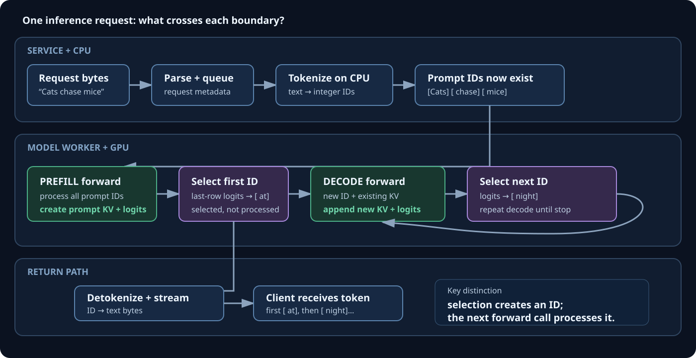
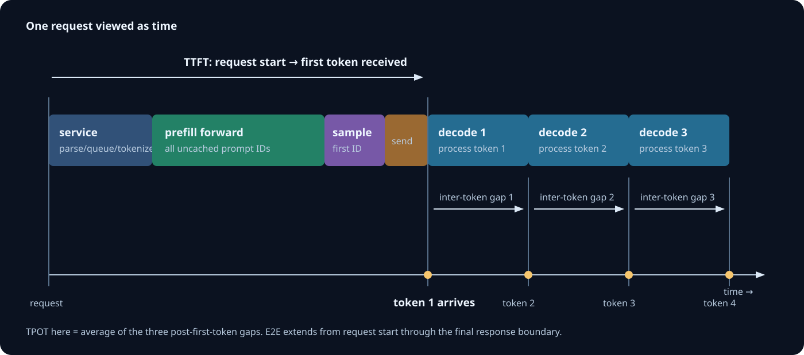
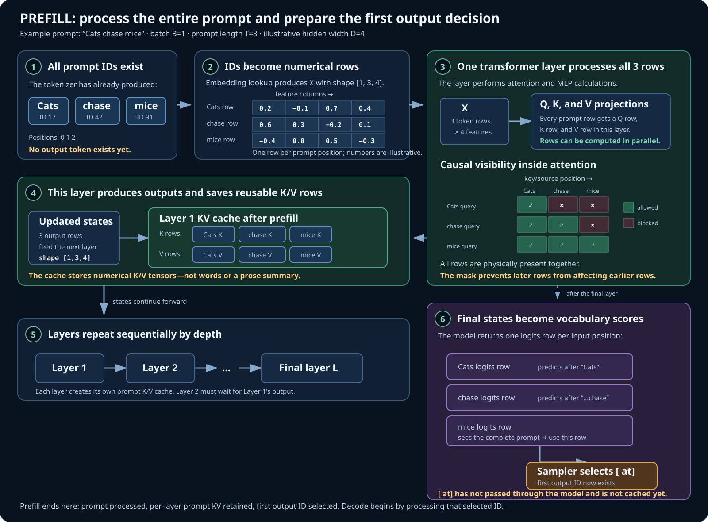
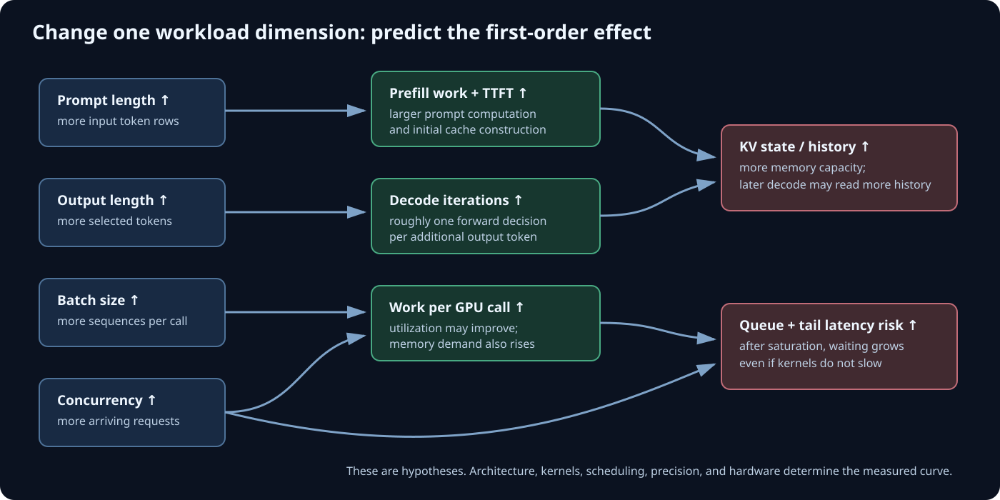

# Lesson 1 — From Request to Performance Equation

## The Question This Lesson Answers

> A user submits a prompt and sees tokens appear. What work occurs, in what
> order, and how does each part contribute to perceived latency?

This lesson deliberately begins with the whole request. Attention mathematics,
GPU kernels, and KV-cache internals will receive dedicated treatment later.
Here, learn the **boundaries** between phases and the quantities a performance
engineer must measure.

## 1. One Request, End to End

Use this example throughout:

```text
User text:       "Cats chase mice"
Illustrative IDs: [Cats] [ chase] [ mice]
Generated text:  [ at] [ night] [.]
```

The bracketed pieces are **tokens**: the model's discrete units of text. The
exact split is tokenizer-dependent; these are illustrative.



The request crosses two different kinds of boundaries:

| Boundary | What crosses it? | Typical owner |
| --- | --- | --- |
| Client → server | bytes containing request data | networking/service |
| Text → tokenizer | characters or bytes | CPU preprocessing |
| Tokenizer → model | integer token IDs | framework/runtime |
| Model layer → layer | tensors of numerical states | GPU kernels |
| Model → sampler | logits: one score per vocabulary token | GPU/CPU runtime |
| Sampler → client | selected token ID, then text bytes | runtime/service |

The model does not directly receive words and does not directly emit text. It
receives IDs, computes numerical tensors, returns **logits**, and a sampling
policy chooses an ID. A tokenizer converts the chosen ID back to text.

### State ledger

| Moment | IDs that already exist | Work that has occurred | Next ID |
| --- | --- | --- | --- |
| Request arrives | prompt IDs do not exist yet | none | nonexistent |
| Tokenization ends | `Cats, chase, mice` | CPU tokenization | nonexistent |
| Prefill forward ends | same three prompt IDs | prompt model states and prompt KV created | nonexistent |
| First sampling ends | prompt + `at` | `at` selected from last-row logits | exists but is not yet processed by the model |
| Decode step 1 ends | prompt + `at` | `at` model states and KV created | `night` not selected yet |
| Sampling ends | prompt + `at, night` | `night` selected | exists but is not yet processed |

This distinction is essential: **selection creates a token ID; the following
model call processes that ID.**

## 2. The Service-Side Timeline

Different systems overlap work, but a single simple request can be understood
with this sequence:

1. Receive and parse the request.
2. Wait in a queue if execution capacity is unavailable.
3. Tokenize the prompt.
4. Schedule the request onto a model worker.
5. Run the prefill forward pass over the uncached prompt.
6. Select the first output token from the returned logits.
7. Detokenize and stream that token.
8. Repeatedly run one decode forward step, select, detokenize, and stream.
9. Stop at an end token, length limit, cancellation, or another stopping rule.



### Why queue time belongs in the model

GPU kernel time can remain unchanged while the user experience becomes much
worse. If requests arrive faster than the server can admit them, queue time
grows. End-to-end performance is therefore not identical to model execution
performance.

### Why tokenization belongs in the model

Tokenization is usually CPU work. Its cost can vary with input length,
tokenizer implementation, concurrency, and process placement. It may be small,
but excluding it without measuring it is an assumption.

## 3. Prefill: Process the Prompt

**Prefill** is the forward computation over all uncached prompt tokens. For the
example, the three prompt IDs already exist before prefill begins:

```text
[Cats] [ chase] [ mice] | next output ID does not exist
```

The following diagram is meant to be read in numbered order. It separates work
that happens **within one transformer layer** from work that repeats across all
layers.



The central flow is:

```text
all prompt IDs
    → one numerical row per prompt position
    → every transformer layer processes those rows
    → every layer retains its prompt K/V rows
    → the final layer produces vocabulary logits
    → the last prompt row selects the first output ID
```

Two kinds of execution occur at the same time in this description:

- **Parallel across prompt rows within a layer:** calculations for multiple
  positions can be organized into large GPU operations.
- **Sequential across layer depth:** layer 2 requires layer 1's output, so all
  transformer layers do not run simultaneously.

The causal mask controls which positions can exchange information even though
their rows are present in the same GPU operation. “Processed together” means
the arithmetic can be grouped and parallelized; it does not mean `Cats` may use
information from the later `mice` position.

At each transformer layer, the model constructs numerical rows for all three
positions. Operations within a layer can process many rows in parallel, while
layers still depend on one another sequentially.

Because this is a causal language model, a position may use itself and earlier
positions, never later positions:

```text
query position       positions it may use
Cats                 Cats
chase                Cats, chase
mice                 Cats, chase, mice
```

Prefill produces:

- a logits row for each prompt position;
- key and value (KV) rows for each prompt position at every attention layer;
- the distribution used to select the first output token from the **last
  prompt position's logits**.

Generation uses the last prompt row because it represents the complete allowed
prefix. Sampling might select `[ at]`. At that exact moment, `at` is a selected
ID, but its hidden states and KV rows have not been computed yet.

## 4. Decode: Extend the Sequence One Decision at a Time

The first decode forward step consumes the newly selected `[ at]` ID plus the
prompt KV cache. At every layer it:

1. computes the new token's query, key, and value rows;
2. compares the new query with cached prompt keys and its new key;
3. mixes the corresponding cached and new values;
4. appends the new key and value to that layer's cache;
5. eventually produces logits for the next output decision.

The sampler might then select `[ night]`. The next decode step consumes
`night`, and the process repeats.

```text
prefill(prompt) → select at
decode(at, prompt cache) → select night
decode(night, larger cache) → select .
decode(., larger cache) → select stop (or reach a stop rule)
```

The calculations **inside** a decode step contain large amounts of GPU
parallelism. The token decisions **between** steps are sequential: the model
cannot process `night` until the prior step has selected `night`.

## 5. KV Cache: Reuse, Not Memory of Meaning

The KV cache stores previously computed key and value tensors at every
attention layer. It does not store prose, final answers, or a summary of what
the model “understood.” Its mechanical purpose is to avoid recomputing the old
positions' keys and values during every decode step.

Without caching, each step would repeatedly process the growing prefix. With
caching, the model normally computes the newest position's row and reuses old
K/V rows. The cache grows as tokens are processed.

A common idealized KV capacity equation is:

```text
KV bytes = 2 × B × L × H_kv × T × D_head × bytes_per_element
```

where:

- `2` accounts for both K and V;
- `B` is batch size;
- `L` is transformer-layer count;
- `H_kv` is the number of KV heads;
- `T` is cached tokens per sequence;
- `D_head` is elements per head row.

The equation predicts capacity, not necessarily bytes read during one step.
Implementations may page, partition, quantize, or avoid reading every stored
byte in the same way.

## 6. The Four User-Facing Metrics

### 6.1 End-to-end latency

Time from the chosen client-side start boundary until the complete response is
received:

```text
T_E2E = T_network_in + T_server + T_network_out
```

For a server-side model:

```text
T_server = T_parse + T_queue + T_tokenize + T_schedule
         + T_prefill + T_first_sample
         + Σ(T_decode_i + T_sample_i + T_detokenize_i + T_stream_i)
         + T_finalize
```

All terms are durations, such as milliseconds. Terms may overlap in a real
server; simple addition is the first model, not the final truth.

### 6.2 Time to first token (TTFT)

Time from request start until the client receives the first generated token:

```text
TTFT = request/queue/preprocess time
     + prefill forward time
     + first sampling/detokenization/streaming time
```

Always state whether TTFT is measured client-side, server-side, or at the model
worker. The same label can otherwise describe different intervals.

### 6.3 Inter-token latency and TPOT

**Inter-token latency (ITL)** is the gap between two streamed output tokens.
**Time per output token (TPOT)** is often an average over the repeated decode
region. Exact conventions vary, so define the numerator and denominator.

One explicit definition is:

```text
TPOT = (time_last_token_received - time_first_token_received)
       / (number_of_output_tokens - 1)
```

This measures the average interval after the first token. It is not TTFT.

### 6.4 Throughput

Throughput is completed work per unit time:

```text
output token throughput = total output tokens / elapsed seconds
request throughput      = completed requests / elapsed seconds
```

Higher batch size can increase aggregate throughput while increasing an
individual request's latency. Throughput and latency are related but not
interchangeable.

## 7. Build the First Performance Model

Suppose a request produces four output tokens and measurement predicts:

| Component | Predicted time |
| --- | ---: |
| Parse + queue + tokenize + schedule | 6 ms |
| Prefill | 24 ms |
| First sample + detokenize + stream | 2 ms |
| Three later token intervals | 3 × 12 ms |
| Finalization + remaining network | 4 ms |

Then:

```text
predicted TTFT = 6 ms + 24 ms + 2 ms = 32 ms

predicted E2E = 32 ms + (3 × 12 ms) + 4 ms
              = 72 ms

predicted TPOT = 36 ms / 3 tokens = 12 ms/token
```

There are four output tokens but only three intervals **after** the first
token. This is why the explicit TPOT denominator is `output_tokens - 1`.

### Prediction error

If measured E2E latency is 81 ms:

```text
absolute error = measured - predicted = 81 ms - 72 ms = 9 ms

percentage error = (measured - predicted) / measured × 100
                 = 9 / 81 × 100
                 ≈ 11.1%
```

Do not hide the error. Investigate it. Candidate causes include synchronization,
warm-up, memory allocation, framework overhead, overlapping phases, inaccurate
boundaries, network buffering, and measurement perturbation.

## 8. What Changes When Workload Dimensions Change?



| Change | First-order expectation | Important qualification |
| --- | --- | --- |
| Longer prompt | higher prefill work and TTFT; larger initial KV cache | kernels and attention algorithm affect scaling |
| More output tokens | more decode iterations and higher E2E latency | stop behavior and batching alter totals |
| Longer current context | more cached history for new queries to attend over | architecture and cache implementation matter |
| Larger batch | more work per model call, often higher throughput | per-request latency and memory may rise |
| More concurrent requests | improved utilization until saturation | queueing and tail latency can rise sharply |
| Lower precision | lower storage and often less data movement | kernel support and accuracy determine benefit |

These are hypotheses to test, not universal promises.

## 9. What Each Profiler Can Prove

| Question | First tool | Evidence |
| --- | --- | --- |
| Where are CPU waits and GPU gaps? | Nsight Systems | CPU threads, CUDA API calls, kernels, NVTX ranges |
| Which PyTorch operations dominate? | PyTorch Profiler | framework operations, shapes, CPU/CUDA time, memory |
| Why is one GPU kernel slow? | Nsight Compute | memory traffic, occupancy, instruction and roofline metrics |
| Is the GPU generally busy? | `nvidia-smi` or DCGM | coarse utilization and memory telemetry |

Start broad, then narrow. Nsight Compute is not the first tool for diagnosing a
network or queueing delay.

## 10. Knowledge Check

Answer before expanding the key.

1. When `[ at]` is sampled after prefill, has its KV state already been added to
   the cache?
2. Why does prefill use the last prompt position's logits for generation?
3. A request has 200 ms TTFT and returns 5 tokens with later arrival gaps of
   40, 45, 35, and 40 ms. What are TPOT and time through receipt of token 5?
4. If GPU execution is unchanged but request latency rises under load, name two
   likely places to investigate.
5. Why can a throughput optimization make latency worse?
6. Which profiler should you begin with when the GPU timeline contains unexplained
   idle gaps?
7. What assumption makes the simple additive E2E equation imperfect?
8. Longer prompts increase which major phase first? More requested output tokens
   increase which repeated work?

<details>
<summary>Answer key</summary>

1. No. Sampling creates the token ID. Its K/V rows are produced when that ID is
   processed during the next model forward step.
2. It is the row whose causal context includes the entire prompt, so its logits
   predict the token immediately following the prompt.
3. `TPOT = (40 + 45 + 35 + 40) / 4 = 40 ms/token`. Time through token 5 is
   `200 + 160 = 360 ms` from the TTFT start boundary.
4. Queue/scheduling delay and CPU/service overhead are likely candidates;
   networking and response buffering are others.
5. Larger batches can do more total work per GPU call while making an individual
   request wait longer for admission or completion.
6. Nsight Systems, because the question concerns CPU/GPU timing and gaps across
   the system.
7. Real phases can overlap, pipeline, synchronize, or buffer; not every duration
   is strictly serial and independently measurable.
8. Longer prompts first increase prefill work and initial KV state. More output
   tokens add decode-and-sampling iterations.

</details>

## 11. Readiness Check

Before the GPU lab, draw the pipeline from memory and annotate:

- the first point at which token IDs exist;
- the prefill boundary;
- the point at which the first generated ID exists;
- the first decode forward step;
- where KV state grows;
- the start and end of TTFT;
- the repeated interval used for TPOT.

If any boundary is ambiguous, revisit Sections 1–6. You do not need to know the
attention equations yet to understand this lifecycle.
