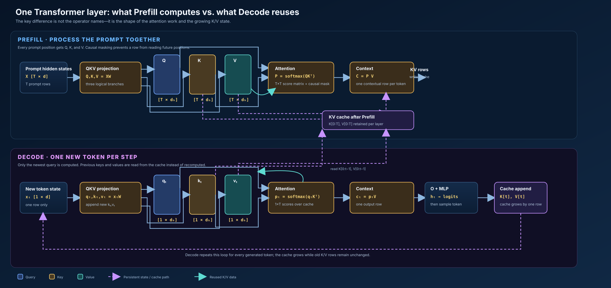

# Module 04 — Decode and KV Performance

**Status:** Visual foundation added

This module will treat one autoregressive decode iteration as the unit of work.
It will model weight reads, KV-cache growth and reads, context length, batch
size, memory bandwidth, launch overhead, and per-token latency.

The primary artifact will predict KV capacity and decode latency, then compare
early-context and late-context profiler captures.

## Visual model

The diagram is an original vector model of the same core ideas emphasized by
the reference explainer: Prefill computes prompt-wide attention and creates the
cache; Decode computes one new query, reads prior K/V rows, appends the new
K/V row, and repeats. See the [reference explainer](https://www.dailydoseofds.com/p/kv-caching-in-llms-explained-visually/)
for the motivating intuition; this repository's diagram adds explicit shapes,
cache state transitions, and the operation boundaries needed for performance
modeling.
