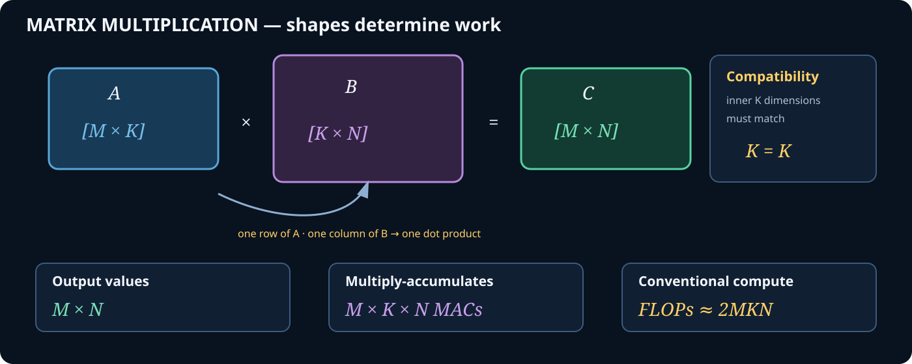
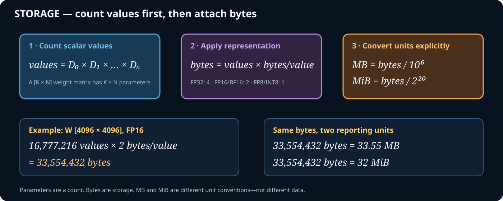
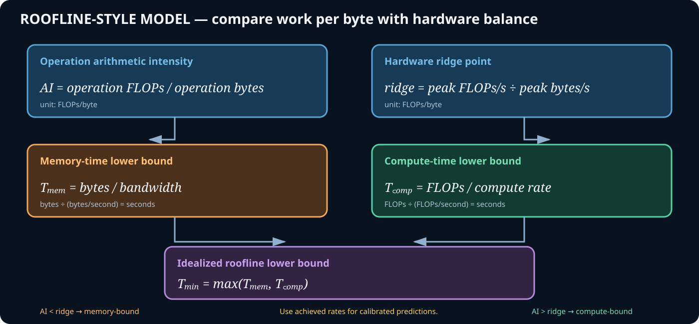
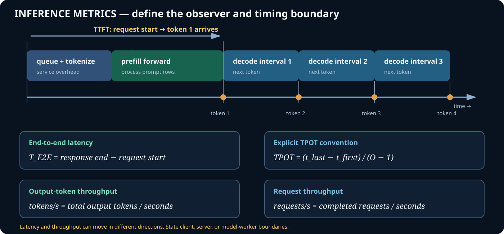
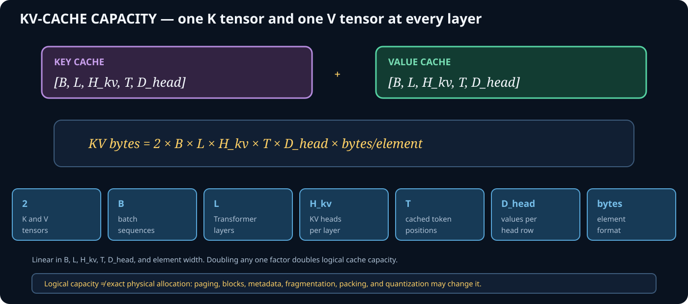

# Inference Performance Formula Reference

## How to Use This Page

This is a working reference, not a memorization list. For every equation:

1. draw or write the tensor shapes;
2. define the boundary being modeled;
3. state the units of every input;
4. calculate exact values before approximating;
5. compare the prediction with a measurement.

The cards are ordered in the same sequence used to build a performance model:

```text
shapes → work → bytes → arithmetic intensity → hardware time bounds
       → user-facing metrics → capacity
```

## 1. Matrix Shapes and Compute



For one dense matrix multiplication:

```text
A: [M × K]
B: [K × N]
C: [M × N]
```

The two `K` dimensions must match because each output value is a length-`K`
dot product. `M × N` is the number of output values.

| Symbol | Meaning in a Transformer projection |
| --- | --- |
| `M` | token rows processed together, often `batch × tokens` |
| `K` | input feature width |
| `N` | output feature width |
| `MAC` | one multiply-accumulate contribution |
| `FLOP` | one floating-point arithmetic operation |

The standard `2MKN` convention counts one multiplication and one addition per
contribution. A length-`K` dot product has exactly `K` multiplies and normally
`K−1` additions, but `2MKN` is the conventional large-matrix approximation.

## 2. Values, Parameters, and Storage



Parameter count and storage capacity answer different questions:

```text
parameter count = number of learned scalar values
storage bytes   = parameter count × bytes per stored value
```

Common element sizes:

| Format | Nominal bytes/value |
| --- | ---: |
| FP32 | 4 |
| FP16 | 2 |
| BF16 | 2 |
| FP8 | 1 |
| INT8 | 1 |
| INT4 | 0.5 before packing/metadata overhead |

Always distinguish decimal performance units from binary capacity units:

```text
MB  = 10⁶ bytes                 MiB = 2²⁰ bytes
GB  = 10⁹ bytes                 GiB = 2³⁰ bytes
```

Quantized formats may require scales, zero points, packing, and alignment, so
`values × bits/value` can understate actual stored bytes.

## 3. Data Movement, Arithmetic Intensity, and Roofline Bounds



For the simplified projection model used in Problems 01 and 02:

```text
total bytes = weight read + input read + output write
```

Do not automatically use this traffic equation for every kernel. A real
operation may reuse cache lines, reread values, allocate workspace, fuse output
consumers, or generate additional traffic.

| Comparison | Idealized classification |
| --- | --- |
| `AI < ridge point` | memory-bandwidth-bound |
| `AI > ridge point` | compute-bound |
| `AI ≈ ridge point` | both ceilings matter |

`max(T_compute, T_memory)` is a roofline lower bound because the model assumes
the two resource demands can overlap ideally. It is not necessarily measured
kernel time.

## 4. Inference Latency and Throughput Metrics



Every reported latency must include its start and end boundaries. Client-side
TTFT includes effects that a model-worker TTFT may exclude, such as networking,
queueing, and response transmission.

One explicit TPOT convention is:

```text
TPOT = (last-token arrival time − first-token arrival time)
       / (output tokens − 1)
```

The denominator is the number of post-first-token intervals, not total output
tokens. State the convention because systems and reports do not always define
TPOT identically.

## 5. KV-Cache Capacity



For a conventional cache with equal sequence length per batch item:

```text
KV bytes = 2 × B × L × H_kv × T × D_head × bytes_per_element
```

The factor `2` represents separate key and value tensors. This estimates logical
capacity. Allocator rounding, block metadata, paging, fragmentation, cache
quantization, and unequal sequence lengths can change physical allocation.

## 6. Prediction Error

Use signed error to preserve direction:

```text
signed error = measured − predicted
```

Use absolute percentage error to compare magnitude across differently sized
measurements:

```text
absolute percentage error = |measured − predicted| / measured × 100%
```

If the measured value is zero, percentage error is undefined. Never hide a
large error by reporting only an aggregate average.

## Unit Conversion Ladder

```text
seconds × 10³ = milliseconds
seconds × 10⁶ = microseconds
seconds × 10⁹ = nanoseconds

GFLOPs  = FLOPs / 10⁹
TFLOPs  = FLOPs / 10¹²
GB/s    = bytes per second / 10⁹
tokens/s = tokens / seconds
```

When dividing work by a rate, write the cancellation:

```text
FLOPs ÷ (FLOPs/second) = seconds
bytes ÷ (bytes/second) = seconds
```

## Common Mistakes

- Using incompatible matrix inner dimensions
- Counting `MKN` FLOPs instead of approximately `2MKN`
- Confusing parameters with bytes
- Mixing MB and MiB silently
- Multiplying shared weight traffic by token rows within one modeled call
- Comparing FLOPs directly with bytes instead of using FLOPs/byte
- Adding roofline compute and memory bounds when the stated model uses `max`
- Calling a peak hardware rate an achieved rate
- Confusing lower time per token with lower request latency
- Treating one projection as the complete Transformer layer
- Applying the KV capacity equation as if it were exact physical allocation

## Formula Provenance in This Curriculum

| Formula group | First applied in |
| --- | --- |
| Matrix work and weight storage | [Problem 01](../problems/01-transformer-projection-cost/problem.md) |
| Arithmetic intensity and roofline bounds | [Problem 02](../problems/02-decode-vs-prefill-roofline/problem.md) |
| TTFT, TPOT, E2E latency, throughput | [E2E Pipeline Lesson](../../../02-e2e-inference-pipeline/lessons/01-request-to-performance-equation/README.md) |
| KV-cache capacity | Decode and KV performance module, forthcoming |

