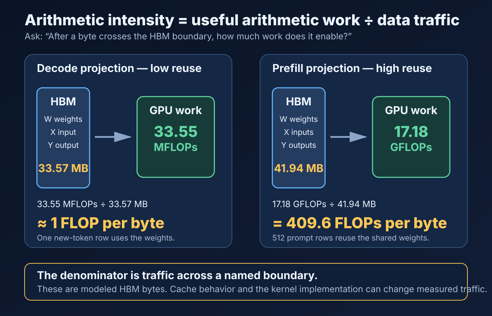
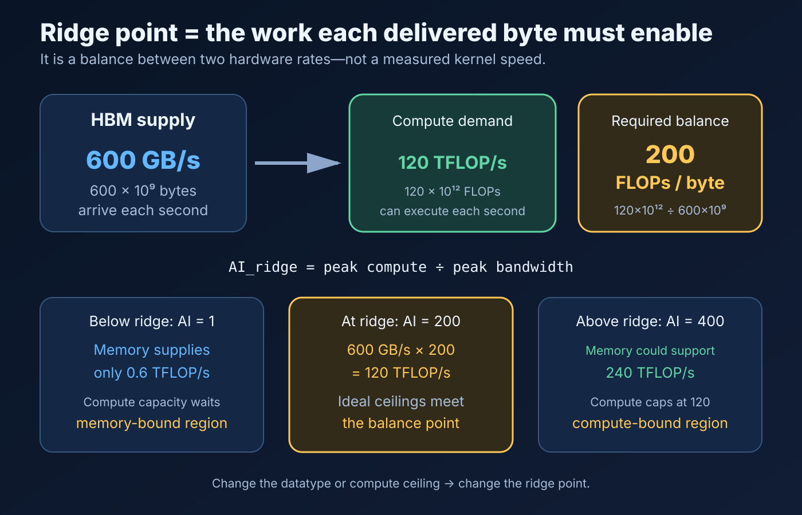
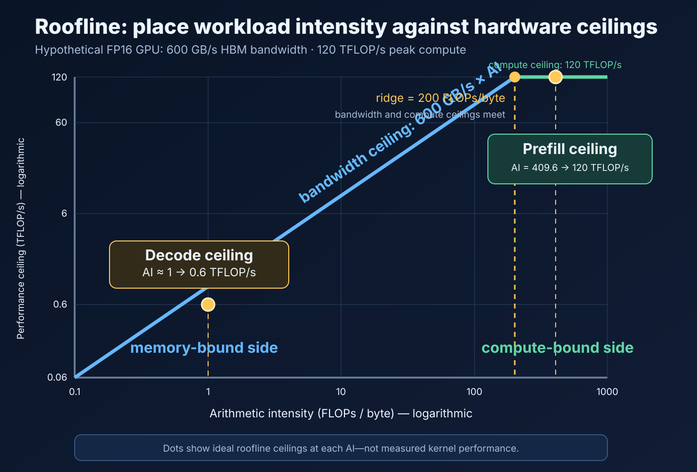

# Inference Performance Formula Reference

## How to Use This Page

This is a working reference, not a memorization list. For every equation:

1. draw or write the tensor shapes;
2. define the boundary being modeled;
3. state the units of every input;
4. calculate exact values before approximating;
5. compare the prediction with a measurement.

The cards are ordered in the same sequence used to build a performance model:

```text
shapes → work → bytes → arithmetic intensity → hardware time bounds
       → user-facing metrics → capacity
```

## 1. Matrix Shapes and Compute


For one dense matrix multiplication:

```text
A: [M × K]
B: [K × N]
C: [M × N]
```

The two `K` dimensions must match because each output value is a length-`K`
dot product. `M × N` is the number of output values.

| Symbol | Meaning in a Transformer projection |
| --- | --- |
| `M` | token rows processed together, often `batch × tokens` |
| `K` | input feature width |
| `N` | output feature width |
| `MAC` | one multiply-accumulate contribution |
| `FLOP` | one floating-point arithmetic operation |

The standard `2MKN` convention counts one multiplication and one addition per
contribution. A length-`K` dot product has exactly `K` multiplies and normally
`K−1` additions, but `2MKN` is the conventional large-matrix approximation.

## 2. Values, Parameters, and Storage


Parameter count and storage capacity answer different questions:

```text
parameter count = number of learned scalar values
storage bytes   = parameter count × bytes per stored value
```

Common element sizes:

| Format | Nominal bytes/value |
| --- | ---: |
| FP32 | 4 |
| FP16 | 2 |
| BF16 | 2 |
| FP8 | 1 |
| INT8 | 1 |
| INT4 | 0.5 before packing/metadata overhead |

Always distinguish decimal performance units from binary capacity units:

```text
MB  = 10⁶ bytes                 MiB = 2²⁰ bytes
GB  = 10⁹ bytes                 GiB = 2³⁰ bytes
```

Quantized formats may require scales, zero points, packing, and alignment, so
`values × bits/value` can understate actual stored bytes.

## 3. Data Movement, Arithmetic Intensity, and Roofline Bounds


### 3.1 Arithmetic intensity: work obtained from each byte moved

Arithmetic intensity answers a ratio question:

```text
                         floating-point work performed
arithmetic intensity = ---------------------------------
                         bytes crossing a chosen boundary

units: FLOPs / byte
```



Think of the denominator as a **byte budget**. If 1,000 bytes cross from HBM
into the GPU and the kernel performs 2,000 FLOPs, its HBM arithmetic intensity
is `2 FLOPs/byte`. If it performs 200,000 FLOPs from those same 1,000 bytes,
its intensity is `200 FLOPs/byte`. The second operation obtains much more
arithmetic work from every byte it paid to move.

Arithmetic intensity is **not speed**. It does not say how many seconds an
operation takes. It describes the relationship between its work and traffic.
Hardware rates are introduced later to turn those quantities into time bounds.

The boundary must always be named. For this curriculum, an unqualified
arithmetic intensity normally means traffic across the **HBM-to-chip boundary**:

```text
HBM arithmetic intensity = total FLOPs / bytes read from and written to HBM
```

The same kernel can have different intensity at HBM, L2, and L1 because the
amount of traffic crossing each boundary can differ. A value loaded once from
HBM might be served repeatedly from cache. Arithmetic intensity is therefore a
property of a **specified operation, implementation, and traffic boundary**—not
an immutable label attached to an algorithm.

For the simplified projection model used in Problems 01 and 02:

```text
total bytes = weight read + input read + output write
AI          = 2MKN / total bytes
```

Do not automatically use this traffic equation for every kernel. A real
operation may reuse cache lines, reread values, allocate workspace, fuse output
consumers, or generate additional traffic.

#### Why decode and prefill have different intensity

For `X[M, 4096] × W[4096, 4096]`, one modeled call reads the shared weight
matrix once. Increasing `M` increases the number of input token rows that use
those weights. Work rises rapidly while weight traffic stays fixed in this
simplified model:

| Mode | Token rows `M` | Work | Modeled traffic | HBM arithmetic intensity |
| --- | ---: | ---: | ---: | ---: |
| Decode | 1 | 33.55 MFLOPs | 33.57 MB | ≈ 1.00 FLOP/byte |
| Prefill | 512 | 17.18 GFLOPs | 41.94 MB | 409.6 FLOPs/byte |

This is the central reuse insight: decode makes little use of the weight matrix
before producing its one output row; a large prefill matrix multiplication can
reuse the same weights across many prompt rows. Real kernels and cache behavior
change the traffic, but the modeling idea remains useful.

### 3.2 Ridge point: the hardware's required work-per-byte balance

The roofline model gives an upper bound on attainable performance:

```text
attainable FLOP/s ≤ min(peak compute FLOP/s,
                        memory bandwidth byte/s × arithmetic intensity FLOP/byte)
```

The **ridge point** is where the memory-bandwidth ceiling meets the compute
ceiling:

```text
bandwidth × AI_ridge = peak compute

                       peak compute FLOP/s
AI_ridge = -------------------------------------------
                       memory bandwidth byte/s

units: (FLOP/s) / (byte/s) = FLOPs/byte
```



Suppose a hypothetical GPU can move `600 GB/s` from HBM and perform
`120 TFLOP/s` of FP16 compute:

```text
AI_ridge = 120 × 10¹² FLOP/s / 600 × 10⁹ byte/s
         = 200 FLOPs/byte
```

Interpret `200 FLOPs/byte` in plain language: at full HBM bandwidth, **each byte
delivered must enable 200 FLOPs of useful work for the compute pipelines to have
enough work to reach their stated peak**.

- At `1 FLOP/byte`, HBM can feed at most `600 GFLOP/s`, far below the
  `120 TFLOP/s` compute ceiling. More compute units do not fix the byte supply.
- At `200 FLOPs/byte`, the two ideal ceilings meet.
- At `400 FLOPs/byte`, bandwidth could theoretically support `240 TFLOP/s`, but
  the compute hardware caps performance at `120 TFLOP/s`.

This is why the ridge point is useful: it compares a workload ratio
(`FLOPs/byte`) with a hardware balance ratio (`peak FLOP/s per byte/s`).

### 3.3 Reading the roofline graph



Both axes are normally logarithmic. To read the graph:

1. Compute the operation's arithmetic intensity and locate it on the horizontal
   axis.
2. Move upward until reaching the lower of the sloped bandwidth line or the
   horizontal compute line.
3. That height is the ideal roofline performance ceiling for that intensity.
4. A measured point below the line shows headroom, but the roofline alone does
   not identify the cause of the gap.

For the hypothetical GPU above:

```text
decode:  AI ≈ 1.0     → bandwidth roof = 600 GB/s × 1 FLOP/byte
                        = 0.6 TFLOP/s                 (memory side)

prefill: AI = 409.6   → bandwidth roof = 245.76 TFLOP/s
                        min(245.76, 120) = 120 TFLOP/s (compute side)
```

The dots in the visual mark **ideal ceilings at those intensities**, not
measured performance. A real decode kernel might achieve less than 0.6 TFLOP/s,
and a real prefill kernel might achieve less than 120 TFLOP/s.

### 3.4 The equivalent time test

The same classification can be understood without a graph:

```text
T_compute = FLOPs / peak compute rate
T_memory  = bytes / peak memory bandwidth
roofline lower-bound time = max(T_compute, T_memory)
```

| Comparison | Idealized classification |
| --- | --- |
| `AI < ridge point` | `T_memory > T_compute`; memory-bandwidth-bound |
| `AI > ridge point` | `T_compute > T_memory`; compute-bound |
| `AI ≈ ridge point` | both ceilings matter |

`max(T_compute, T_memory)` is a roofline lower bound because the model assumes
the two resource demands can overlap ideally. It is not necessarily measured
kernel time.

### 3.5 What the ridge point does—and does not—tell you

The ridge point is reliable as an **idealized ratio derived from stated hardware
rates**. It is not a promise of application performance.

It helps you ask:

- Does this operation fundamentally need more data reuse or fewer bytes?
- Or is its intensity high enough that compute optimization is the more likely
  direction?
- Would batching or processing more prompt rows move the operation to the right?

It does **not** account by itself for kernel-launch overhead, tensor shapes,
occupancy, instruction mix, synchronization, cache misses, layout, fusion, or
whether the chosen kernel reaches either advertised peak. There is also no
single universal ridge point for a GPU: FP32, FP16 Tensor Core, FP8, and INT8
have different compute ceilings, so each produces a different ridge against the
same bandwidth.

For measured work, construct a more realistic roofline from the relevant
datatype and achieved or documented rates, then compare it with profiler data.
NVIDIA Nsight Compute can report hierarchical rooflines and measured workload
positions; its documentation uses the same sloped-bandwidth, flat-compute, and
ridge-point interpretation described here.

Ways to move an operation rightward include reusing data across more work,
batching, fusing kernels to avoid intermediate traffic, and storing fewer bytes
with a lower-precision representation. Each has tradeoffs: larger batches may
improve throughput while worsening queueing or per-request latency, and doing
extra FLOPs merely to inflate intensity is not an optimization.

## 4. Inference Latency and Throughput Metrics


Every reported latency must include its start and end boundaries. Client-side
TTFT includes effects that a model-worker TTFT may exclude, such as networking,
queueing, and response transmission.

One explicit TPOT convention is:

```text
TPOT = (last-token arrival time − first-token arrival time)
       / (output tokens − 1)
```

The denominator is the number of post-first-token intervals, not total output
tokens. State the convention because systems and reports do not always define
TPOT identically.

## 5. KV-Cache Capacity


For a conventional cache with equal sequence length per batch item:

```text
KV bytes = 2 × B × L × H_kv × T × D_head × bytes_per_element
```

The factor `2` represents separate key and value tensors. This estimates logical
capacity. Allocator rounding, block metadata, paging, fragmentation, cache
quantization, and unequal sequence lengths can change physical allocation.

## 6. Prediction Error

Use signed error to preserve direction:

```text
signed error = measured − predicted
```

Use absolute percentage error to compare magnitude across differently sized
measurements:

```text
absolute percentage error = |measured − predicted| / measured × 100%
```

If the measured value is zero, percentage error is undefined. Never hide a
large error by reporting only an aggregate average.

## Unit Conversion Ladder

```text
seconds × 10³ = milliseconds
seconds × 10⁶ = microseconds
seconds × 10⁹ = nanoseconds

GFLOPs  = FLOPs / 10⁹
TFLOPs  = FLOPs / 10¹²
GB/s    = bytes per second / 10⁹
tokens/s = tokens / seconds
```

When dividing work by a rate, write the cancellation:

```text
FLOPs ÷ (FLOPs/second) = seconds
bytes ÷ (bytes/second) = seconds
```

## Common Mistakes

- Using incompatible matrix inner dimensions
- Counting `MKN` FLOPs instead of approximately `2MKN`
- Confusing parameters with bytes
- Mixing MB and MiB silently
- Multiplying shared weight traffic by token rows within one modeled call
- Comparing FLOPs directly with bytes instead of using FLOPs/byte
- Adding roofline compute and memory bounds when the stated model uses `max`
- Calling a peak hardware rate an achieved rate
- Confusing lower time per token with lower request latency
- Treating one projection as the complete Transformer layer
- Applying the KV capacity equation as if it were exact physical allocation

## Formula Provenance in This Curriculum

| Formula group | First applied in |
| --- | --- |
| Matrix work and weight storage | [Problem 01](../problems/01-transformer-projection-cost/problem.md) |
| Arithmetic intensity and roofline bounds | [Problem 02](../problems/02-decode-vs-prefill-roofline/problem.md) |
| TTFT, TPOT, E2E latency, throughput | [E2E Pipeline Lesson](../../../02-e2e-inference-pipeline/lessons/01-request-to-performance-equation/README.md) |
| KV-cache capacity | Decode and KV performance module, forthcoming |

## Further Reading

- [NVIDIA Nsight Compute: Roofline Charts](https://docs.nvidia.com/nsight-compute/ProfilingGuide/index.html#roofline-charts)
- [NVIDIA: Roofline Analysis with Nsight Compute](https://developer.nvidia.com/blog/accelerating-hpc-applications-with-nsight-compute-roofline-analysis/)
