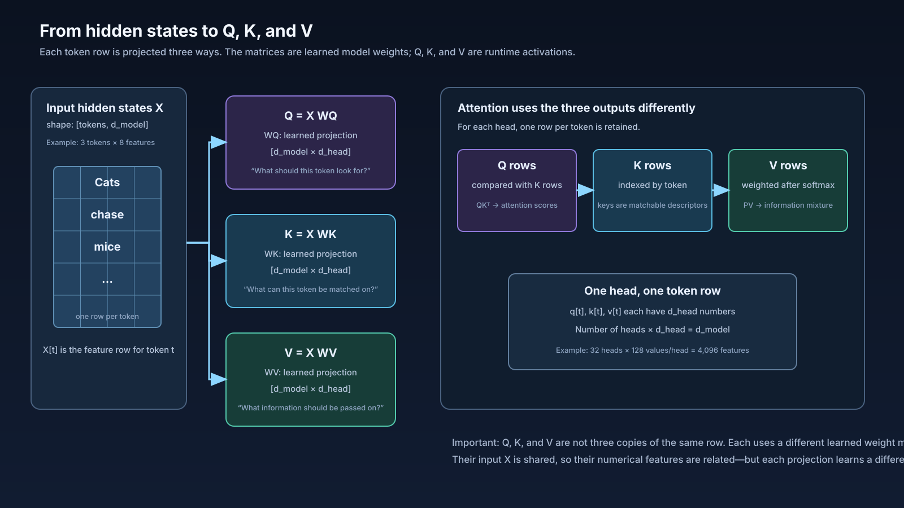
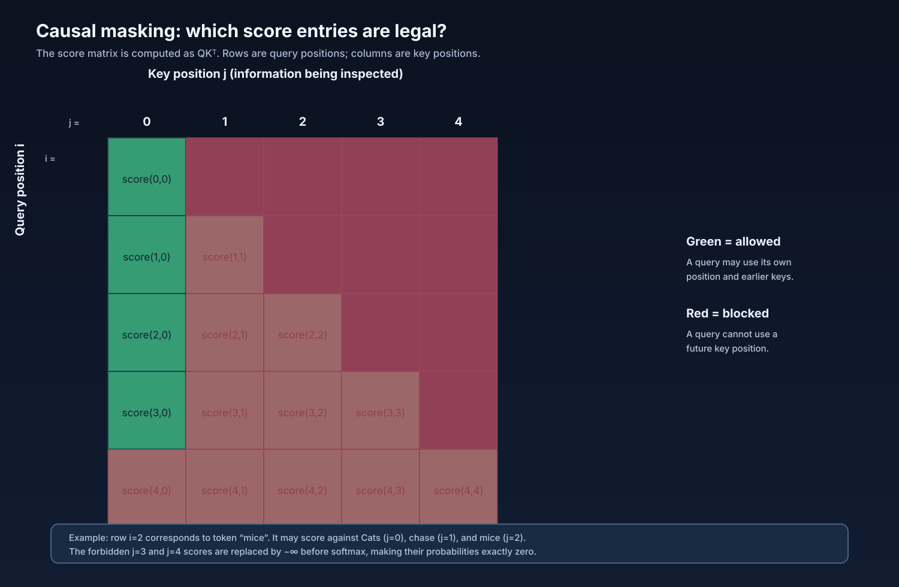
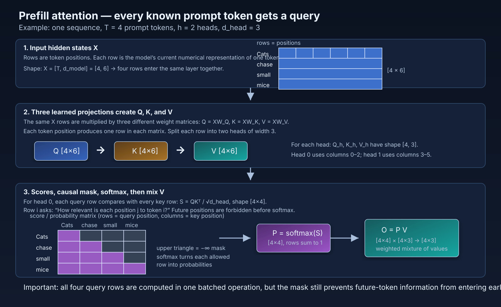
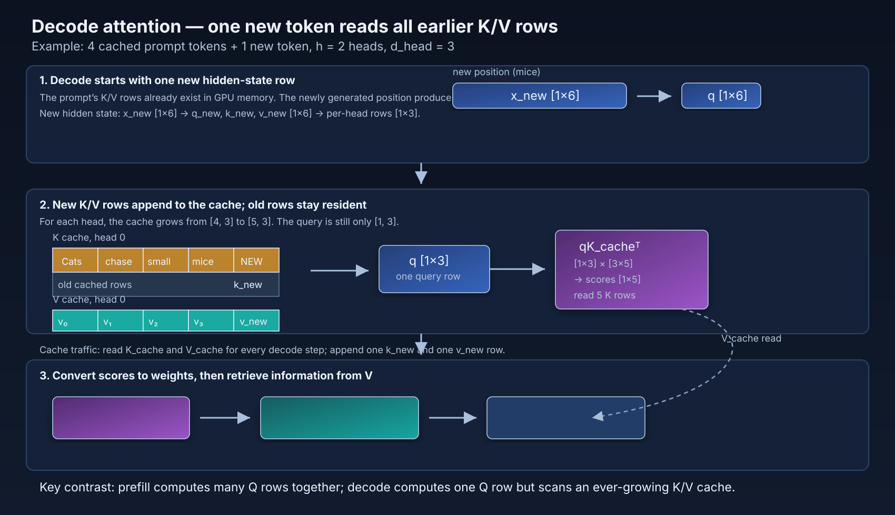
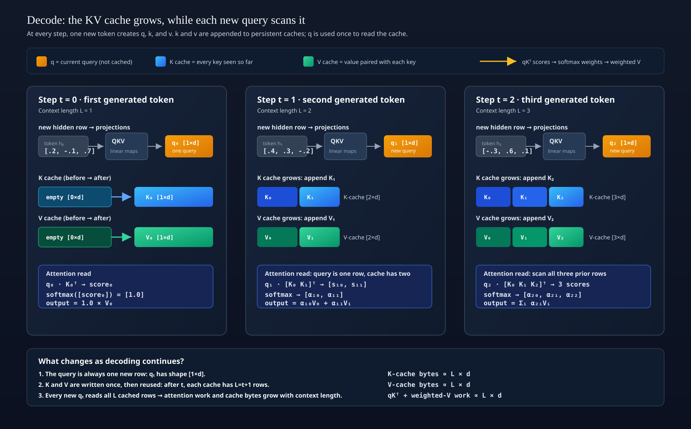

# Problem 04 — What does attention and the KV cache cost?

## Why this problem matters

Problem 03 stopped after the model created `Q`, `K`, and `V`. This problem
models the operations that consume those tensors. It is the first problem that
separates **prefill** from **decode** and makes the growing KV cache part of a
performance equation.

The goal is not to reproduce every detail of a production kernel. The goal is
to learn how an inference performance engineer turns an attention operation
into tensor shapes, arithmetic, memory traffic, and predicted time.

## Background: what attention does

For one attention head, each token has three learned representations:

- **Query (`Q`)**: what this token is looking for.
- **Key (`K`)**: what each available token can be matched on.
- **Value (`V`)**: the information that will be retrieved if a key matches.

The query is compared with every allowed key using a dot product. Those scores
are scaled and converted into weights by softmax. The weights then form a
weighted sum of the corresponding values:

```text
scores = Q Kᵀ / √D
probabilities = softmax(scores + causal_mask)
context = probabilities V
```

The causal mask is conceptually important for language generation: token `t`
may use itself and earlier tokens, but not future prompt positions. In a
straightforward implementation the score matrix still has a rectangular
storage shape; masked entries are assigned a very negative value before
softmax so their probability becomes effectively zero.

## Visual guide: follow the data before doing arithmetic

The diagrams below are part of the problem. Read them from left to right and
say out loud what each arrow carries. The boxes are numerical tensors; the
words are labels that help us remember what those numbers mean.

### 1. How hidden states become Q, K, and V



Each token starts with a hidden-state row. Three learned projections transform
that row into a query row, a key row, and a value row. The output can be
reshaped from `[d_model]` into `[H, D]`; here, `[4096] → [32 heads, 128
values/head]`. Q, K, and V are not three copies of the input: each uses a
different learned weight matrix and encodes a different role.

### 2. How a causal mask blocks future information



Rows represent query positions and columns represent key positions. A green
cell is an allowed comparison; a red cell is a future position that must be
blocked. For example, query position 2 may use keys at positions 0, 1, and 2,
but not positions 3 or 4. The mask changes which scores participate in
softmax; it does not automatically make a dense matrix-multiplication kernel
skip those arithmetic locations.

### 3. Prefill: all prompt rows are processed together



Prefill creates Q, K, and V for every prompt token. For one head, `QKᵀ` turns
`[T × D]` and `[D × T]` into a `[T × T]` score matrix. Softmax turns each row
into weights, and multiplying by V produces one contextual `[D]` row per
prompt token. The K and V rows are retained in the cache when this layer is
finished.

### 4. Decode: one new query reads the existing cache



Decode creates only `q_t`, `k_t`, and `v_t` for the newest token. The new query
is compared with all cached keys, producing `[1 × T]` scores for one head. The
softmax weights then select a weighted combination of the cached values. The
new key and value are appended after the attention step so the next generated
token can use them.

### 5. Why decode traffic grows with context length



At every decode step, the query remains one row, but the K/V cache gains one
row. Consequently, the score vector and value lookup become longer as the
conversation grows. This is why decode latency and cache-read traffic often
increase with context length even though only one token is generated at a
time.

## Background: what an attention head is

The model hidden width is divided into logical heads. With 32 heads and 128
values per head:

```text
32 heads × 128 values/head = 4096 values = d_model
```

Thus a Q, K, or V tensor can be viewed as `[tokens, 32, 128]`. Heads are not
physical GPU units. They are independent slices that let the model perform
several smaller attention calculations in parallel and then concatenate their
context rows.

## Background: prefill versus decode

### Prefill

Prefill processes all `T` prompt tokens together. Every prompt position gets a
query, key, and value row. For each head, the score matrix is `[T × T]`: every
row of queries is compared with all prompt keys (subject to the causal mask).
The resulting keys and values are written into the KV cache for later decode
steps.

### Decode

Decode processes one newly generated token at a time. The new token produces
only one query row, one key row, and one value row. The query is compared with
all keys already stored in the cache. For one head, the score vector is
`[1 × T]`, not `[T × T]`. The new key and value are appended to the cache.

The cache stores numerical K/V rows for every transformer layer, position, and
KV head. It does not store words, logits, or model weights.

## Model setup

Use the following intentionally simplified model:

```text
number of layers L = 32
model width d_model = 4096
attention heads H = 32
head dimension D = 128
prompt/cache length T = 512
FP16 = 2 bytes/value
peak compute = 120 TFLOP/s
peak HBM bandwidth = 600 GB/s
```

Assume standard multi-head attention (`H_kv = H`). Ignore the QKV projection,
output projection, MLP, layer normalization, kernel-launch overhead, and CPU
work. They will be added in later problems. Model one layer first, then
multiply layer-local quantities by `L` where requested.

## Shapes to use

### Prefill shapes

```text
Q, K, V       = [H, T, D] = [32, 512, 128]
QKᵀ scores    = [H, T, T] = [32, 512, 512]
softmax output= [H, T, T]
context       = [H, T, D] = [32, 512, 128]
```

The multiplication for one head is:

```text
[T × D] × [D × T] → [T × T]       (QKᵀ)
[T × T] × [T × D] → [T × D]       (probabilities × V)
```

### Decode shapes

At the decode step immediately after 512 positions are already cached:

```text
q_t           = [H, 1, D] = [32, 1, 128]
K_cache       = [H, T, D] = [32, 512, 128]
V_cache       = [H, T, D] = [32, 512, 128]
q_t K_cacheᵀ  = [H, 1, T] = [32, 1, 512]
context_t     = [H, 1, D] = [32, 1, 128]
```

For one head:

```text
[1 × D] × [D × T] → [1 × T]
[1 × T] × [T × D] → [1 × D]
```

## Traffic-model assumptions

Use this **materialized attention** model so the accounting is unambiguous.
Count only the tensors listed below; do not count weights or framework traffic.

### Prefill, per layer

```text
Read Q, K, V once.
Write the score matrix once and the softmax/probability matrix once.
Read the probability matrix and V for the value-mixing operation.
Write the context output once.
Write K and V to the KV cache once.
```

### Decode, per layer and token

```text
Read q_t once.
Read the existing K and V cache.
Write the score vector and probability vector once each.
Read the probability vector and V cache for value mixing.
Write the context row once.
Append the new k_t and v_t rows to the cache.
```

This is deliberately conservative and resembles a simple implementation that
materializes intermediate tensors. Production kernels such as FlashAttention
may fuse operations and avoid writing the full score/probability matrices to
HBM. Later, compare this model with a fused-kernel traffic model.

## Arithmetic assumptions

For a matrix multiplication `[M × K] [K × N]`, use:

```text
2MKN FLOPs
```

For softmax, use the approximation of **5 scalar operations per score**. State
that this is an estimate, not a hardware-instruction count.

## Tasks

For both **prefill** and **decode**, calculate the following for one layer:

1. Write every tensor shape and explain what each dimension means.
2. Count the QKᵀ FLOPs.
3. Count the probabilities×V FLOPs.
4. Estimate softmax FLOPs using 5 operations per score.
5. Calculate total attention FLOPs.
6. Calculate bytes read and written under the traffic assumptions above.
7. Calculate total modeled HBM traffic in bytes, MB, and MiB.
8. Calculate arithmetic intensity in FLOPs/byte.
9. Calculate ideal compute time and memory time using 120 TFLOP/s and 600 GB/s.
10. Use `max(compute_time, memory_time)` as the roofline lower bound.
11. Classify the one-layer operation as compute-bound or memory-bandwidth-bound.
12. Multiply the per-layer FLOPs, traffic, and roofline bound by 32 layers.
13. For decode, repeat the calculation when the cache length grows from 512 to
    2048. Identify which terms grow with `T`.

## Required comparison table

| Quantity | Prefill, T=512 | Decode, T=512 | Decode, T=2048 | Unit |
| --- | ---: | ---: | ---: | --- |
| QKᵀ FLOPs, one layer | | | | FLOPs |
| probabilities×V FLOPs, one layer | | | | FLOPs |
| Softmax estimate, one layer | | | | FLOPs |
| Total attention FLOPs, one layer | | | | FLOPs |
| Bytes read, one layer | | | | bytes |
| Bytes written, one layer | | | | bytes |
| Total traffic, one layer | | | | bytes |
| Arithmetic intensity | | | | FLOPs/byte |
| Compute time | | | | µs |
| Memory time | | | | µs |
| Roofline lower bound | | | | µs |
| Bottleneck | | | | — |

## Reasoning questions

1. Why does prefill have a `[T × T]` score matrix while decode has a `[1 × T]`
   score vector?
2. Why can many prefill rows be organized into large parallel matrix
   operations, even though the causal mask prevents future-token information
   from being used?
3. Why does decode repeatedly read old K/V rows but not recompute their
   projections?
4. Which cache terms are linear in sequence length, and which are constant per
   generated token?
5. Why does a causal mask restrict information flow but not necessarily reduce
   the FLOPs of a dense GEMM implementation?
6. How could tiling or FlashAttention reduce HBM traffic without changing the
   mathematical result?
7. Why is this still not a complete end-to-end inference model?

## Modeling boundary

This problem models attention arithmetic and a transparent, materialized
memory-traffic approximation. It does **not** model QKV projections, the
attention output projection, MLP layers, normalization, logits, sampling,
request scheduling, batching, GPU occupancy, or kernel launch latency. Record
those exclusions in your solution; a performance model is only meaningful when
its boundary and assumptions are explicit.
