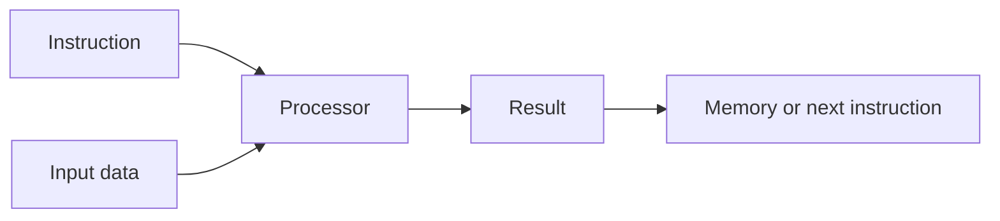
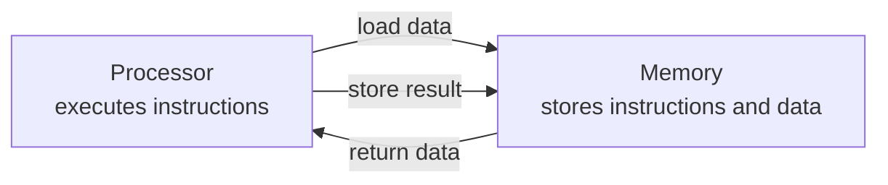
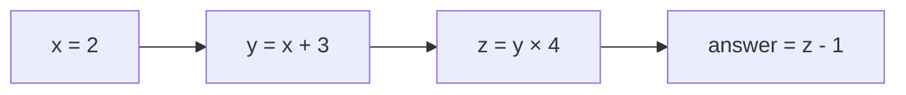
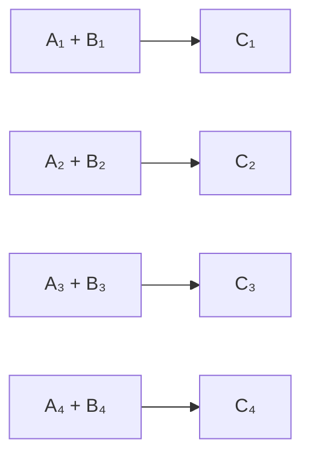
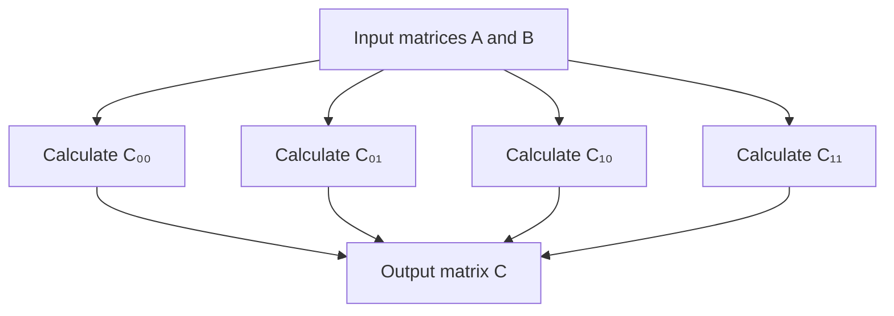

# Lesson 01 — Computing and Parallelism Foundations

## Why This Lesson Comes First

A GPU is not simply a faster CPU. It is a different design tradeoff. To
understand that tradeoff, we first need a small vocabulary for programs,
instructions, data, processors, memory, latency, throughput, and parallel work.

No programming or computer-architecture background is assumed.

## 1. What a Computer Does

At the simplest useful level, a computer repeatedly:

1. Obtains an instruction.
2. Obtains the data required by that instruction.
3. Performs the instruction.
4. Stores or forwards the result.



An **instruction** is a small operation understood by a processor: add two
numbers, compare two values, load data from memory, or store a result. A
**program** is an organized sequence of instructions. **Data** is the
information those instructions operate on.

Consider adding two lists:

```text
A = [2, 4, 6, 8]
B = [1, 3, 5, 7]
C = [3, 7, 11, 15]
```

Conceptually, the computer performs four independent additions. Independence
is important: calculating `C[0]` does not require the result of `C[1]`.

## 2. Processor and Memory

The **processor** performs instructions. **Memory** retains instructions and
data. They are separate jobs.



This separation creates a recurring performance problem: arithmetic units can
only work when their required data has arrived. A processor with enormous
arithmetic ability can still sit idle while waiting for memory.

## 3. Latency and Throughput

These terms describe different aspects of speed.

- **Latency** is the time required for one unit of work to finish.
- **Throughput** is the amount of work completed per unit time.

Imagine a ferry:

- One crossing takes 20 minutes: that is crossing latency.
- The ferry carries 100 cars per crossing: that contributes to throughput.
- A speedboat may cross in 10 minutes but carry only 4 people.

The analogy is imperfect, but it shows why lower latency does not always imply
higher throughput.

```text
                 Latency for one trip     Capacity per trip
Speedboat              10 min                   4 people
Ferry                   20 min                 100 cars
```

A CPU core is designed to finish a complicated instruction stream with low
latency. A GPU is designed to keep a very large amount of parallel work moving,
producing high aggregate throughput.

## 4. Sequential and Parallel Work

### Sequential dependency

Some steps depend on earlier results:

```text
x = 2
y = x + 3       # requires x
z = y * 4       # requires y
answer = z - 1  # requires z
```



These operations form a dependency chain. Simply adding more processors cannot
make every step happen simultaneously.

### Independent parallel work

Other operations can proceed independently:



If four execution resources are available, these additions can potentially run
at the same time. This is **data parallelism**: apply similar operations to
different pieces of data.

### Parallelism is available work, not guaranteed speed

A task may contain one million independent operations, but performance still
depends on:

- The cost of preparing and scheduling the work
- How quickly inputs reach the processor
- Whether the operations match available hardware
- Whether enough work exists to keep the hardware occupied
- How results must be combined afterward

## 5. Why CPUs Look the Way They Do

A modern CPU contains a modest number of sophisticated cores. Each core is
designed to handle changing control flow, operating-system work, application
logic, and workloads where the next action may depend heavily on the previous
one.

CPU designs devote substantial hardware to capabilities such as:

- Large caches that reduce average memory delay
- Branch prediction that guesses which path code will take
- Out-of-order execution that finds independent instructions dynamically
- Powerful individual cores optimized for low-latency progress

Simplified conceptual allocation:

```text
CPU die
┌─────────────────────────────────────────┐
│ Complex core │ Complex core │ Caches    │
│ Complex core │ Complex core │ Control   │
│ Branch prediction and scheduling logic │
└─────────────────────────────────────────┘
```

This is not a literal floor plan. It illustrates the design priority: make a
small number of instruction streams progress quickly and flexibly.

CPUs are excellent for:

- Operating systems
- Web-server request routing
- Parsing and tokenization
- Complicated branching logic
- Small computations without enough work to occupy a GPU
- Coordinating other devices

## 6. Why GPUs Look the Way They Do

A GPU devotes much more of its design to parallel arithmetic throughput. It
contains many Streaming Multiprocessors, which collectively manage a very large
number of threads and arithmetic operations.

```text
GPU die — conceptual, not to scale
┌─────────────────────────────────────────────────────┐
│ SM │ SM │ SM │ SM │ SM │ SM │ SM │ SM │ ...      │
│                                                     │
│          Shared L2 cache and interconnect           │
│                                                     │
│              Memory controllers                     │
└─────────────────────────────────────────────────────┘
```

GPUs make a deliberate trade:

- Less emphasis on making one arbitrary thread finish as quickly as possible
- More emphasis on keeping many threads and arithmetic pipelines busy

They are especially useful when the same broad operation must be applied to
many elements, as in graphics, simulation, and neural-network tensor
operations.

## 7. A Matrix Multiplication Example

A matrix is a rectangular grid of numbers. Multiplying matrices produces many
output values. Each output is formed from a row of the first matrix and a
column of the second.

```text
          B                    C
      ┌ 5  6 ┐             ┌ ?  ? ┐
A  =  │      │      A×B =  │      │
┌1 2┐ └ 7  8 ┘             └ ?  ? ┘
└3 4┘

C₀₀ = (1×5) + (2×7) = 19
C₀₁ = (1×6) + (2×8) = 22
C₁₀ = (3×5) + (4×7) = 43
C₁₁ = (3×6) + (4×8) = 50
```

The four output cells can be calculated independently once the input matrices
are available.



Real transformer matrices may contain millions or billions of values. That
creates a large supply of parallel arithmetic work.

## 8. Why Transformers Contain GPU-Friendly Work

During inference, a transformer repeatedly performs operations on tensors.
A **tensor** is a multidimensional collection of numbers together with a shape
and data type.

Examples:

```text
Scalar: 7                         shape: []
Vector: [2, 4, 6]                 shape: [3]
Matrix: [[1, 2], [3, 4]]          shape: [2, 2]
Token-state tensor                shape: [batch, tokens, hidden_size]
```

Transformer layers contain large linear transformations, attention operations,
normalization, and elementwise operations. The large linear transformations
reduce to matrix multiplication and related operations, exposing substantial
parallelism.


The CPU still matters. It may tokenize input, run Python, schedule work, launch
GPU operations, and serve network requests. GPU acceleration is cooperation
between host and device, not total replacement of the CPU.

## 9. Prefill and Decode: An Early Preview

You will study these deeply in Module 03, but they help explain GPU use.

### Prefill

The model processes the prompt's tokens and creates internal state, including
the KV cache. Many prompt-token calculations can be organized into large
parallel operations.

```text
Prompt: [token₁ token₂ token₃ ... tokenₙ]
                 │
                 ▼
        large tensor operations
                 │
                 ▼
        first next-token logits + cache
```

### Decode

The model selects a token, appends it, and repeats. One request usually advances
one new token per decode iteration.


Decode still uses large model matrices, but batch-one decode provides less
parallel work across tokens and repeatedly needs model weights. This is one
reason prefill and decode can have different bottlenecks.

## 10. When a GPU May Not Help

A GPU may be a poor choice when:

- The workload is tiny
- Operations are strongly sequential
- The program branches unpredictably
- Transferring data costs more than computing it
- The operation lacks an efficient GPU implementation
- The GPU cannot hold the required data

Worked thought experiment:

```text
CPU calculation:                  20 microseconds
Copy input to GPU:               100 microseconds
Launch and run GPU work:          10 microseconds
Copy result back:                100 microseconds
Total GPU path:                  210 microseconds
```

The GPU arithmetic was faster, but the complete path was slower. Performance
engineering measures the whole relevant boundary.

## 11. Common Misconceptions

### “A GPU has more cores, so it is always faster.”

Core labels are not directly comparable across CPU and GPU architectures.
Speed depends on workload shape, data movement, implementation, and the metric
being optimized.

### “Parallel means every operation happens simultaneously.”

Hardware has finite resources. Parallel work is scheduled in waves, and
dependencies still impose order.

### “The GPU runs the entire Python program.”

Ordinary Python runs on the CPU. Framework code asks CUDA libraries and the
driver to schedule specific operations on the GPU.

### “High throughput means every request has low latency.”

Batching can increase total work completed per second while making an
individual request wait longer.

## Vocabulary

- **Instruction:** a primitive operation understood by a processor
- **Program:** an organized sequence of instructions
- **Processor:** hardware that executes instructions
- **Memory:** hardware that retains data and instructions
- **Latency:** time for one unit of work to finish
- **Throughput:** work completed per unit time
- **Dependency:** a requirement for an earlier result
- **Parallelism:** work that can progress concurrently
- **Tensor:** a shaped multidimensional collection of values
- **Host:** the CPU and its system environment in CUDA terminology
- **Device:** the GPU in CUDA terminology

## Knowledge Check

Answer without copying sentences from the lesson:

1. What separate jobs do a processor and memory perform?
2. Give your own example of latency versus throughput.
3. Why can the four output cells in the 2×2 matrix example be computed in
   parallel?
4. What makes part of a workload inherently sequential?
5. What broad design tradeoff distinguishes CPUs from GPUs?
6. Why do transformer linear layers provide useful GPU work?
7. Name three costs that can offset faster GPU arithmetic.
8. Why does the CPU remain involved in GPU inference?
9. At a high level, why might prefill expose more parallel work than
   single-request decode?
10. Explain why “more cores” is not enough evidence that one processor will run
    a workload faster.

## Ready to Continue When

You can explain, without notes, why a GPU is a high-throughput parallel
processor rather than a universally faster CPU.
