# Lesson 01 — Computing and Parallelism Foundations

> **Current instruction:** Finish this reading and complete lab Stations 1–4.
> Stop there. Do not begin attention until you pass the
> [foundation readiness gate](../../CURRENT-STUDY-PLAN.md#readiness-gate-for-attention).

**Lesson lab:** After reading and completing the checkpoints, use Stations 1–4
of the [interactive visual lab](lab/README.md). Stations 5–6 wait until Lesson
02 teaches transformer attention and generation; Station 7 waits until Lesson
03 connects transformer operations to end-to-end GPU cost.

**Estimated study time:** 4–5 hours across multiple sittings

**Prerequisites:** None

## Chapter Purpose

A GPU is not simply a faster CPU. A CPU and a GPU are processors designed with
different priorities. Understanding those priorities requires a foundation in
how programs become executable work, how processors obtain data, which
operations must occur in order, which operations may occur concurrently, and
how latency differs from throughput.

This chapter assumes no programming, computer-architecture, linear-algebra, or
machine-learning background. It deliberately explains ideas that experienced
engineers may take for granted.

## Learning Objectives

By the end of this chapter, you should be able to:

1. Distinguish source code, a program, an instruction, and data.
2. Describe a simplified fetch → decode → execute cycle.
3. Trace a list-addition operation through loads, arithmetic, and stores.
4. Distinguish dependency order from the order selected by an implementation.
5. Distinguish latency, throughput, capacity, concurrency, and parallelism.
6. Explain the broad design priorities of CPUs and GPUs.
7. Work through a small matrix multiplication and identify both its dependent
   and independent operations.
8. Explain why transformer inference creates useful GPU work.
9. Explain at a high level why prefill and decode expose different amounts and
   shapes of parallel work.
10. Identify situations in which using a GPU can make a complete workload
    slower rather than faster.

---

## 1. From a Human Idea to Processor Work

### 1.1 A computer transforms information

At a very high level, computing means transforming input information into
output information according to a defined procedure.

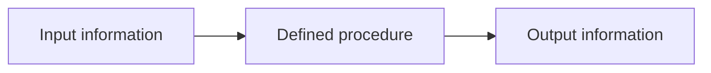

Examples:

| Input | Procedure | Output |
| --- | --- | --- |
| Two numbers | Add them | Their sum |
| Image pixels | Resize algorithm | Smaller image |
| Prompt tokens | Transformer inference | Next-token scores |
| Network request | Request handler | HTTP response |

The **procedure** is what a program describes. The processor performs the
low-level operations needed to carry it out.

### 1.2 Source code is written for humans and software tools

Suppose a programmer writes:

```python
total = left + right
```

This is **source code**. It communicates an intention using the rules of the
Python language. A physical processor does not directly understand the words
`total`, `left`, or `right`. Other software must translate or interpret that
intent and eventually arrange operations the processor understands.

The complete route varies by language and runtime. A simplified picture is:

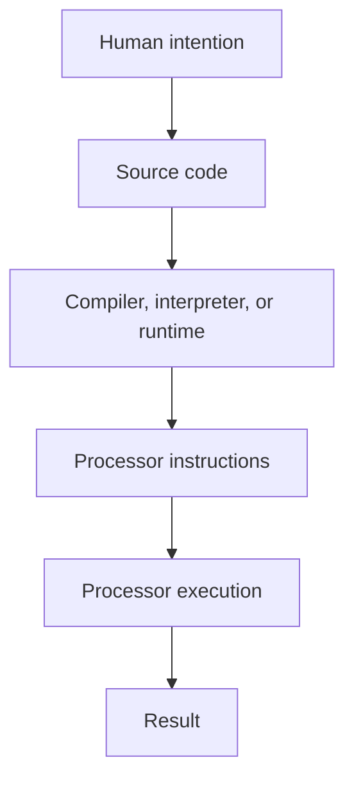

Python often involves an interpreter and compiled native libraries. PyTorch
adds further dispatch and library layers. Lesson 08 explains that software
stack in detail. For this chapter, the important distinction is:

> A source-code statement expresses what should happen. Processor instructions
> are the much smaller operations used to make it happen.

### 1.3 What is an instruction?

An **instruction** is an encoded operation a particular processor architecture
defines. Typical instruction categories include:

- **Load:** copy data from memory into storage close to the processor.
- **Store:** copy a result from processor-local storage into memory.
- **Arithmetic:** add, subtract, multiply, or divide values.
- **Logical:** combine or test bit patterns.
- **Compare:** determine relationships such as equal, less than, or greater
  than.
- **Branch or jump:** select a different next instruction.

One source statement can require several instructions. The exact instructions
depend on language implementation, processor architecture, optimization, data
type, and surrounding code.

Conceptually, `total = left + right` might require:

```text
1. LOAD  the value of left  into a processor register.
2. LOAD  the value of right into another register.
3. ADD   the two register values.
4. STORE the sum in the memory location associated with total.
```

This is a teaching model, not literal Python machine code. Python objects and
runtime behavior add more steps. The model isolates the essential movement and
arithmetic.

### 1.4 What is data?

**Data** is the encoded information instructions read or modify. It includes:

- Numbers
- Characters and text
- Memory addresses
- Images and audio samples
- Tensor values
- Model weights
- Instructions themselves

Everything is represented as bits in hardware. A data type tells software how
to interpret a bit pattern—for example, as an integer or floating-point value.

The same operation name can behave differently for different data types. Adding
two integers, two floating-point values, and two Python strings are different
operations even though source code may use `+` for each.

### 1.5 What is a program?

A **program** is more than a loose list of instructions. It is an organized
description of:

- Which operations should be performed
- Which data they use
- Which results become inputs to later operations
- Which decisions alter the path
- When repetition stops

The order of a program is constrained by **dependencies**. If operation B needs
the result of operation A, B cannot correctly finish before A produces that
result.


The arrows mean “must happen before because the later step needs the earlier
result.”

### 1.6 A simplified instruction cycle

A traditional introductory model says a processor repeatedly:

1. **Fetches** the next instruction.
2. **Decodes** what the instruction requests.
3. **Obtains operands**, such as register values or data loaded from memory.
4. **Executes** the requested operation.
5. **Writes back** or stores the result.
6. Selects the next instruction and repeats.


Real CPUs overlap, reorder, and pipeline parts of this process. Real GPUs issue
instructions across groups of threads. The cycle remains a useful conceptual
starting point because every arithmetic result still requires an operation and
available input data.

### 1.7 Complete worked example: adding two lists

Consider elementwise list addition:

```text
Input A = [2, 4, 6, 8]
Input B = [1, 3, 5, 7]
Output C should become [3, 7, 11, 15]
```

The intended rule is:

```text
C[i] = A[i] + B[i]
```

Here, `i` is an **index** identifying one position. The output list `C` is not
known in advance; the computer must calculate and store it.

#### One possible sequential implementation

```text
for i from 0 through 3:
    C[i] = A[i] + B[i]
```

For `i = 0`, a simplified execution story is:

```text
1. Determine where A[0] is stored.
2. Load A[0], which is 2.
3. Determine where B[0] is stored.
4. Load B[0], which is 1.
5. Add 2 + 1 to produce 3.
6. Determine where C[0] should be stored.
7. Store 3 in C[0].
8. Advance i from 0 to 1.
9. Check whether another iteration is required.
```

The processor then performs the equivalent work for `i = 1`, `i = 2`, and
`i = 3`.

```text
Iteration 0: load 2, load 1, add →  3, store C[0]
Iteration 1: load 4, load 3, add →  7, store C[1]
Iteration 2: load 6, load 5, add → 11, store C[2]
Iteration 3: load 8, load 7, add → 15, store C[3]
```

Within one iteration, some order is necessary:

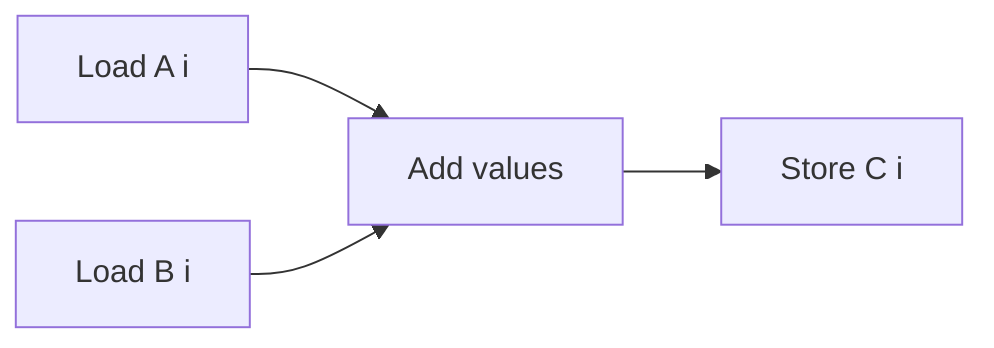

The addition needs both input values. The store needs the sum. Therefore the
store cannot correctly occur before the addition.

#### Why the four additions are independent

Now compare the four iterations:

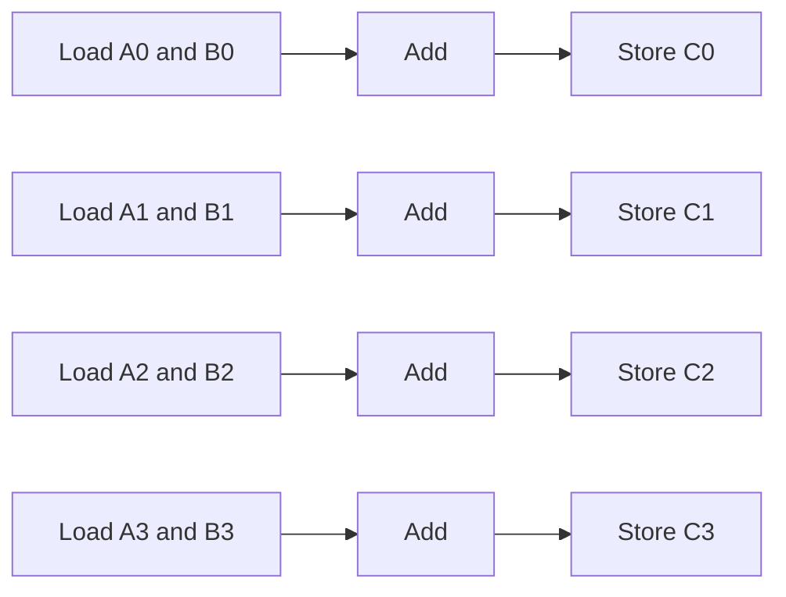

There are dependencies **within** each row, but no result arrow between rows:

- Computing `C[0]` requires `A[0]` and `B[0]`.
- Computing `C[1]` requires `A[1]` and `B[1]`.
- `C[1]` does not require the value of `C[0]`.
- `C[0]` does not require the value of `C[1]`.

That is what independence means here. It does **not** mean the operations must
run simultaneously. It means they may be scheduled in any order, or
concurrently, without changing the mathematically correct result—provided each
output position is written correctly.

Possible valid execution orders include:

```text
Sequential:       C[0], C[1], C[2], C[3]
Reverse:          C[3], C[2], C[1], C[0]
Two at a time:    C[0] and C[1], then C[2] and C[3]
All concurrently: C[0], C[1], C[2], and C[3]
```

The implementation and available hardware determine which schedule is used.

#### Mathematical independence versus physical execution

This distinction is foundational:

- **Mathematical independence** describes which results depend on which other
  results.
- **Execution scheduling** describes when hardware actually performs ready
  work.
- **Parallel hardware** describes how much work can physically execute at once.

Four independent additions on one simple arithmetic unit may still execute one
after another. Four independent additions on suitable parallel hardware may
execute together. One million independent additions may execute in many waves
because hardware resources are finite.

#### What if one output depended on the previous output?

Consider a running sum:

```text
C[0] = A[0]
C[1] = C[0] + A[1]
C[2] = C[1] + A[2]
C[3] = C[2] + A[3]
```

Now the dependency graph is a chain:

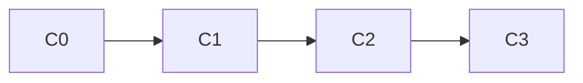

The straightforward algorithm cannot calculate `C[3]` before `C[2]`, because
`C[3]` needs `C[2]`. This is fundamentally different from elementwise list
addition.

### Section 1 checkpoint

You should now be able to explain:

- Why source code is not identical to processor instructions
- Why an addition often requires loads and a later store
- Which ordering constraints exist inside one elementwise addition
- Why different output elements are mathematically independent
- Why independence permits parallel scheduling but does not guarantee it

---

## 2. Processor, Registers, and Memory

### 2.1 Separate responsibilities

A **processor** executes instructions. **Memory** retains encoded instructions
and data. Neither job is useful alone: a processor needs data and instructions,
while stored data does not transform itself.


### 2.2 Memory locations and addresses

You can think of main memory as a very large collection of numbered storage
locations. A number identifying a location is an **address**.

```text
Address      Stored value
1000         2
1004         4
1008         6
1012         8
```

The addresses are illustrative. A real layout depends on data type, runtime,
alignment, and representation.

For a compact fixed-width array, software can often find an element using a
base address and an index:

```text
element address = base address + index × bytes per element
```

If `A` begins at address 1000 and each value occupies 4 bytes:

```text
A[0] address = 1000 + 0 × 4 = 1000
A[1] address = 1000 + 1 × 4 = 1004
A[2] address = 1000 + 2 × 4 = 1008
```

This address calculation is one of the steps hidden by a high-level expression
such as `A[i]`.

> Python lists are collections of references to Python objects and are more
> complex than this compact-array picture. Tensors and low-level arrays more
> closely resemble contiguous typed storage. The simplified model teaches the
> memory relationship without pretending to describe Python object internals.

### 2.3 Registers: the processor's immediate workspace

Processors contain very small, very fast storage locations called
**registers**. Arithmetic instructions generally operate on values available
in registers or other processor-local pathways, not on an abstract variable
name in source code.

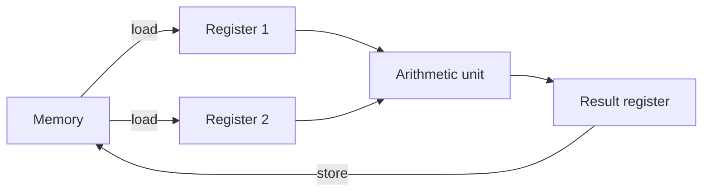

Registers are fast but scarce. Main memory is much larger but farther from
execution.

### 2.4 Why data movement matters

Suppose an arithmetic unit can perform an addition in one unit of time, but
obtaining the values takes many units of time. The arithmetic unit cannot add
values it has not received.

```text
Time ───────────────────────────────────────────▶
Load A:       [---------- waiting ----------]
Load B:                    [----- waiting -----]
Add:                                          [x]
Store:                                          [----]
```

The one-step arithmetic is not the dominant cost. Data movement and waiting
are.

### 2.5 Caches: keeping likely-needed data closer

Between registers and large memory, processors use **caches**: smaller, faster
storage that retains recently or nearby accessed data. If required data is
already in a cache, the processor may avoid a longer trip to main memory.

```text
Closest, smallest, usually lowest latency
        Registers
            ↓
           Cache
            ↓
        Main memory
Farthest, largest, usually higher latency
```

This hierarchy exists in different forms on CPUs and GPUs. Lesson 06 examines
GPU registers, shared memory/L1, L2, and VRAM in detail.

### 2.6 Waiting does not always mean total idleness

Modern processors try to perform other useful work while one operation waits.
A CPU may execute independent instructions out of order. A GPU may issue an
instruction from another ready group of threads. These mechanisms do not make
memory latency disappear. They attempt to **hide** it behind other work.

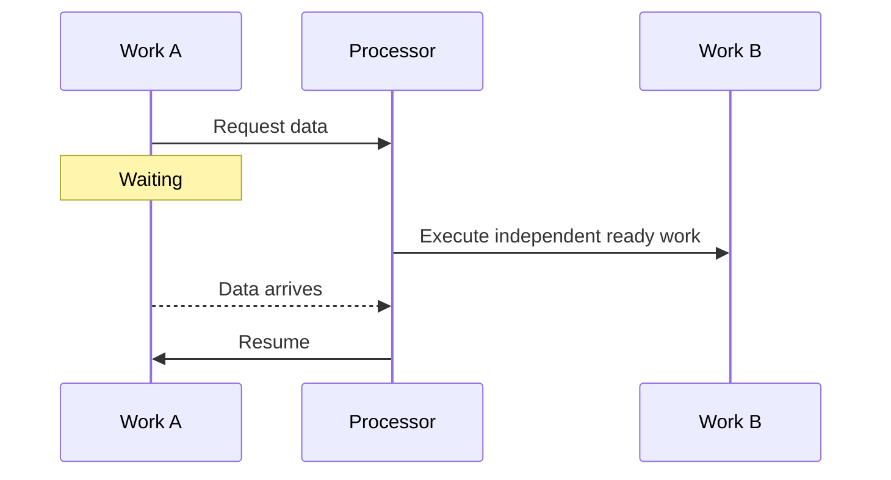

### 2.7 Capacity, bandwidth, and latency preview

These are separate properties:

- **Capacity:** how much data can be stored.
- **Bandwidth:** how much data can be transferred per unit time.
- **Latency:** how long one access or operation takes.

A memory system can have large capacity and high bandwidth while an individual
access still has meaningful latency. Lesson 06 develops these distinctions with
calculations.

### Section 2 checkpoint

Explain why the statement “the processor adds the numbers” omits the critical
questions of where the numbers are stored, how they reach the arithmetic unit,
and where the result goes.

---

## 3. Latency, Throughput, Capacity, Concurrency, and Parallelism

Performance discussions become confusing when these words are treated as
synonyms. They answer different questions.

### 3.1 Latency

**Latency** is the elapsed time for one defined unit of work.

Examples:

- Time for one memory request
- Time for one matrix multiplication
- Time from an inference request arriving to its first generated token
- Time for a complete response

A latency statement must define start, end, and units:

```text
Poor:  “Latency is 40.”
Better: “Warm end-to-end request latency is 40 milliseconds.”
```

### 3.2 Throughput

**Throughput** is completed work divided by elapsed time.

```text
throughput = completed units / elapsed time
```

Examples:

- Requests per second
- Output tokens per second
- Bytes transferred per second
- Arithmetic operations per second

If a server completes 240 requests in 60 seconds:

```text
throughput = 240 requests / 60 seconds = 4 requests per second
```

This does not reveal the latency experienced by each request. Some may have
waited much longer than others.

### 3.3 Capacity

**Capacity** is how much can be held or accommodated, not how quickly work is
completed.

Examples:

- 24 GB of VRAM
- A queue that holds 1,000 requests
- A batch containing 32 sequences

Capacity can enable throughput, but it is not throughput.

### 3.4 Concurrency and parallelism

**Concurrency** means multiple tasks are in progress during overlapping periods
of time. They do not necessarily execute at the same instant.

**Parallelism** means multiple operations actually execute at the same time on
different resources.

One worker alternating between tasks creates concurrency without physical
parallel execution:

```text
Time ───────────────────────────────────────────▶
Worker 1: [Task A][Task B][Task A][Task B]
```

Two workers can execute in parallel:

```text
Time ───────────────────────────────────────────▶
Worker 1: [──────────── Task A ────────────]
Worker 2: [──────────── Task B ────────────]
```

Software discussions sometimes use these words loosely, but the distinction is
useful when reasoning about hardware.

### 3.5 Worked service example

Imagine one worker takes 100 ms to process a request.

With no overlap:

```text
Request A: [100 ms]
Request B:          [100 ms]
Request C:                   [100 ms]
```

Idealized throughput is 10 requests per second, and each request's service time
is 100 ms, excluding queueing.

Now imagine four workers process four requests simultaneously:

```text
Worker 1: [Request A: 100 ms]
Worker 2: [Request B: 100 ms]
Worker 3: [Request C: 100 ms]
Worker 4: [Request D: 100 ms]
```

Four requests finish after approximately 100 ms. Aggregate throughput rises to
about 40 requests per second while the service latency of each request remains
about 100 ms.

But if requests wait 80 ms for a batch to form, client-observed latency becomes
approximately:

```text
80 ms queueing + 100 ms processing = 180 ms
```

Throughput improved while individual end-to-end latency worsened.

### 3.6 The ferry analogy, completed carefully

Imagine:

```text
Vehicle      Trip latency      Passengers per trip      Trips per hour
Speedboat       10 min                  4                     6
Ferry           20 min                100                     3
```

Idealized passenger throughput:

```text
Speedboat: 4 × 6   = 24 passengers/hour
Ferry:     100 × 3 = 300 passengers/hour
```

The speedboat gives one passenger a shorter crossing latency. The ferry moves
far more passengers per hour. This resembles the broad CPU/GPU tradeoff, but
only as an analogy: processors do not literally wait to fill boats, and their
workloads have dependencies and memory behavior.

### 3.7 Why this matters for inference

An inference system may optimize:

- Time to first token for one user
- Time per output token
- Requests completed per second
- Tokens generated per second across all users
- Maximum concurrent sequences

These goals can conflict. An engineer must state which metric matters.

### Section 3 checkpoint

Construct an example in which throughput increases but end-to-end latency also
increases. Identify queueing time and processing time separately.

---

## 4. Dependencies, Order, and Parallel Work

### 4.1 Dependency order

An operation is **dependent** on another when it needs the earlier operation's
result or when both operations access shared state in an order that affects
correctness.

Example:

```text
x = 2
y = x + 3
z = y × 4
answer = z - 1
```

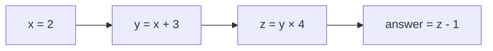

The straightforward chain must preserve this logical order. More processors
cannot make `z` use a `y` that does not yet exist.

### 4.2 Independent work

Compare:

```text
p = 10 + 5
q = 20 × 3
```

Neither calculation requires the other's result.

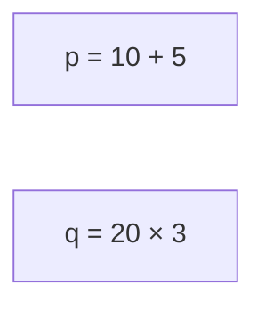

They may execute sequentially or in parallel. Both schedules are valid if there
are no hidden side effects.

### 4.3 A dependency graph

Programs can be represented as a directed acyclic graph for a region of work:

```text
a = x + y
b = p × q
c = a - b
d = c × 2
```

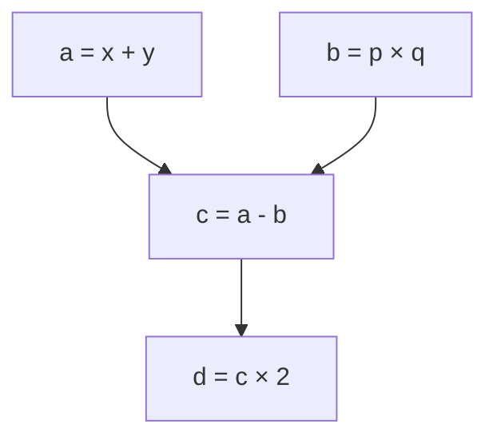

`a` and `b` may run in parallel. `c` waits for both. `d` waits for `c`.

This graph contains parallel work and sequential stages. Most real programs are
mixtures rather than purely sequential or purely parallel.

### 4.4 Reduction: independent work followed by combination

Suppose we want the sum of eight numbers.

A sequential method forms a chain:

```text
(((((((a+b)+c)+d)+e)+f)+g)+h)
```

A tree method first forms independent pairs:

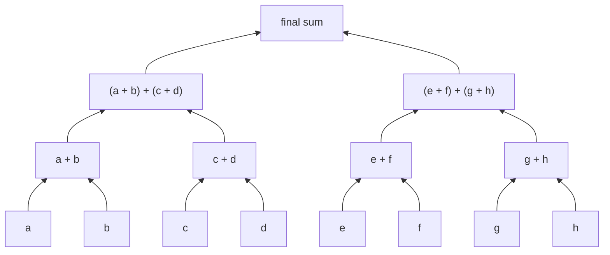

Each level has independent work, but levels depend on earlier levels. Parallel
algorithms often restructure work to expose this kind of tree.

### 4.5 Scheduling in waves

Available parallelism may exceed physical resources.

```text
Ready operations:  [1][2][3][4][5][6][7][8]
Execution slots:   [A][B]

Wave 1: operations 1 and 2
Wave 2: operations 3 and 4
Wave 3: operations 5 and 6
Wave 4: operations 7 and 8
```

The operations are independent, but only two execute simultaneously. GPUs use
large-scale scheduling to process far more ready threads than can issue an
instruction in one instant.

### 4.6 Data parallelism

**Data parallelism** applies the same broad operation to different data items.
Elementwise list addition is a simple example:

```text
Operation rule: C[i] = A[i] + B[i]
Different data: i = 0, 1, 2, 3, ...
```

Image filters, tensor elementwise functions, and many matrix operations expose
data parallelism.

### 4.7 Task parallelism

**Task parallelism** executes different kinds of independent work:

```text
Task A: tokenize one request
Task B: write logs
Task C: prepare another response
```

CPU servers frequently exploit task parallelism. GPUs are especially designed
for large groups of similarly structured data-parallel work, although they can
execute diverse kernels over time.

### 4.8 Parallel fraction limits total speedup

If part of a task remains sequential, accelerating only the parallel part has a
limit.

Example:

```text
Original total time:      100 ms
Sequential preparation:   40 ms
Parallel calculation:     60 ms
```

Even if the 60 ms calculation became infinitely fast, the total could not drop
below the remaining 40 ms preparation in this simplified scenario.

This is the intuition behind Amdahl's law. You do not need its formula yet. The
lesson is:

> End-to-end speedup is limited by work that the optimization does not improve.

### Section 4 checkpoint

Given a sequence of operations, draw arrows only where a later result truly
requires an earlier result. Identify which operations could be ready together
and which must wait.

---

## 5. CPU Design Priorities

### 5.1 What a CPU must handle

A general-purpose CPU runs:

- Operating-system code
- Browser and application logic
- File and network handling
- Database queries
- Python interpreters
- Tokenization and request orchestration
- Small and irregular calculations

These workloads often include unpredictable decisions and limited parallelism.
The CPU is designed to make a few complicated instruction streams progress
quickly.

### 5.2 CPU cores

A **CPU core** is a sophisticated execution engine capable of running its own
instruction stream. A multicore CPU has several such cores.

```text
Conceptual CPU
┌──────────────────────────────────────────────────┐
│ Core 0 │ Core 1 │ Core 2 │ Core 3 │ Shared cache │
└──────────────────────────────────────────────────┘
```

The diagram is not a physical floor plan. Actual CPUs vary significantly.

### 5.3 Branch prediction

Programs frequently make decisions:

```text
if request_is_valid:
    process_request
else:
    return_error
```

The processor may not know which path is needed until a comparison finishes.
A **branch predictor** guesses the likely path so the CPU can begin preparing
work instead of waiting. A correct prediction saves time. A wrong prediction
requires discarding incorrectly prepared work and restarting on the correct
path.

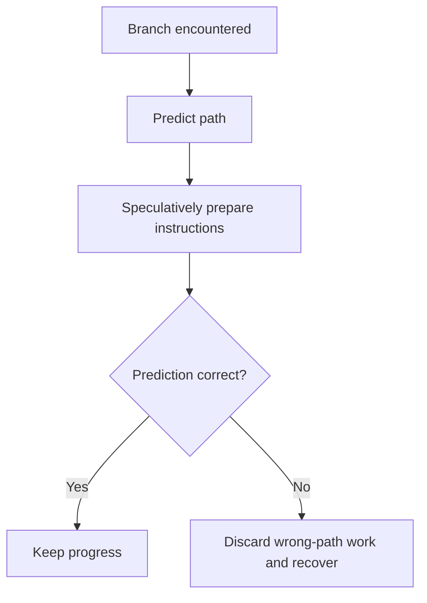

This hardware is valuable for irregular control flow but consumes design area
and power.

### 5.4 Out-of-order execution

Suppose instruction A waits for memory while independent instruction B is ready.
An out-of-order CPU may execute B first, even if A appeared earlier in program
order, while still preserving the program's observable correctness.

```text
Program order:       A(waiting), B(ready), C(depends on A)
Possible execution:  B, wait/other work, A, C
```

This dynamically discovers instruction-level parallelism in a single thread.

### 5.5 Caches and low-latency focus

CPUs devote substantial resources to multi-level caches that keep likely-needed
instructions and data close to each core. They also use complex scheduling,
prediction, and speculative machinery.

Simplified design-priority picture:

```text
CPU die — conceptual only
┌────────────────────────────────────────────────────┐
│ Sophisticated cores                                │
│ Large cache hierarchy                              │
│ Branch prediction and out-of-order scheduling      │
│ Interfaces to memory and devices                   │
└────────────────────────────────────────────────────┘
```

The priority is not “do little work.” It is:

> Make a relatively small number of diverse, dependency-heavy instruction
> streams advance with low latency.

### 5.6 Why CPUs are still important in inference

In an inference system, the CPU may:

- Receive network requests
- Validate parameters
- Tokenize text
- Allocate and prepare inputs
- Run Python and server logic
- Submit GPU operations
- Select output tokens
- Serialize and return responses
- Record metrics and logs

The GPU accelerates suitable numerical work. It does not eliminate the rest of
the system.

### Section 5 checkpoint

Explain why branch prediction and out-of-order execution are useful for a CPU
running irregular application logic, and why those capabilities represent a
different design investment from maximizing parallel arithmetic throughput.

---

## 6. GPU Design Priorities

### 6.1 Terms Needed Before We Discuss GPU Inference

This section uses several machine-learning and NVIDIA terms that have not yet
been introduced. Define them first; do not infer their meaning from their names.

#### Token

A language model does not normally receive complete English words directly. A
**token** is one unit produced by a model's tokenizer. Depending on the
tokenizer and text, a token can represent:

- A whole word
- Part of a word
- Punctuation
- Whitespace combined with nearby text
- A byte or character-like unit

The exact split belongs to the selected tokenizer. For example, one tokenizer
might split:

```text
"Why is the sky blue?"
```

into the illustrative pieces:

```text
["Why", " is", " the", " sky", " blue", "?"]
```

Another tokenizer may split the same text differently.

#### Token ID

The tokenizer owns a vocabulary: a mapping between token pieces and integer
identifiers. A **token ID** is the integer the model uses to identify a token.

```text
Token piece       Hypothetical ID
-----------       ---------------
"Why"                  812
" is"                   27
" the"                 279
" sky"              13,180
" blue"              6,437
"?"                     30
```

These numbers are intentionally hypothetical. Token IDs have meaning only in
the vocabulary of a particular tokenizer and model.

#### Tensor

A **tensor** is a multidimensional collection of numerical values together with
properties such as shape and data type. At this point, think of a tensor as a
generalization of a number, list, or matrix:

```text
One number:                 scalar tensor
One-dimensional list:       vector tensor
Two-dimensional grid:       matrix tensor
Three or more dimensions:   higher-dimensional tensor
```

Section 8 develops tensors in more detail. The definition appears here because
GPU frameworks package model inputs, weights, and intermediate results as
tensors.

#### Embedding

A token ID is only a category label; arithmetic on the number `812` would not
capture the meaning of “Why.” An **embedding** maps each token ID to a learned
vector of floating-point values.

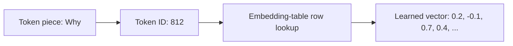

The real vector can contain thousands of values. The four-value vector above is
only a teaching illustration.

#### Model weights

**Weights** are numerical parameters learned during training. During inference,
the model repeatedly uses large weight tensors to transform input and
intermediate tensors. Weight matrices encode learned transformations; they are
not a database of human-readable sentences.

#### CUDA

**CUDA** is NVIDIA's software platform and programming model for using NVIDIA
GPUs for general-purpose computation. CUDA supplies concepts and interfaces for
activities such as:

- Selecting a GPU
- Allocating GPU memory
- Moving data
- Submitting functions for GPU execution
- Ordering and synchronizing work
- Using optimized numerical libraries

CUDA is not the GPU itself, and it is not another name for a Tensor Core.
Frameworks such as PyTorch use CUDA-enabled libraries and runtime interfaces so
the application can ask an NVIDIA GPU to execute suitable operations. Lesson 08
explains the CUDA software stack fully; this definition is enough for the
request walkthrough below.

#### GPU kernel

A **kernel** is a function submitted for parallel execution on the GPU. A
framework operation may launch one kernel, several kernels, or a fused kernel
representing several conceptual operations.

#### Streaming Multiprocessor

A **Streaming Multiprocessor (SM)** is a major GPU processing unit that contains
thread schedulers, registers, shared memory/cache resources, and several kinds
of execution pipelines. A GPU contains multiple SMs. They collectively execute
thread groups assigned by GPU hardware.

Lesson 04 explains kernels, threads, blocks, warps, and SM scheduling in depth.

### 6.2 Origins: From Graphics to General-Purpose Computation

Graphics workloads repeatedly apply related calculations to many vertices,
fragments, and pixels. For example, millions of output pixels may need colors
computed from geometry, textures, lighting, and viewing information. That work
contains large amounts of structured data parallelism.

GPU designs evolved around this need for high aggregate arithmetic throughput.
As GPU programmability increased, engineers used the same broad architecture
for non-graphics workloads with similar parallel structure, including:

- Physical simulation
- Scientific computing
- Image and video processing
- Machine learning
- Transformer inference

CUDA is the NVIDIA platform that exposes NVIDIA GPUs for this
general-purpose-computing use. The important chain is:

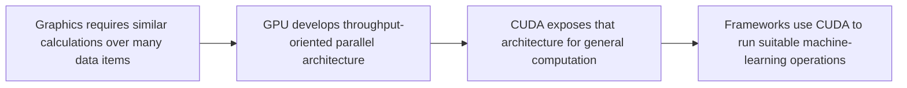

### 6.3 The CPU/GPU Design Tradeoff — The Main Rule and the Nuance

The main distinction is exactly the one you suspected:

> **CPUs are primarily optimized for flexible control flow and low-latency
> progress through a modest number of instruction streams. GPUs are primarily
> optimized for high-throughput execution of large amounts of structured
> parallel numerical work.**

The earlier wording—“CPUs perform parallel work; GPUs handle control flow”—was
not intended to reverse those roles. It attempted to say neither capability is
exclusive, but it gave the exception too much emphasis and obscured the rule.

Here is the corrected comparison:

| Design concern | CPU emphasis | GPU emphasis |
| --- | --- | --- |
| Primary strength | Flexible application and control logic | Structured parallel numerical computation |
| Individual execution resources | Fewer sophisticated cores | Many SMs containing many execution pathways |
| Branching | Strong machinery for irregular and unpredictable branches | Supports branches, but divergence within thread groups can waste work |
| Latency strategy | Make one/few threads advance quickly using caches, prediction, and out-of-order execution | Keep many thread groups available and issue other work while some groups wait |
| Memory design emphasis | Large low-latency cache hierarchy | High aggregate device-memory bandwidth plus on-chip reuse |
| Typical inference responsibilities | Networking, validation, tokenization, scheduling, orchestration | Embeddings and large tensor operations across model layers |

#### Why the nuance still matters

“CPU handles control; GPU handles parallel work” is a good first approximation,
not an absolute boundary:

- Modern CPUs have multiple cores and vector instructions, so they can execute
  parallel numerical work.
- GPUs execute instructions containing comparisons, loops, and branches, so
  they do perform control flow.
- A full inference engine may move token selection or generation bookkeeping to
  the GPU to avoid synchronization.
- Some small tensor operations may be faster on the CPU because GPU overhead
  exceeds useful work.

The accurate conclusion is asymmetric:

```text
PRIMARY DESIGN PRIORITY

CPU ───────────────────────────────▶ flexible control + low thread latency
GPU ───────────────────────────────▶ structured parallel throughput

SECONDARY CAPABILITY

CPU can perform parallel math.
GPU can execute control-flow instructions.
```

The secondary capabilities do not erase the primary design priorities.

### 6.4 Frame-by-Frame Walkthrough: One Prompt Reaches the GPU

The following figure functions like six animation frames. Read it from the
upper-left downward, then continue at the upper-right.

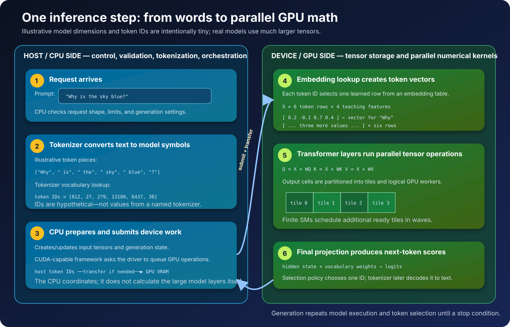

The dimensions, vectors, and token IDs are deliberately tiny or hypothetical
so the transformations can be seen. A real model uses its own tokenizer and
weight tensors with much larger dimensions.

#### Frame 1 — CPU receives and validates the request

Suppose a client sends:

```text
Prompt: "Why is the sky blue?"
Maximum new tokens: 20
Sampling policy: deterministic greedy selection
```

Server code running on the CPU may:

1. Parse the HTTP request.
2. Confirm the prompt is a string.
3. Check prompt and output limits.
4. Confirm the requested model is ready.
5. Choose the appropriate tokenizer and generation configuration.

These are branching and orchestration tasks. They are natural CPU work.

#### Frame 2 — CPU tokenizer converts text to token IDs

Using the hypothetical mapping introduced in Section 6.1:

```text
Text:
"Why is the sky blue?"

Token pieces:
["Why", " is", " the", " sky", " blue", "?"]

Token IDs:
[812, 27, 279, 13180, 6437, 30]
```

The position in the ID list preserves token order:

```text
position:    0     1     2       3      4    5
token ID:  812    27   279   13180   6437   30
```

The model uses both token identity and position. Reordering these IDs changes
the input sequence.

#### Frame 3 — Framework prepares device work

The framework represents the IDs as an integer tensor with a shape such as:

```text
input_ids shape = [batch size, token count]
                = [1, 6]
```

If the tensor is in host memory and the model is on the GPU, the required input
data is made available in GPU memory. The CPU-side framework then submits CUDA
operations. The CPU does not send English words directly to arithmetic units;
it submits operations over encoded tensors.

#### Frame 4 — GPU performs embedding lookup

The embedding table can be imagined as a large matrix:

```text
embedding_table shape = [vocabulary size, hidden size]
```

Each token ID selects one row. For teaching purposes, pretend the hidden size is
only four:

```text
Token       Hypothetical embedding row
-----       --------------------------------
"Why"       [ 0.2, -0.1,  0.7,  0.4]
" is"       [ 0.0,  0.5, -0.3,  0.8]
" the"      [ 0.6,  0.2,  0.1, -0.4]
" sky"      [ 0.9, -0.5,  0.3,  0.2]
" blue"     [ 0.7,  0.1,  0.8, -0.2]
"?"         [-0.1,  0.4,  0.0,  0.5]
```

Stacking the rows produces a token-state matrix `X`:

```text
X shape = [6 token positions, 4 hidden features]

    feature 0  feature 1  feature 2  feature 3
    ---------  ---------  ---------  ---------
Why     0.2       -0.1        0.7        0.4
 is     0.0        0.5       -0.3        0.8
 the    0.6        0.2        0.1       -0.4
 sky    0.9       -0.5        0.3        0.2
 blue   0.7        0.1        0.8       -0.2
 ?     -0.1        0.4        0.0        0.5
```

These values do not individually translate back into simple concepts such as
“question” or “color.” Meaning is distributed across learned dimensions and
transformations.

#### Frame 5 — Transformer layers apply matrix operations

A simplified linear transformation is:

```text
Y = X × W
```

If `X` has shape `[6, 4]` and a weight matrix `W` has shape `[4, 8]`, then:

```text
[6, 4] × [4, 8] → [6, 8]
```

`Y` contains 48 output values. Each output value is a dot product between one
row of `X` and one column of `W`.

The next figure uses even smaller integer matrices—three token rows, two input
features, and four output features—so every output can be verified manually.

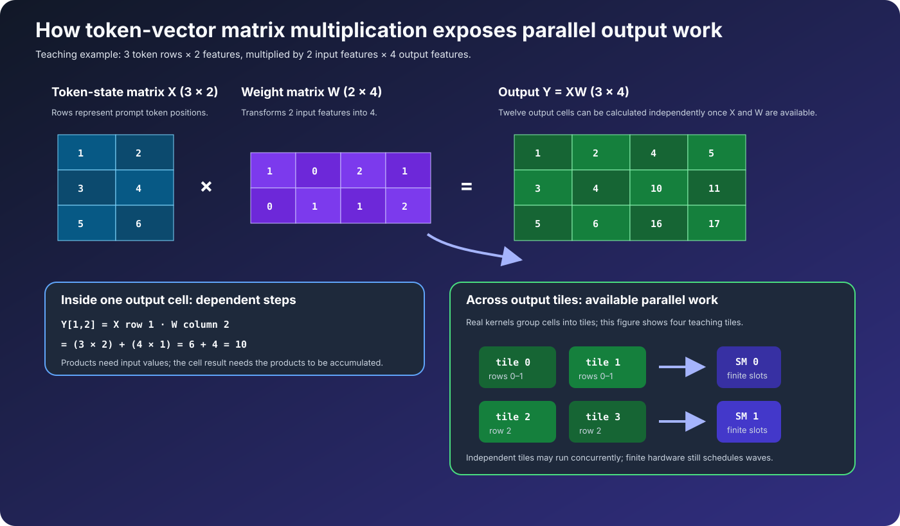

For one cell in that figure:

```text
X row 1       = [3, 4]
W column 2    = [2, 1]

Y[1,2] = (3 × 2) + (4 × 1)
       = 6 + 4
       = 10
```

Other output cells use other row/column combinations. Once input values are
available, output cells do not require one another's final values. This creates
available parallel work.

Real GPU matrix kernels do not normally assign one simplistic standalone
thread to each entire dot product. Efficient libraries divide matrices into
**tiles**, assign tiles to thread blocks, cooperate across thread groups, reuse
data, and use specialized instructions. The correct beginner insight is:

```text
Large output matrix
        ↓ divide into tiles
Many independent or regularly structured output regions
        ↓ schedule blocks across finite SMs
Many arithmetic operations execute concurrently and in waves
```

Transformer blocks repeat several large learned transformations. In attention,
the model forms query, key, and value tensors using operations commonly written
as:

```text
Q = X × WQ
K = X × WK
V = X × WV
```

The model then calculates attention relationships and applies additional
projections and feed-forward layers. Section 8 introduces that flow; Module 03
develops the mechanics fully.

#### Frame 6 — Final projection produces next-token scores

After all transformer layers, a final transformation produces one score for
each token in the model vocabulary. These scores are called **logits**.

Tiny illustration:

```text
Candidate token      Logit
---------------      -----
"Because"             8.2
"The"                 6.9
"Blue"                3.1
"Car"                -1.4
```

A decoding policy converts logits into a next-token choice. If the chosen token
is `"Because"`, the generated sequence becomes conceptually:

```text
"Why is the sky blue?" + "Because"
```

The model then performs another decode iteration to choose the following token.
The generated answer emerges one selected token at a time—not as a complete
sentence stored inside one matrix.

### 6.5 CPU and GPU Activity Over Time

The following sequence diagram emphasizes responsibility and ordering:

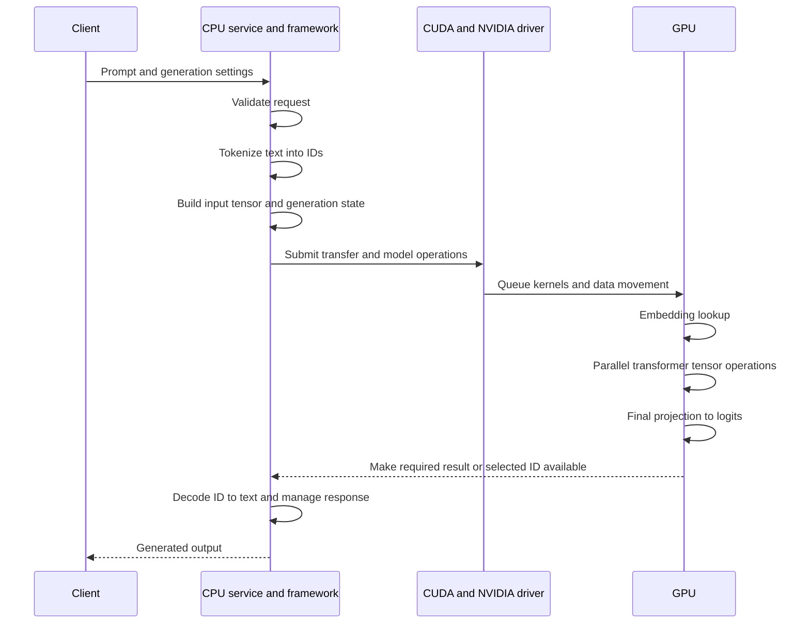

Implementations differ. Some keep token selection and more generation logic on
the GPU to avoid repeated CPU synchronization. The diagram communicates the
conceptual responsibilities, not a mandatory transfer after every token.

### 6.6 Throughput-Oriented GPU Resources

A GPU allocates substantial resources to:

- Many arithmetic execution pathways
- Scheduling many active thread groups
- High aggregate device-memory bandwidth
- Specialized matrix multiply-accumulate hardware
- Hiding latency by switching among ready work

```text
GPU die — conceptual, not to scale
┌──────────────────────────────────────────────────────┐
│ SM │ SM │ SM │ SM │ SM │ SM │ SM │ SM │ ...       │
│                                                      │
│          Shared L2 cache and interconnect            │
│                                                      │
│              Memory controllers                      │
└──────────────────────────────────────────────────────┘
```

The GPU still has finite resources. A matrix with millions of logical output
calculations is divided and scheduled across available hardware over time.

### 6.7 GPU Threads Are Logical Workers, Not Permanent Cores

A GPU program may define thousands or millions of logical threads. A thread
describes one instance of work, such as “help calculate this output region.” It
does not mean the GPU contains one permanent physical core for every thread.

```text
Logical threads:  [0][1][2][3][4][5] ... [999999]
Physical GPU:      finite SMs and execution pipelines
Execution:         logical work scheduled in groups and waves
```

Lesson 04 explains how threads are grouped into blocks and warps. For now,
separate the **quantity of described work** from the **quantity of physical
hardware available at one instant**.

### 6.8 Hiding Latency With Many Ready Groups

When one thread group waits for data, an SM can issue eligible instructions
from another ready group.

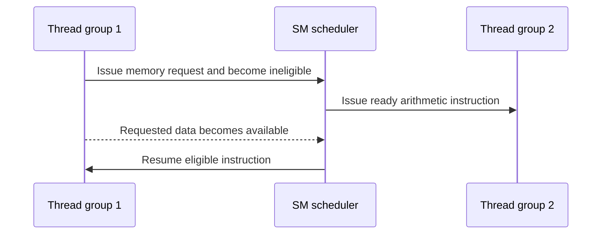

This does not shorten the memory access itself. It tries to keep execution
resources productive during the wait. It requires enough independent ready
groups; a tiny workload may leave much of the GPU unused.

### 6.9 Host and Device Cooperation

In CUDA terminology:

- The **host** is the CPU-side system.
- The **device** is the GPU.

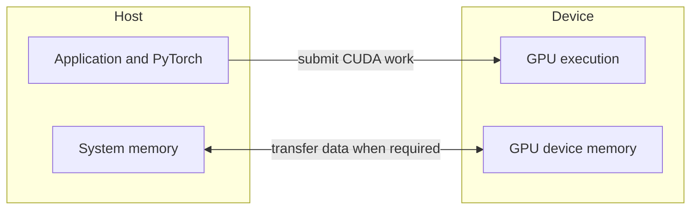

The host prepares and orchestrates work. The device performs submitted GPU
operations. Data movement and synchronization are real costs, so efficient
systems avoid unnecessary back-and-forth transfers.

### 6.10 Why Large Tensor Operations Help

Now that **tensor** has been defined, we can state the connection precisely.
If a tensor operation contains millions of independent or regularly structured
output calculations, the GPU has a large pool of ready work. That allows it to:

- Divide output regions into blocks or tiles
- Distribute blocks across many SMs
- Keep multiple thread groups ready
- Hide some memory latency
- Reuse data within faster parts of the memory hierarchy
- Use specialized matrix hardware when the operation, shape, dtype, and kernel
  are eligible

A four-element list is useful for understanding independence but is too small
to justify a real GPU launch by itself. Transformer layers apply the same broad
principle at enormous scale.

### Section 6 Checkpoint

Without looking back, explain:

1. CUDA, token, token ID, tensor, embedding, weight, kernel, and SM.
2. The primary CPU/GPU design distinction and the non-exclusive nuance.
3. The path from `"Why is the sky blue?"` to token IDs and an embedding matrix.
4. How `Y = X × W` creates many output calculations that GPU kernels can divide
   into tiles and schedule across SMs.
5. Why logical GPU threads are not permanent physical cores.
6. Why a large supply of ready work can hide memory latency.
7. Why a real implementation may keep token selection on the GPU rather than
   copying a result to the CPU after every iteration.

---

## 7. Matrix Multiplication, Step by Step

### 7.1 Scalars, vectors, and matrices

- A **scalar** is one value: `7`.
- A **vector** is an ordered one-dimensional collection: `[2, 4, 6]`.
- A **matrix** is a rectangular two-dimensional collection.

```text
Matrix A with 2 rows and 3 columns:

┌ 1  2  3 ┐
└ 4  5  6 ┘

Shape: 2 × 3
```

The shape describes the number of entries along each dimension.

### 7.2 The multiplication shape rule

If:

```text
A has shape M × K
B has shape K × N
```

then:

```text
C = A × B has shape M × N
```

The inner dimension `K` must match because each output uses a row of length `K`
from A and a column of length `K` from B.

```text
(M × K) × (K × N) → (M × N)
       matching K
```

### 7.3 Complete 2 × 2 example

```text
A = ┌ 1  2 ┐       B = ┌ 5  6 ┐
    └ 3  4 ┘           └ 7  8 ┘

C = A × B
```

Each output is a row-column dot product:

```text
C[0,0] = A row 0 · B column 0
       = (1 × 5) + (2 × 7)
       = 5 + 14
       = 19

C[0,1] = A row 0 · B column 1
       = (1 × 6) + (2 × 8)
       = 6 + 16
       = 22

C[1,0] = A row 1 · B column 0
       = (3 × 5) + (4 × 7)
       = 15 + 28
       = 43

C[1,1] = A row 1 · B column 1
       = (3 × 6) + (4 × 8)
       = 18 + 32
       = 50
```

Result:

```text
C = ┌ 19  22 ┐
    └ 43  50 ┘
```

### 7.4 Dependencies within one output

For `C[0,0]`, the two products can be computed independently:

```mermaid
flowchart TD
    P1[1 × 5 = 5] --> S[5 + 14 = 19]
    P2[2 × 7 = 14] --> S
```

The final sum must wait for both products. With a longer dot product, partial
sums form a reduction. The calculation contains parallel multiplication and a
dependent accumulation structure.

Hardware often uses fused multiply-accumulate instructions and tiled algorithms
rather than literally creating this exact graph, but the data dependencies are
the same.

### 7.5 Independence across output cells

Once A and B are available, each output cell can be computed without needing
another output cell:

```mermaid
flowchart TD
    IN[Input matrices A and B]
    IN --> C00[Compute C00]
    IN --> C01[Compute C01]
    IN --> C10[Compute C10]
    IN --> C11[Compute C11]
    C00 --> OUT[Completed C]
    C01 --> OUT
    C10 --> OUT
    C11 --> OUT
```

The final matrix is complete only after all output cells are ready, but their
calculations expose parallelism.

### 7.6 Scaling the example

If C has shape 4,096 × 4,096, it contains:

```text
4,096 × 4,096 = 16,777,216 output elements
```

If each output is a dot product of length 4,096, there is an enormous amount of
multiply-accumulate work. Efficient GPU libraries divide matrices into tiles,
reuse input values through the memory hierarchy, and distribute work across
SMs.

```text
Large matrices
      ↓ divide into tiles
Thread blocks process output tiles
      ↓ distributed across SMs
Many multiply-accumulate operations
      ↓
Completed output matrix
```

Lesson 05 explains general arithmetic pipelines and Tensor Cores. Lesson 06
explains why tiling and reuse reduce expensive data movement.

### 7.7 Matrix multiplication is parallel but not order-free

It would be incorrect to say “all matrix operations happen in any order.”
Instead:

- Output cells are broadly independent from one another.
- Products within a dot product can be formed independently.
- Products must be combined to produce the output.
- Input data must be available before it is used.
- The final consumer must wait for required outputs.
- Floating-point regrouping can introduce small numerical differences because
  finite-precision addition is not perfectly associative.

Parallel algorithms preserve required dependencies while choosing an efficient
valid schedule.

### Section 7 checkpoint

For one 2 × 2 result cell, identify the loads, multiplications, additions, and
store. Then explain which work can overlap across the four result cells.

---


## Lesson 01 Completion Check

Continue only when you can explain without notes:

1. The difference between an instruction, data, an operation, and a program.
2. How dependencies constrain valid execution order.
3. Why independence permits parallel scheduling but does not guarantee physical
   simultaneous execution.
4. The main CPU/GPU design tradeoff.
5. Rank, axes, shape, and indexing for a small tensor.
6. The matrix-multiplication shape rule and one complete output-cell dot product.
7. Why logical GPU work must be scheduled over finite hardware in waves.

You have now completed the required computing and parallelism foundation.
Continue to [Lesson 02 — Transformer Inference Foundations](../02-transformer-inference-foundations/)
before studying how transformer workloads map to GPUs.
