# Lesson 02 — Transformer Inference Foundations

**Prerequisite:** Lesson 01, especially vectors, matrices, tensors, matrix
multiplication, dependencies, and parallel work  
**Purpose:** Understand the decoder-only transformer algorithm before analyzing
how GPU hardware executes it  
**Expected study time:** 4–6 hours

## Learning Objectives

By the end of this lesson, you should be able to trace one prompt through:

```text
text → tokens → token IDs → embeddings → hidden states → Q/K/V projections
→ attention scores → causal mask → softmax weights → value mixing → logits
→ token selection → decode iteration → KV-cache update
```

This lesson answers **what the algorithm does**. Lesson 03 separately answers
**why its workload shapes map well—or imperfectly—to a GPU**. Keeping those
questions separate prevents hardware terminology from obscuring the algorithm.

## 1. Transformer Inputs and Building Blocks

### 1.1 What is inference?

**Inference** means using an already-trained model to produce outputs from new
inputs. For a decoder-only language model, inference repeatedly predicts a next
token based on the tokens seen so far.

Training adjusts model weights. Inference primarily reads those weights and
uses them in numerical operations.

### 1.2 What is a tensor?

A **tensor** is a multidimensional collection of values with properties such as:

- **Shape:** number of positions along each dimension
- **Data type:** representation used for each value
- **Device:** where its storage resides
- **Layout or strides:** how logical positions map to memory

More concretely, a tensor is a regular collection of same-data-type values that
can be addressed with integer indices, plus metadata describing how to
interpret and locate those values. A rank-3 tensor is not necessarily stored as
a literal geometric cube. Its axes are a logical indexing organization; its
underlying storage is commonly a one-dimensional region of memory.

Examples:

```text
Scalar: 7                              shape: []
Vector: [2, 4, 6]                      shape: [3]
Matrix: [[1, 2], [3, 4]]               shape: [2, 2]
Token states                           shape: [batch, tokens, hidden_size]
```

If a token-state tensor has shape `[2, 128, 4096]`:

- `2` means two sequences in the batch.
- `128` means 128 token positions per sequence.
- `4096` means each token position is represented by 4,096 numerical features.

Total values:

```text
2 × 128 × 4096 = 1,048,576 values
```

The word **dimension** is overloaded, so we will be precise:

- An **axis** is one direction in which a tensor can be indexed.
- The **size of an axis** is the number of positions along that axis.
- The **rank** is the number of axes. Rank is not the number of stored values.
- The **shape** lists the axis sizes in order.

The following figure builds rank one axis at a time. Every colored square is
one scalar value. Brackets in a shape describe axes; they are not matrix rows.

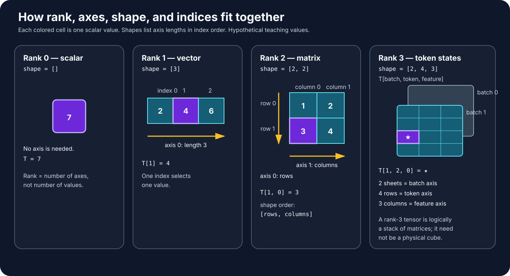

#### Reading an index

For the matrix below, the first index chooses a row and the second chooses a
column:

```text
                 column 0   column 1   column 2
                            axis 1 →
row 0, axis 0 ↓      10         11         12
row 1                20         21         22

shape = [2 rows, 3 columns]
matrix[1, 2] = 22
       │  └──────── choose column 2
       └─────────── choose row 1
```

A rank-3 tensor adds another index. It is often easiest to understand it as a
stack of matrices. `T[batch, token, feature]` means:

1. Choose a sequence from the batch.
2. Choose a token position in that sequence.
3. Choose one numerical feature belonging to that token position.

#### Expanding `[2, 128, 4096]`

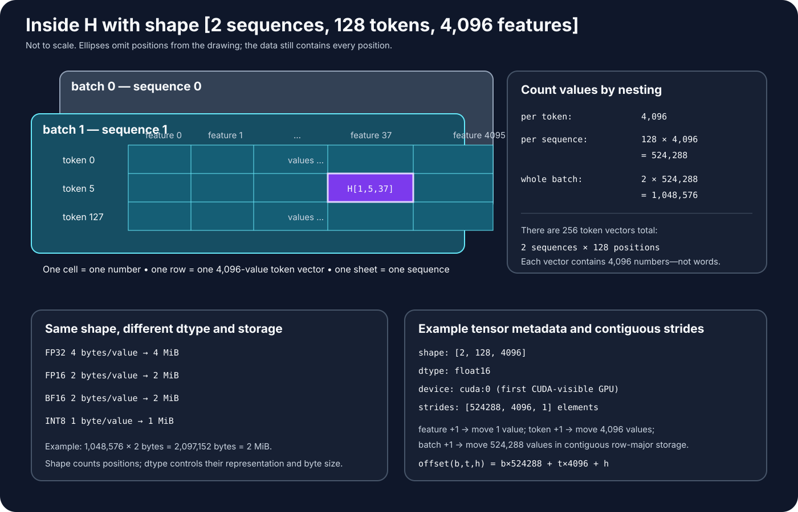

The picture deliberately cannot draw all 1,048,576 cells. Ellipses mean
“positions omitted from the drawing,” not missing data. The tensor contains:

```text
2 sequences
× 128 token positions in each sequence
× 4,096 feature values for each token position
= 1,048,576 scalar values
```

One particular scalar might be written:

```text
H[1, 5, 37]
  │  │   └── feature 37
  │  └────── token position 5
  └───────── sequence 1 (the second sequence because indexing starts at 0)
```

The 4,096 values at `H[1, 5, :]` collectively represent the model's current
state for that token position. Individual features generally do not have a
simple fixed translation such as “feature 37 means blue.” Meaning is distributed
across the vector and transformed from layer to layer.

#### Shape is only part of a tensor's description

Two tensors can have the same shape and still differ:

| Property | Example | What it answers |
| --- | --- | --- |
| Shape | `[2, 128, 4096]` | How many positions exist along each axis? |
| Data type | `float16` | How is each value encoded, and how many bytes does it use? |
| Device | `cuda:0` | In which processor's attached memory does the storage reside? |
| Stride | `[524288, 4096, 1]` | How far in storage must we move when an index increases by one? |

For a contiguous row-major `[2, 128, 4096]` tensor, adjacent features are next
to one another. Moving forward one token skips 4,096 stored values; moving
forward one batch item skips `128 × 4096 = 524,288` values. Lesson 06 develops
layout and memory consequences.

The data type determines bytes per value. For example, if every value occupies
2 bytes, the raw storage for this tensor is:

```text
1,048,576 values × 2 bytes/value = 2,097,152 bytes = 2 MiB
```

Lesson 06 turns this reasoning into broader memory estimates.

### 1.3 Token embeddings

Text is first converted into token IDs. An embedding lookup maps each token ID
to a learned vector.

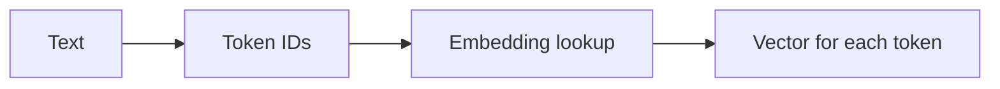

The model does not directly calculate on English words. It calculates on
numerical tensors.

### 1.4 Linear transformations

A transformer repeatedly applies learned weight matrices to token-state
vectors. In simplified form:

```text
output = input × weights + bias
```

For many token positions and a batch, these become large matrix operations.

Example shapes:

```text
Input token states:  [256 token positions, 4096 features]
Weight matrix:       [4096 input features, 4096 output features]
Output states:       [256 token positions, 4096 output features]
```

Before using the large numbers, examine a complete teaching example:

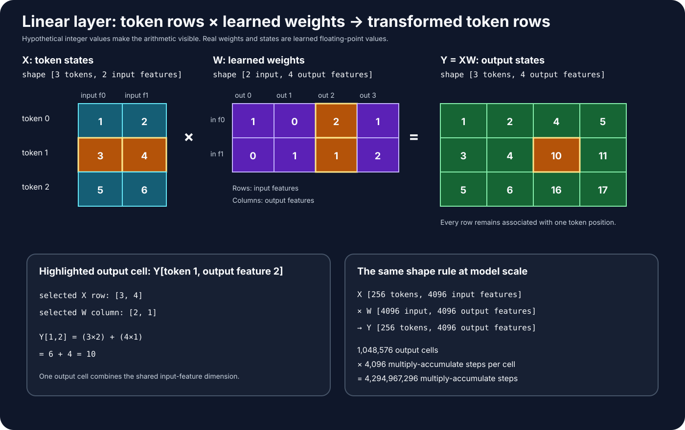

Here `X` contains three token positions with two input features each. `W`
describes how two input features contribute to four output features. Therefore:

```text
X shape: [3 token positions, 2 input features]
W shape: [2 input features, 4 output features]
Y shape: [3 token positions, 4 output features]

             shared dimension
                    ┌─┴─┐
[3 tokens, 2 input] × [2 input, 4 output] → [3 tokens, 4 output]
 └ output rows ┘                         └── output columns ──┘
```

For example, output `Y[token 1, output feature 2]` uses row 1 of `X` and
column 2 of `W`:

```text
X row 1 = [3, 4]
W column 2 = [2, 1]
Y[1, 2] = (3 × 2) + (4 × 1) = 10
```

The same shape rule applies to the realistic example:

```text
[256 token positions, 4096 input features]
× [4096 input features, 4096 output features]
→ [256 token positions, 4096 output features]
```

That output contains:

```text
256 × 4096 = 1,048,576 output values
```

Each output is a dot product of length 4,096, so forming all outputs requires
approximately:

```text
1,048,576 outputs × 4,096 multiply-accumulate steps per output
= 4,294,967,296 multiply-accumulate steps
```

This count describes mathematical work, not elapsed time or the number of
physical GPU cores. Many output cells and tiles can be worked on concurrently;
finite hardware schedules them in waves. The bias, if present, contributes one
additional value to each output cell after the dot product.

### 1.5 Attention at a first-pass level

Attention creates query, key, and value tensors through linear transformations,
calculates relationships between token positions, combines information, and
projects the result.

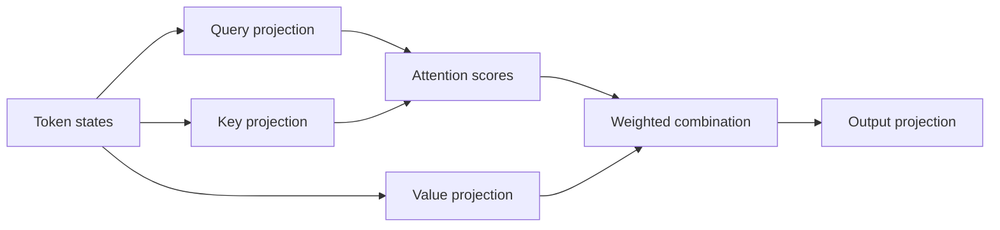

This is a structural preview, not a complete attention lesson. Module 03 will
explain causal masking and the KV cache.

### 1.6 Feed-forward layers

Transformer blocks also contain feed-forward networks, often with an expansion
to a larger intermediate dimension followed by projection back to the hidden
dimension. These are dominated by large linear operations plus elementwise
activation functions.

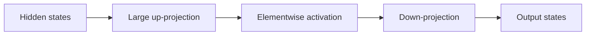

### 1.7 Not every transformer operation is equally GPU-friendly

Different operations have different characteristics:

- Large matrix multiplication can expose high parallelism and data reuse.
- Elementwise operations expose parallelism but may perform little math per
  byte moved.
- Normalization requires reductions and elementwise work.
- Token selection and Python control flow can be small or CPU-oriented.
- One-token decode creates smaller operation shapes than processing many prompt
  tokens together.

Therefore “transformers use matrix multiplication” is only the beginning of a
performance explanation.

### 1.8 The CPU-GPU pipeline

A simplified inference request crosses both processors:

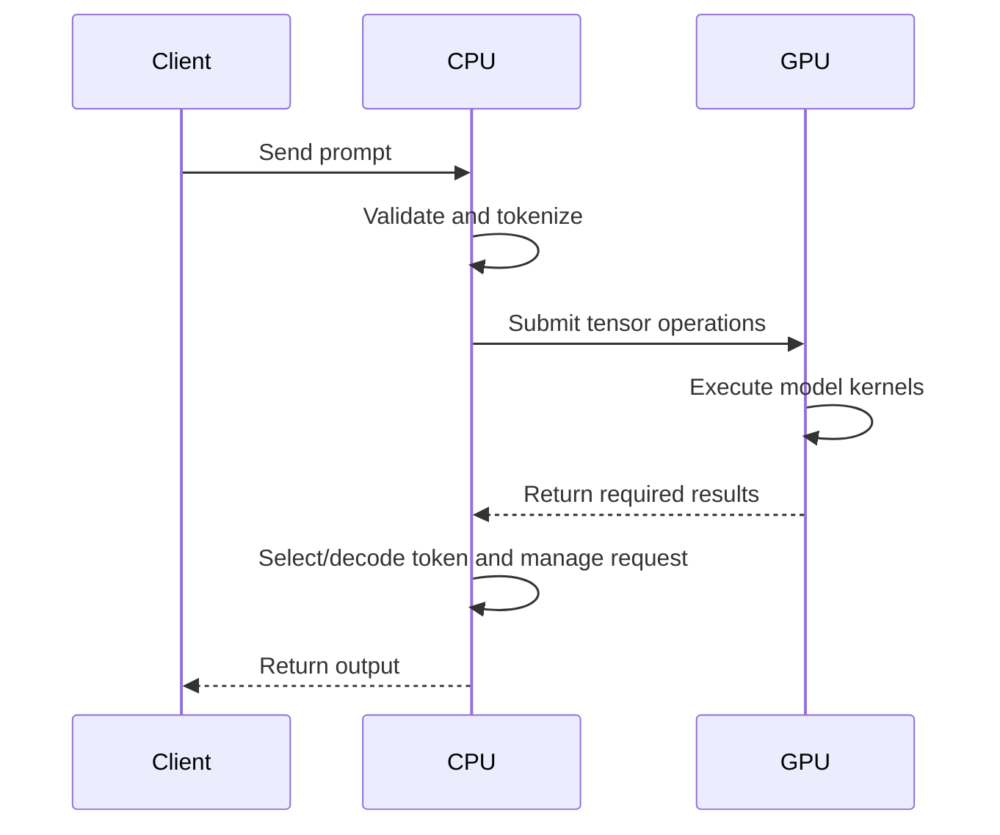

Frameworks may keep much of the generation loop and token selection on device,
and implementations vary. The key point is that end-to-end inference includes
more than GPU arithmetic.

### Section 1 checkpoint

Explain how text becomes numerical tensor work and identify at least three
different operation types in a transformer block.

---

## 2. Prefill and Decode: A Careful Preview

This section provides only the performance foundation. Module 03 develops the
full mechanics.

### 2.0 Start With Time: Which Tokens Exist Right Now?

Before defining prefill, separate two categories that the earlier version called
“known” and “unknown” without enough explanation.

Suppose the user submits this prompt:

```text
"The sky is blue"
```

After tokenization, assume the prompt contains four token pieces:

```text
position       0        1       2        3
token        "The"    " sky"  " is"   " blue"
```

These are **known tokens** because their identities are already present in the
request. The server does not need the model to guess them. It can immediately
convert all four to token IDs and supply those IDs to the model.

The token that should follow `" blue"` is **not yet known**. The request did not
contain it, and the model has not selected it yet. We can draw the boundary at
the instant the request arrives:

```text
ALREADY PROVIDED BY THE USER                  NOT SELECTED YET

position 0   position 1   position 2   position 3   position 4
  "The"       " sky"        " is"       " blue"         ?
└──────────────── prompt tokens ────────────────┘    next token
         known to the program now                     unknown now
```

“Known” does **not** mean that the model understands the token, that its answer
is predetermined, or that the token came from training data. It means only:

> **At this moment in this request, the program already has this token's ID.**

After the model selects a token for position 4—suppose it selects
`" because"`—that token becomes known and is appended to the sequence. Position
5 is then the new unknown:

```text
[The] [ sky] [ is] [ blue] [ because] [?]
                            newly known  next unknown
```

This boundary moves one position to the right after every generated token.

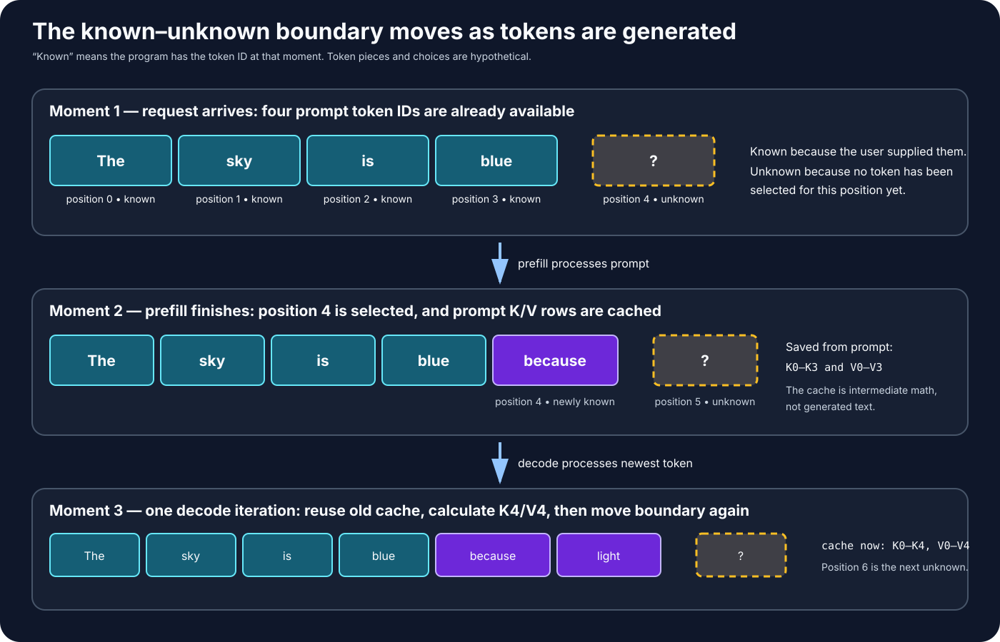

### 2.1 The Two Stages of Generation

Generation divides naturally at that boundary:

| Stage | Input available at the start | What the stage accomplishes |
| --- | --- | --- |
| **Prefill** | All tokens supplied in the prompt | Processes the prompt, saves reusable attention information, and produces scores for the first token after the prompt. |
| **Decode** | The prompt plus tokens generated so far | Selects one additional token, saves its reusable attention information, and repeats. |

For our example:

```text
PREFILL
input:   [The] [ sky] [ is] [ blue]
output:  scores for position 4 + saved attention information for positions 0–3

DECODE ITERATION 1
select:  [ because] for position 4
output:  scores for position 5 + add position 4 to saved attention information

DECODE ITERATION 2
select:  perhaps [ light] for position 5
output:  scores for position 6 + add position 5 to saved attention information
```

The model does not secretly calculate the whole answer during prefill. It
produces scores for one next-token decision. A decoding policy selects one
token from those scores. Only then does the next decode iteration have its full
input.

### 2.2 Prefill, Slowly and Concretely

**Prefill is the first model pass over the prompt tokens.** It does three things
that matter for this chapter:

1. It produces contextual representations for the prompt positions.
2. It saves reusable key and value vectors for those positions in the KV cache.
3. It produces logits used to select the first token after the prompt.

To understand how, we must first understand attention mechanically. Do not
begin with the metaphors “a query asks a question” or “a key advertises what it
contains.” Those can become useful later, but they hide the actual calculation.

#### 2.2.1 Attention's purpose: controlled information mixing

Consider a sentence with a reference:

```text
"The animal did not cross the street because it was tired."
```

When a transformer updates the numerical representation at `"it"`, information
from the earlier `"animal"` position may be useful. Attention is a mechanism
that lets one position form a weighted mixture of numerical information from
other permitted positions.

```text
current state at one token position
                 +
weighted information from permitted positions
                 │
                 ▼
new, context-aware state at that token position
```

It does not copy English words into one another. It operates on learned vectors.

#### 2.2.2 The prompt begins as one numerical row per token position

Return to the four-token teaching prompt:

```text
position       0        1       2        3
token        "The"    " sky"  " is"   " blue"
```

At the entrance to an attention layer, each position has a hidden-state vector:

```text
x0 = current numerical representation at position 0
x1 = current numerical representation at position 1
x2 = current numerical representation at position 2
x3 = current numerical representation at position 3
```

Stacking them creates a matrix:

```text
Xprompt
shape: [4 token positions, hidden_size]

row 0: x0 for "The"
row 1: x1 for " sky"
row 2: x2 for " is"
row 3: x3 for " blue"
```

All four rows can be prepared together because all four token IDs arrived in
the user's prompt.

#### 2.2.3 Q, K, and V are three calculated versions of each row

The attention layer owns three learned weight matrices. It applies them to `X`:

```text
Q = X × WQ
K = X × WK
V = X × WV
```

This is the origin of Q, K, and V. They are three **sibling outputs derived
from the same layer input**:

```text
                         ┌── × WQ ──▶ Q
current layer input X ───┼── × WK ──▶ K
                         └── × WV ──▶ V
```

Do not picture this as `Q → K → V`. Q does not create K, and K does not create
V. The three projections can be calculated independently once `X` and the
three weight matrices are available.

#### Where does X come from?

For the first transformer block, `X` is based on token embeddings plus
position-related information and any preprocessing defined by the architecture.
For a later block, `X` is the set of contextual hidden states produced by the
preceding block. Therefore every transformer block receives its own input `X`
and produces its own Q, K, and V.

```text
token IDs
   │
   ▼
embeddings and position information
   │
   ▼
X for transformer block 0 ──▶ Q0, K0, V0
   │ block 0 output
   ▼
X for transformer block 1 ──▶ Q1, K1, V1
   │
   ▼
and so on through the model
```

The rows of `X` are not raw token IDs. Each row is a numerical hidden state for
one sequence position at the current depth of the model.

#### Where do WQ, WK, and WV come from?

`WQ`, `WK`, and `WV` are model parameters learned during training. Training
adjusts their values so that the resulting attention behavior helps reduce the
model's prediction error. When an already-trained model performs inference,
these matrices are loaded with the model weights and normally remain fixed;
inference uses them rather than learning them again.

Some implementations store or calculate the three projections together using
one combined matrix and then split the result:

```text
[Q | K | V] = X × WQKV
```

That is an implementation optimization. Conceptually it still represents three
different learned projections with three different roles.

#### Shape derivation

For one attention head, suppose:

```text
X:   [T token positions, H hidden features]
WQ:  [H hidden features, Dk query/key features]
WK:  [H hidden features, Dk query/key features]
WV:  [H hidden features, Dv value features]
```

Then matrix multiplication produces:

```text
Q = X × WQ  → [T, Dk]
K = X × WK  → [T, Dk]
V = X × WV  → [T, Dv]
```

Q and K must share `Dk` because a query row is dot-multiplied with a key row.
Their corresponding feature coordinates occupy a compatible comparison space,
but their values are not expected to be equal. V does not participate in that
dot product and may conceptually use a different feature count `Dv`.

This creates one query, key, and value row for every token position:

```text
position 0: q0, k0, v0
position 1: q1, k1, v1
position 2: q2, k2, v2
position 3: q3, k3, v3
```

Here are the mechanical—not metaphorical—roles:

| Vector | Exact role in the calculation |
| --- | --- |
| **Query `qi`** | Represents destination position `i` on the left side of a dot product with every permitted key. It helps produce one score row. |
| **Key `kj`** | Represents possible source position `j` on the right side of that dot product. Together, `qi` and `kj` produce score `S[i,j]`. |
| **Value `vj`** | Represents the numerical source information at position `j`. It is multiplied by the normalized weight derived from `S[i,j]`. |

Queries and keys determine **how much weight** a source receives. Values supply
the **information multiplied by that weight**.

```text
S = Q × Kᵀ                       query/key dot-product scores
Smasked = apply_causal_mask(S)   forbid illegal source positions
A = softmax(Smasked)             normalized attention weights
O = A × V                        weighted mixture of value rows
```

The shortest accurate summary is:

> **Q and K mechanically produce attention scores and therefore determine the
> weights. V supplies the numerical information those weights combine. All
> three are separately projected from the same current hidden states X using
> learned model parameters.**

Q, K, and V are not English questions, database keys, or copies of token text.
They are learned numerical projections. A layer learns useful projections
during training.

#### 2.2.4 A complete query-key comparison

Suppose the query vector at the `"blue"` position is:

```text
qblue = [2, 1]
```

Suppose the four key vectors are:

```text
kThe  = [0, 1]
ksky  = [2, 1]
kis   = [1, 0]
kblue = [1, 1]
```

The model takes a dot product with every permitted key. Before applying the
causal mask, the four raw scores are:

```text
qblue · kThe  = (2×0) + (1×1) = 1
qblue · ksky  = (2×2) + (1×1) = 5
qblue · kis   = (2×1) + (1×0) = 2
qblue · kblue = (2×1) + (1×1) = 3

source position:          The    sky    is    blue
raw score from qblue:      1      5      2      3
```

In this hypothetical example, `qblue` and `ksky` have the largest dot product.
That is all the phrase “the query matches the key” means here: a learned
numerical comparison produced a relatively large score.

Real attention normally scales these scores and applies softmax. Suppose the
resulting weights are:

```text
source position:          The    sky    is    blue
attention weight:        0.05   0.60   0.10   0.25
```

The weights add to `1`. They are then applied to the value vectors:

```text
attention output for "blue"
= 0.05 × vThe
+ 0.60 × vsky
+ 0.10 × vis
+ 0.25 × vblue
```

Notice the division of labor:

```text
qblue and the keys produced:  [0.05, 0.60, 0.10, 0.25]
those weights selected/mixed: [vThe, vsky, vis, vblue]
```

The following figure traces those two separate stages:

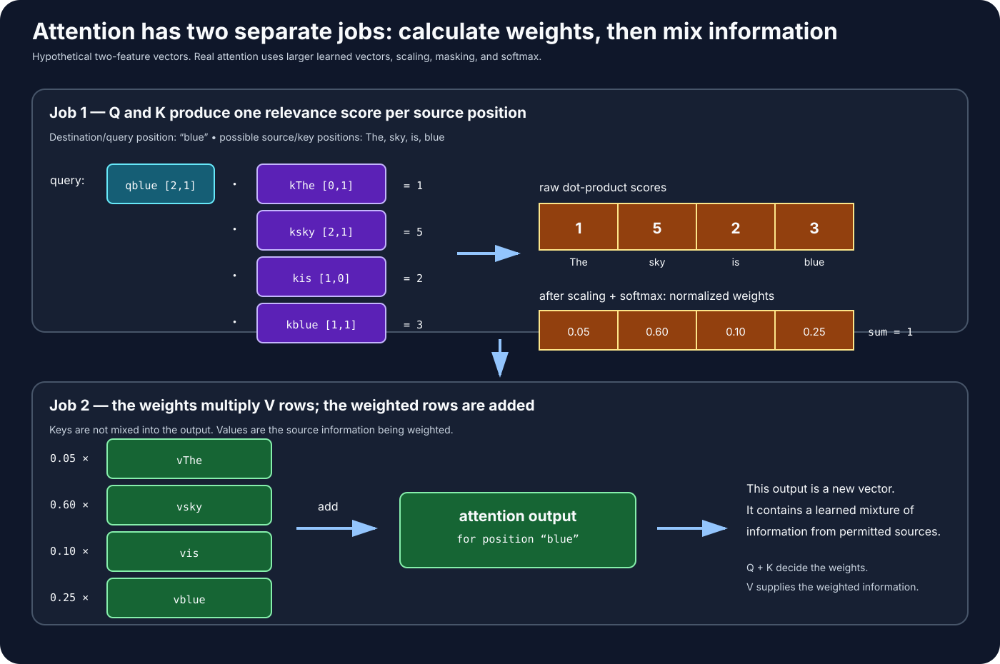

The output is a new numerical vector for the `"blue"` position. It can contain
context gathered from earlier positions, especially `"sky"` in this teaching
example. An individual vector coordinate does not have to correspond to a
human-readable concept.

#### 2.2.5 Why future-token leakage is a training problem

The complete training sentence is already stored in the training dataset:

```text
"The sky is blue"
```

Training creates next-token prediction examples from it:

```text
information that should be usable       target answer

"The"                                  → " sky"
"The sky"                              → " is"
"The sky is"                           → " blue"
```

Focus on the second example. The representation at position 1, `" sky"`, is
used to predict the target at position 2, `" is"`.

If query position 1 were allowed to use key/value position 2, it could inspect
information derived from `" is"` while being trained to predict `" is"`:

```text
legal input for the prediction:   [The] [sky]
target answer:                                 [is]

illegal shortcut:
position 1 representation ───────────────reads position 2 "is"
                                                  │
                                                  └── the answer leaked into its input
```

The model could appear accurate during training by exploiting information that
will not exist when it must generate new text. That is **future-token leakage**:

> Information from the target or a still-later sequence position improperly
> influences a representation that is supposed to predict without that future.

#### 2.2.6 The causal mask removes the illegal shortcut

The causal mask specifies which source positions each query row may use:

```text
                           KEY/VALUE SOURCE POSITION
                         0      1      2      3
QUERY position 0       allow  block  block  block
QUERY position 1       allow  allow  block  block
QUERY position 2       allow  allow  allow  block
QUERY position 3       allow  allow  allow  allow
```

For query position 1:

```text
may use:      positions 0 and 1
may not use:  positions 2 and 3
```

Suppose its unmasked scores were:

```text
source:          The    sky     is    blue
raw score:        2      4       8      3
```

The causal mask conceptually replaces forbidden scores with negative infinity:

```text
source:          The    sky     is    blue
masked score:     2      4      −∞      −∞
```

After softmax, forbidden positions receive zero weight:

```text
source:          The    sky     is    blue
attention weight: approximately 0.12, 0.88, 0, 0
```

Therefore `vis` and `vblue` contribute nothing to the output for query position
1. The mask blocks influence; it does not remove the tokens from server memory.

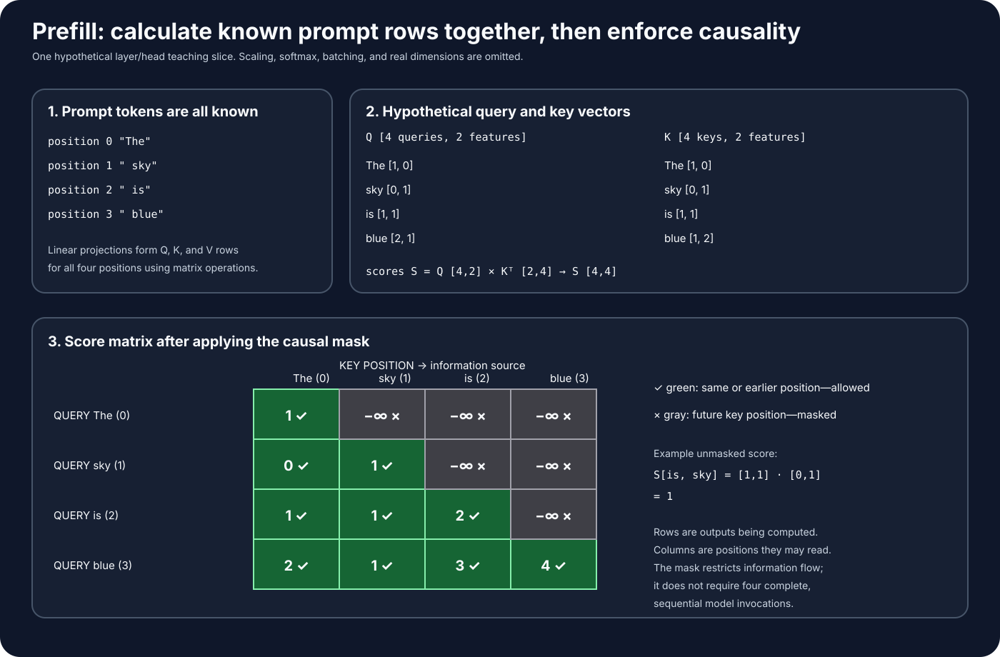

#### 2.2.7 Known to the server is not the same as visible to a row

This is the distinction that resolves the apparent contradiction during
inference prefill:

| Question | Meaning |
| --- | --- |
| Is the token **known to the server**? | Does its token ID already exist in the prompt input? |
| Is the token **visible to this query row**? | Does the causal mask permit this row to use that token position's key and value? |

All four prompt tokens are known to the server, so the GPU can construct all
four Q/K/V rows using large matrix operations. But their permitted views differ:

```text
row 0 represents prefix: "The"
row 1 represents prefix: "The sky"
row 2 represents prefix: "The sky is"
row 3 represents prefix: "The sky is blue"
```

Consequently:

```text
row 0 may read positions 0
row 1 may read positions 0–1
row 2 may read positions 0–2
row 3 may read positions 0–3
```

The GPU may calculate many matrix cells in parallel. The mask determines which
cells are allowed to influence each output. Causal information flow therefore
does not require four separate complete model passes during prefill.

#### 2.2.8 How prefill ends and the KV cache begins

After attention and the rest of the transformer layers run, the last prompt
row represents the complete prompt prefix:

```text
row 3 → "The sky is blue"
```

That final row is used to produce logits for the next position, position 4. A
selection policy might choose `" because"`.

Meanwhile, each relevant layer retains the prompt's key and value rows:

```text
K cache after prefill                 V cache after prefill

position 0: kThe                     position 0: vThe
position 1: ksky                     position 1: vsky
position 2: kis                      position 2: vis
position 3: kblue                    position 3: vblue
```

These rows are saved because the next generated position will need to compare
its new query with the earlier keys and combine the earlier values. The cache
contains reusable intermediate numbers—not words, logits, the answer, or model
weights.

#### Section 2.2 checkpoint

Before continuing, explain each answer in your own words:

1. In the attention calculation, what do Q and K produce together?
2. What is done with V after Q and K produce attention weights?
3. Why would allowing position 1 to read position 2 leak the answer when
   position 1 is being used to predict position 2?
4. How can a token be known to the server but blocked from a particular row?
5. Why can prefill calculate all prompt Q/K/V rows together without allowing
   information to flow backward from future positions?
6. What exactly is saved in the KV cache at the end of prefill?

### 2.3 Decode and the KV Cache, Slowly and Concretely

At the start of the first decode iteration, `" because"` has now been selected.
Its ID is therefore known and can be processed as the newest input position.

#### What would happen without a KV cache?

Attention for the new position needs keys and values representing the earlier
positions. Without saved results, the system would repeatedly recreate the old
K and V rows:

```text
iteration 1: recreate K/V for positions 0–3, then process position 4
iteration 2: recreate K/V for positions 0–4, then process position 5
iteration 3: recreate K/V for positions 0–5, then process position 6
```

That repeats work whose inputs and results have not changed.

#### What happens with a KV cache?

The old rows are retrieved from device memory. Only the newest position needs
new K and V rows:

```text
REUSE from cache                         CALCULATE now

K0 K1 K2 K3                              K4 for " because"
V0 V1 V2 V3                              V4 for " because"
```

The model also calculates a new query `Q4`. That query compares with all keys
available through position 4:

```text
Q4 compares with [K0, K1, K2, K3, K4]
                         │
                         ▼
             five attention scores
                         │
                         ▼
scores mix [V0, V1, V2, V3, V4]
                         │
                         ▼
        context for newest position 4
```

Position 4 can read all positions 0–4 because all are at or before its own
position. There is no future prompt row to mask for this single newest query.

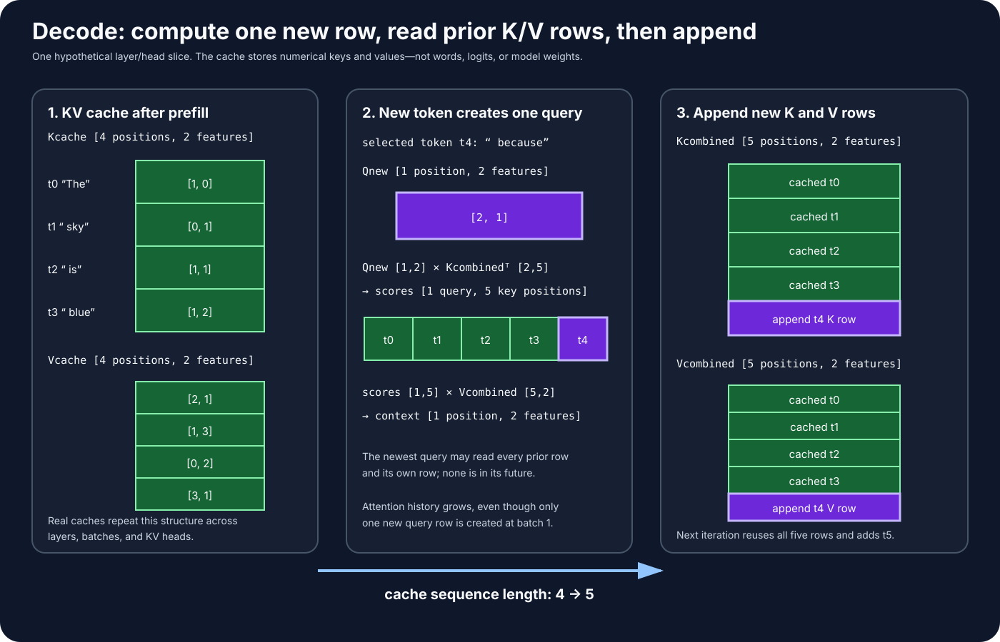

After the layer uses the rows, `K4` and `V4` are appended to the cache:

```text
before: cache covers positions [0, 1, 2, 3]
after:  cache covers positions [0, 1, 2, 3, 4]
```

The model eventually produces logits for position 5 and selects another token.
That selected token becomes the input to the next iteration.

#### What the cache saves—and what it costs

The KV cache saves **recomputation of old key and value projections**. It does
not make attention free:

- The new token still passes through every transformer layer.
- A new Q, K, and V must be formed for the new position.
- The new query still compares with the growing collection of cached keys.
- The attention result still combines cached values.
- New K/V rows consume additional GPU memory at every relevant layer.

Therefore the cache trades memory capacity for less repeated computation. Its
memory usage grows with sequence length.

#### Check your mental model

For the prompt `[The, sky, is, blue]`, answer these before continuing:

1. Why are the four prompt tokens called known before prefill?
2. Which token is unknown at that moment?
3. Why may query position 1 not read key position 3 during prefill?
4. Does the causal mask mean the GPU must run four complete sequential model
   passes? Why not?
5. What numerical rows does the KV cache retain?
6. When `" because"` is appended, which K/V rows are reused and which are new?

### 2.4 Parallel inside, sequential outside

Each decode iteration contains large operations that run in parallel on the
GPU. But the iterations themselves are ordered because the next selected token
is not known until the current iteration finishes.

```text
Decode iteration 1: [many parallel GPU operations] → token 1
Decode iteration 2:                               [many parallel GPU operations] → token 2
Decode iteration 3:                                                               [many parallel GPU operations] → token 3
```

This pattern combines inner parallelism with outer sequential dependency.

### 2.5 Why the shapes differ

Simplified linear-operation shapes:

```text
Prefill input: [many prompt positions, hidden size]
Decode input:  [one new position, hidden size]  # per sequence at batch 1
```

The weights are large in both cases. Prefill can reuse them across many prompt
positions in one operation. Batch-one decode has less token-position work per
iteration and repeatedly needs weights as it produces tokens one at a time.

This helps motivate—but does not universally prove—the common observation:

- Prefill often uses compute resources more effectively.
- Small-batch decode is often sensitive to memory bandwidth and launch latency.

Profiler evidence is required for a specific model and system.

The visual contrast is:

```text
PREFILL LINEAR OPERATION                    BATCH-1 DECODE LINEAR OPERATION

many token rows                             one newest-token row
┌──────────────────────┐                    ┌──────────────────────┐
│ t0: 4096 features    │                    │ t128: 4096 features  │
│ t1: 4096 features    │                    └──────────────────────┘
│ ...                  │                              ×
│ t127: 4096 features  │                    same large weight matrix
└──────────────────────┘                              ↓
          ×                                  one output-feature row
same large weight matrix
          ↓
128 output-feature rows

More rows let one operation reuse the same weights across more token positions.
```

### 2.6 Batching changes decode parallelism

If multiple sequences decode together, one iteration can process one new token
position for each sequence:

```text
Batch 1: [sequence A newest token]

Batch 4: [sequence A newest token]
         [sequence B newest token]
         [sequence C newest token]
         [sequence D newest token]
```

This gives the GPU more work per weight load and can improve aggregate
throughput, while queueing and larger batches can affect per-request latency.

In matrix form, batch size changes the number of input rows:

```text
Batch 1 decode:  X [1 sequence, 4096 features] × W [4096, 4096]
                 → Y [1 sequence, 4096 output features]

Batch 4 decode:  X [4 sequences, 4096 features] × W [4096, 4096]
                 → Y [4 sequences, 4096 output features]

Each X row belongs to a different sequence's newest token. The sequences do not
share attention histories; batching merely packages compatible work so kernels
can process more rows together.
```

### Section 2 checkpoint

Explain the phrase “decode is parallel inside each iteration but sequential
across generated tokens.” Then explain why prefill can process known prompt
positions in large tensor operations without violating causal attention.

## Lesson 02 Completion Gate

Continue only when you can explain without notes:

1. The difference between a token ID, an embedding, and a hidden-state row.
2. Where Q, K, and V come from and their distinct mechanical roles.
3. Why Q and K need compatible feature dimensions without equal values.
4. How a query-key score becomes a weight applied to a value row.
5. Why causal masking prevents future-token leakage.
6. The difference between a token being known to the server and visible to a
   particular query row.
7. What prefill produces and what decode repeats.
8. Exactly what the KV cache stores, saves, and costs.

Next: [Lesson 03 — How Transformer Workloads Map to GPUs](../03-transformer-workloads-on-gpus/).

---
