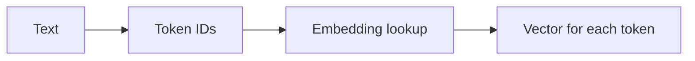
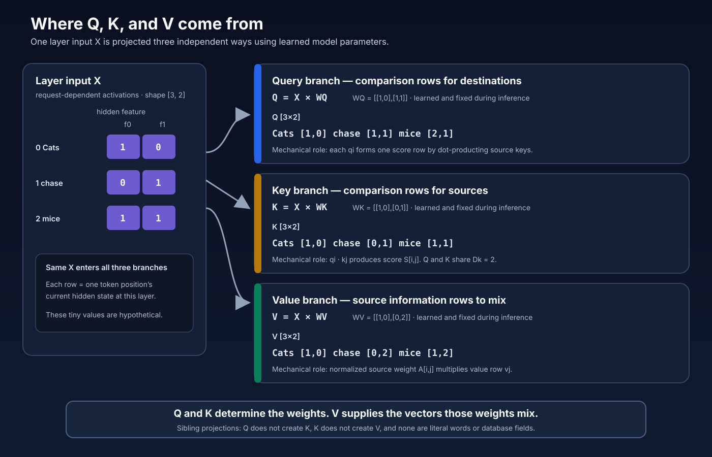
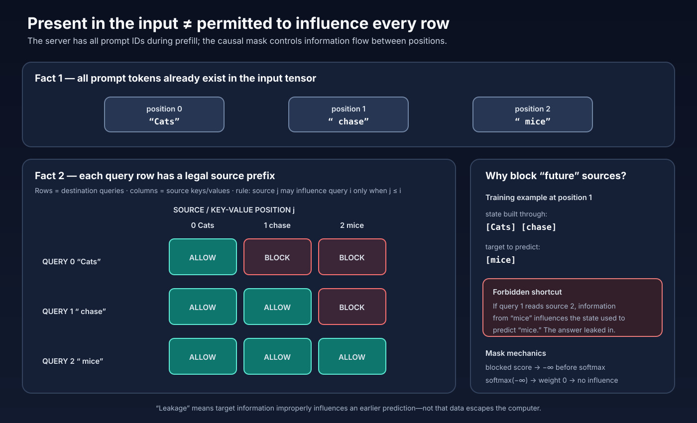
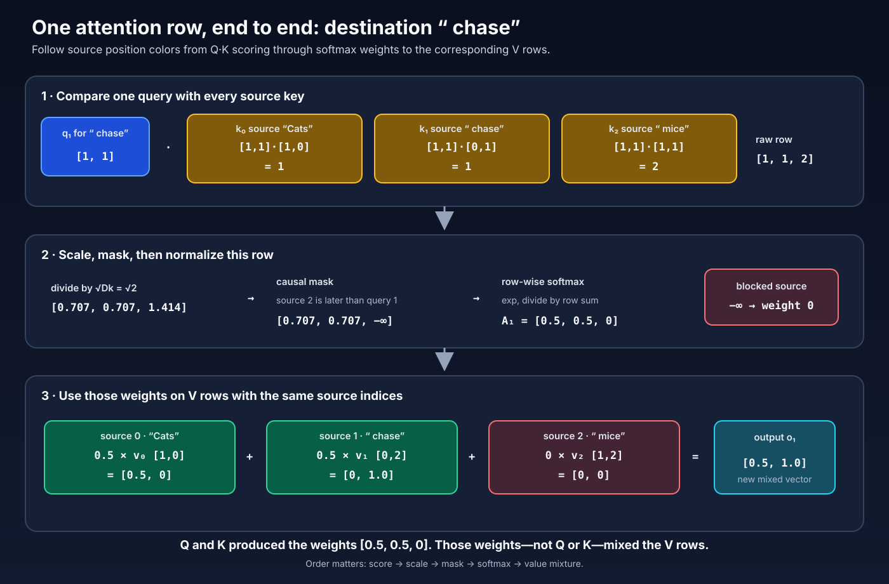
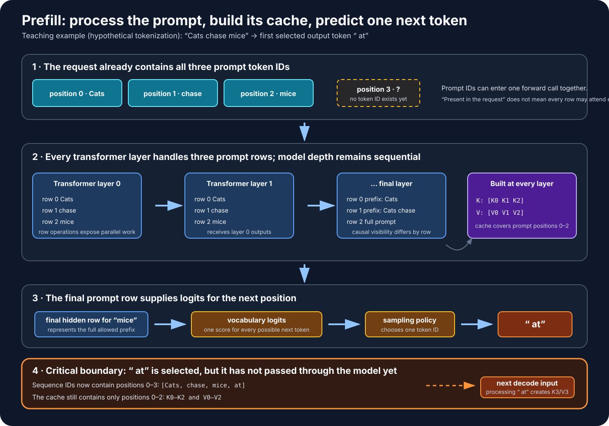
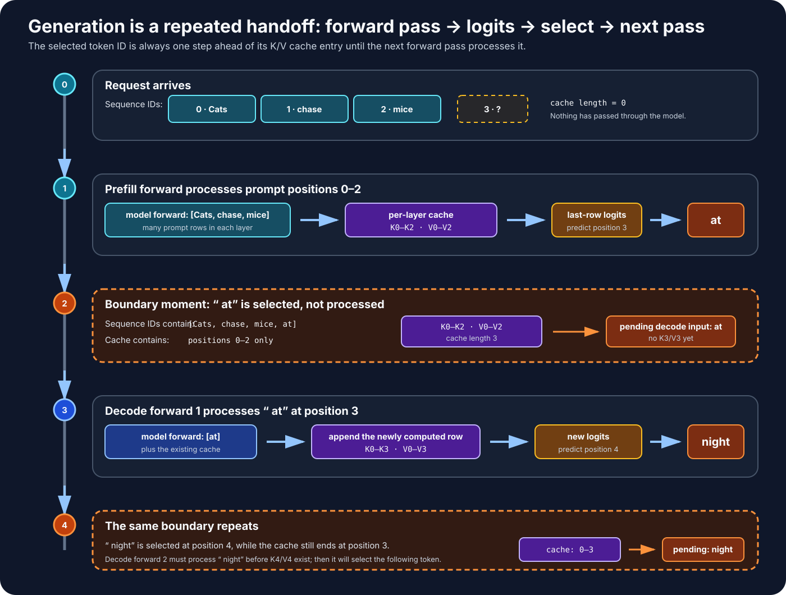
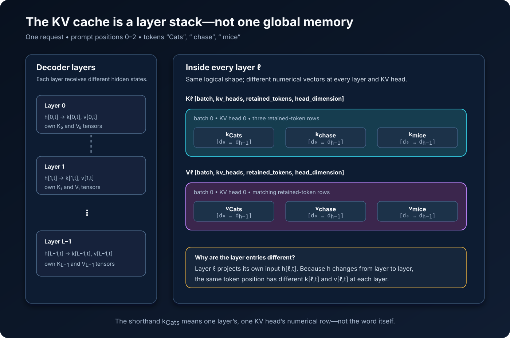
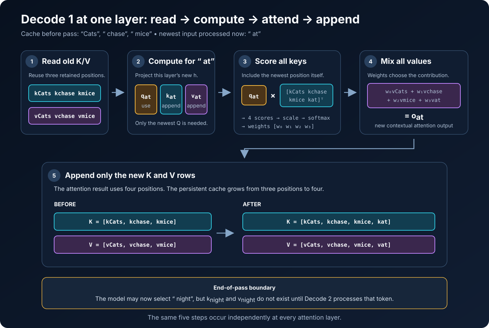
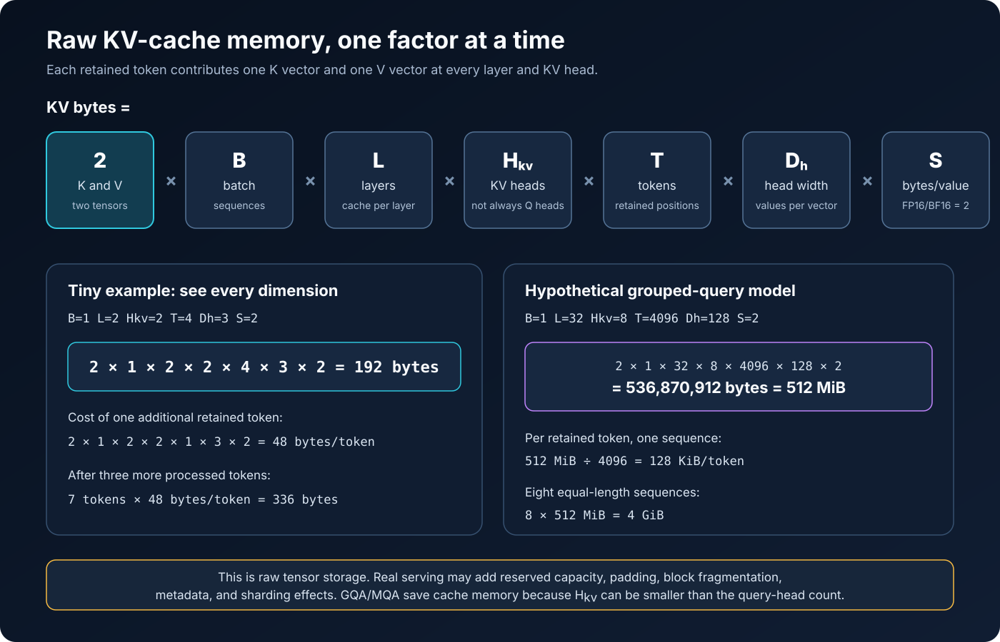

# Lesson 02 — Transformer Inference Foundations

**Prerequisite:** Lesson 01, especially vectors, matrices, tensors, matrix
multiplication, dependencies, and parallel work  
**Purpose:** Understand the decoder-only transformer algorithm before analyzing
how GPU hardware executes it  
**Expected study time:** 4–6 hours

## Learning Objectives

By the end of this lesson, you should be able to trace one prompt through:

```text
text → tokens → token IDs → embeddings → hidden states → Q/K/V projections
→ attention scores → causal mask → softmax weights → value mixing → logits
→ token selection → decode iteration → KV-cache update
```

This lesson answers **what the algorithm does**. Lesson 03 separately answers
**why its workload shapes map well—or imperfectly—to a GPU**. Keeping those
questions separate prevents hardware terminology from obscuring the algorithm.

## 1. Transformer Inputs and Building Blocks

### 1.1 What is inference?

**Inference** means using an already-trained model to produce outputs from new
inputs. For a decoder-only language model, inference repeatedly predicts a next
token based on the tokens seen so far.

Training adjusts model weights. Inference primarily reads those weights and
uses them in numerical operations.

### 1.2 What is a tensor?

A **tensor** is a multidimensional collection of values with properties such as:

- **Shape:** number of positions along each dimension
- **Data type:** representation used for each value
- **Device:** where its storage resides
- **Layout or strides:** how logical positions map to memory

More concretely, a tensor is a regular collection of same-data-type values that
can be addressed with integer indices, plus metadata describing how to
interpret and locate those values. A rank-3 tensor is not necessarily stored as
a literal geometric cube. Its axes are a logical indexing organization; its
underlying storage is commonly a one-dimensional region of memory.

Examples:

```text
Scalar: 7                              shape: []
Vector: [2, 4, 6]                      shape: [3]
Matrix: [[1, 2], [3, 4]]               shape: [2, 2]
Token states                           shape: [batch, tokens, hidden_size]
```

If a token-state tensor has shape `[2, 128, 4096]`:

- `2` means two sequences in the batch.
- `128` means 128 token positions per sequence.
- `4096` means each token position is represented by 4,096 numerical features.

Total values:

```text
2 × 128 × 4096 = 1,048,576 values
```

The word **dimension** is overloaded, so we will be precise:

- An **axis** is one direction in which a tensor can be indexed.
- The **size of an axis** is the number of positions along that axis.
- The **rank** is the number of axes. Rank is not the number of stored values.
- The **shape** lists the axis sizes in order.

The following figure builds rank one axis at a time. Every colored square is
one scalar value. Brackets in a shape describe axes; they are not matrix rows.


#### Reading an index

For the matrix below, the first index chooses a row and the second chooses a
column:

```text
                 column 0   column 1   column 2
                            axis 1 →
row 0, axis 0 ↓      10         11         12
row 1                20         21         22

shape = [2 rows, 3 columns]
matrix[1, 2] = 22
       │  └──────── choose column 2
       └─────────── choose row 1
```

A rank-3 tensor adds another index. It is often easiest to understand it as a
stack of matrices. `T[batch, token, feature]` means:

1. Choose a sequence from the batch.
2. Choose a token position in that sequence.
3. Choose one numerical feature belonging to that token position.

#### Expanding `[2, 128, 4096]`


The picture deliberately cannot draw all 1,048,576 cells. Ellipses mean
“positions omitted from the drawing,” not missing data. The tensor contains:

```text
2 sequences
× 128 token positions in each sequence
× 4,096 feature values for each token position
= 1,048,576 scalar values
```

One particular scalar might be written:

```text
H[1, 5, 37]
  │  │   └── feature 37
  │  └────── token position 5
  └───────── sequence 1 (the second sequence because indexing starts at 0)
```

The 4,096 values at `H[1, 5, :]` collectively represent the model's current
state for that token position. Individual features generally do not have a
simple fixed translation such as “feature 37 means blue.” Meaning is distributed
across the vector and transformed from layer to layer.

#### Shape is only part of a tensor's description

Two tensors can have the same shape and still differ:

| Property | Example | What it answers |
| --- | --- | --- |
| Shape | `[2, 128, 4096]` | How many positions exist along each axis? |
| Data type | `float16` | How is each value encoded, and how many bytes does it use? |
| Device | `cuda:0` | In which processor's attached memory does the storage reside? |
| Stride | `[524288, 4096, 1]` | How far in storage must we move when an index increases by one? |

For a contiguous row-major `[2, 128, 4096]` tensor, adjacent features are next
to one another. Moving forward one token skips 4,096 stored values; moving
forward one batch item skips `128 × 4096 = 524,288` values. Lesson 06 develops
layout and memory consequences.

The data type determines bytes per value. For example, if every value occupies
2 bytes, the raw storage for this tensor is:

```text
1,048,576 values × 2 bytes/value = 2,097,152 bytes = 2 MiB
```

Lesson 06 turns this reasoning into broader memory estimates.

### 1.3 Token embeddings

Text is first converted into token IDs. An embedding lookup maps each token ID
to a learned vector.



The model does not directly calculate on English words. It calculates on
numerical tensors.

### 1.4 Linear transformations

A transformer repeatedly applies learned weight matrices to token-state
vectors. In simplified form:

```text
output = input × weights + bias
```

For many token positions and a batch, these become large matrix operations.

Example shapes:

```text
Input token states:  [256 token positions, 4096 features]
Weight matrix:       [4096 input features, 4096 output features]
Output states:       [256 token positions, 4096 output features]
```

Before using the large numbers, examine a complete teaching example:


Here `X` contains three token positions with two input features each. `W`
describes how two input features contribute to four output features. Therefore:

```text
X shape: [3 token positions, 2 input features]
W shape: [2 input features, 4 output features]
Y shape: [3 token positions, 4 output features]

             shared dimension
                    ┌─┴─┐
[3 tokens, 2 input] × [2 input, 4 output] → [3 tokens, 4 output]
 └ output rows ┘                         └── output columns ──┘
```

For example, output `Y[token 1, output feature 2]` uses row 1 of `X` and
column 2 of `W`:

```text
X row 1 = [3, 4]
W column 2 = [2, 1]
Y[1, 2] = (3 × 2) + (4 × 1) = 10
```

The same shape rule applies to the realistic example:

```text
[256 token positions, 4096 input features]
× [4096 input features, 4096 output features]
→ [256 token positions, 4096 output features]
```

That output contains:

```text
256 × 4096 = 1,048,576 output values
```

Each output is a dot product of length 4,096, so forming all outputs requires
approximately:

```text
1,048,576 outputs × 4,096 multiply-accumulate steps per output
= 4,294,967,296 multiply-accumulate steps
```

This count describes mathematical work, not elapsed time or the number of
physical GPU cores. Many output cells and tiles can be worked on concurrently;
finite hardware schedules them in waves. The bias, if present, contributes one
additional value to each output cell after the dot product.

### 1.5 What comes next

The next three sections build one connected mental model in dependency order:
attention first, then the prefill/decode timeline, then KV caching.

---

## 2. Self-Attention, From Inputs to Outputs

This section teaches one attention head completely before discussing inference
stages. Attention is not a prefill-only operation: the model uses it during
both prefill and decode.

### 2.1 The problem attention solves

A token begins a transformer layer as one row of numbers. That row contains the
model's current representation of that position, but language requires context.
For example, the representation of `"mice"` should be able to incorporate
useful information from `"Cats"` and `" chase"`.

Self-attention gives every **destination position** a controlled way to combine
information from permitted **source positions**:

```text
destination position i
        │
        ├── calculate one weight for every permitted source j
        │
        └── form a weighted sum of the source information
                              │
                              ▼
                  contextual output for position i
```

Those terms will remain consistent throughout the lesson:

| Term | Meaning |
| --- | --- |
| Destination/query position `i` | The row whose new output we are calculating. |
| Source/key-value position `j` | A row that might contribute to that output. |

### 2.2 One teaching prompt and its hidden-state matrix

Assume tokenization gives three token pieces:

```text
position       0          1          2
token        "Cats"    " chase"    " mice"
```

At the entrance to one attention layer, stack one hidden-state row per position:

```text
X = [ [1, 0],     ← x0, current state for "Cats"
      [0, 1],     ← x1, current state for " chase"
      [1, 1] ]    ← x2, current state for " mice"

shape of X = [3 positions, 2 hidden features]
```

These tiny values are invented so every calculation fits on the page. A real
model might use thousands of hidden features, and no individual coordinate is
guaranteed to have a simple English meaning.

### 2.3 Where Q, K, and V come from

The layer owns three learned weight matrices. The same input `X` is multiplied
by each:

```text
Q = XWQ       K = XWK       V = XWV
```

They are **sibling projections**. Q does not create K; K does not create V.
During training, optimization learns the entries of `WQ`, `WK`, and `WV`.
During ordinary inference, those weights are already loaded and fixed; the
request-dependent matrices Q, K, and V are calculated from the current X.

For this example, use:

```text
WQ = [ [1, 0],    WK = [ [1, 0],    WV = [ [1, 0],
       [1, 1] ]          [0, 1] ]          [0, 2] ]
```

The resulting projections are:

```text
Q = [ [1, 0],     K = [ [1, 0],     V = [ [1, 0],
      [1, 1],           [0, 1],           [0, 2],
      [2, 1] ]          [1, 1] ]          [1, 2] ]
```

One row calculation is:

```text
q1 = x1 WQ

     [0, 1] × [ [1, 0], = [0×1 + 1×1, 0×0 + 1×1]
                [1, 1] ]

             = [1, 1]
```

The shapes generalize as follows:

```text
X [T,H] × WQ [H,Dk] → Q [T,Dk]
X [T,H] × WK [H,Dk] → K [T,Dk]
X [T,H] × WV [H,Dv] → V [T,Dv]
```

`T` is the number of token positions, `H` is hidden size, and `Dk` and `Dv`
are per-head feature sizes. Q and K require compatible final dimensions because
their rows will be dot-multiplied. Their numeric values do **not** need to
match.

#### The exact mechanical roles

| Matrix | What its rows do |
| --- | --- |
| Q | A row `qi` sits on the destination side of comparisons and produces score row `i`. |
| K | A row `kj` sits on the source side; `qi · kj` produces the score for source `j`. |
| V | A row `vj` supplies source information that will be multiplied by the resulting weight. |

The compact rule is:

> **Q and K determine the weights. V supplies the vectors those weights mix.**



### 2.4 Step 1: build the raw score matrix

Attention compares every query row with every key row:

```text
Sraw = QKᵀ
```

For example, score cell `[1,2]` is:

```text
Sraw[1,2] = q1 · k2
          = [1,1] · [1,1]
          = (1×1) + (1×1)
          = 2
```

Its meaning is purely mechanical:

```text
row 1    = destination/query position " chase"
column 2 = source/key position " mice"
cell 2   = their unnormalized dot-product score
```

Calculating every pair gives:

```text
                           SOURCE / KEY POSITION j
                         0 Cats   1 chase   2 mice
DESTINATION / QUERY  0  [   1,       0,       1  ]
POSITION i           1  [   1,       1,       2  ]
                     2  [   2,       1,       3  ]

Sraw shape = [3 query positions, 3 key positions]
```

A score is not yet a probability or a final weight.

### 2.5 Step 2: scale the scores

Scaled dot-product attention divides by the square root of the query/key
feature count:

```text
Sscaled = QKᵀ / √Dk
```

Here, `Dk = 2`, so `1/√2 ≈ 0.707`:

```text
                     SOURCE / KEY POSITION
                     Cats     chase    mice
QUERY "Cats"        [0.707,   0.000,   0.707]
QUERY " chase"      [0.707,   0.707,   1.414]
QUERY " mice"       [1.414,   0.707,   2.121]
```

As feature count grows, an unscaled dot product tends to grow in magnitude.
Large logits can make softmax extremely peaked. Division by `√Dk` controls that
growth. Scaling does **not** make a row sum to one; softmax does that later.

### 2.6 Step 3: apply the causal mask

A decoder-only language model must predict left to right. Query position `i`
may use source position `j` only when `j ≤ i`:

```text
                     SOURCE POSITION j
                     0        1        2
QUERY position 0   allow    block    block
QUERY position 1   allow    allow    block
QUERY position 2   allow    allow    allow
```

The mask adds a conceptually negative-infinite value to forbidden score cells:

```text
                     Cats     chase    mice
QUERY "Cats"        [0.707,     −∞,      −∞]
QUERY " chase"      [0.707,   0.707,     −∞]
QUERY " mice"       [1.414,   0.707,   2.121]
```

#### What “future-token leakage” actually means

During training, a complete text is available as a tensor so many next-token
examples can be evaluated together:

```text
state built through position 0  → predict token at position 1
state built through position 1  → predict token at position 2
```

If the state at position 1 could incorporate the actual token at position 2,
the answer `" mice"` would influence the state used to predict `" mice"`.
That is leakage: not data escaping a computer, but the target influencing a
prediction that is supposed to be made without that target.

All three prompt token IDs are present in the prefill input. “Present in the
input” and “permitted to influence this query row” are different facts. The
mask controls influence; it does not delete tokens from memory.



### 2.7 Step 4: softmax converts each score row into weights

Softmax is applied **separately to each query row**:

```text
softmax(z)i = exp(zi) / Σj exp(zj)
```

For query row 1:

```text
masked scores  = [0.707, 0.707, −∞]
exponentials   ≈ [2.028, 2.028, 0]
row sum        ≈ 4.056
weights        = [0.500, 0.500, 0.000]
```

The permitted weights are nonnegative and sum to one. A masked `−∞` becomes
zero after softmax, so that source cannot contribute.

For all three rows:

```text
A ≈ [ [1.000, 0.000, 0.000],
      [0.500, 0.500, 0.000],
      [0.284, 0.140, 0.576] ]
```

### 2.8 Step 5: use the weights to mix V

Now—and only now—V enters the weighted mixture:

```text
O = AV
```

For query position 1:

```text
A1 = [0.5, 0.5, 0]

V = [ [1,0],    ← v0 from source "Cats"
      [0,2],    ← v1 from source " chase"
      [1,2] ]   ← v2 from source " mice"

o1 = 0.5[1,0] + 0.5[0,2] + 0[1,2]
   = [0.5, 1.0]
```

The column index in A selects the V row with the same source position. Q and K
are not averaged into O; their job was to create A.

The complete output is:

```text
O = AV

o0 = 1.000[1,0]                              = [1.000, 0.000]
o1 = 0.500[1,0] + 0.500[0,2]                 = [0.500, 1.000]
o2 = 0.284[1,0] + 0.140[0,2] + 0.576[1,2]   ≈ [0.860, 1.432]

O ≈ [ [1.000, 0.000],
      [0.500, 1.000],
      [0.860, 1.432] ]
```



### 2.9 The complete equation

The whole single-head operation is:

```text
Attention(X)
= softmax((XWQ)(XWK)ᵀ / √Dk + causal_mask)(XWV)
```

Read it inside out:

1. Project X into Q, K, and V.
2. Compare Q with K to make score cells.
3. Scale the scores.
4. Mask illegal source positions.
5. Apply row-wise softmax to obtain weights.
6. Use the weights to mix V rows.

### 2.10 Multiple heads: a bounded preview

A real transformer commonly performs several attention heads in parallel. Each
head owns its projections, calculates its attention output, and operates in a
smaller feature space. The outputs are concatenated and projected:

```text
X ─┬─ head 0: Q0,K0,V0 → O0 ─┐
   ├─ head 1: Q1,K1,V1 → O1 ─┼→ concatenate → ×WO → attention output
   └─ ...                     ┘
```

Different heads can learn different patterns. Do not assume each head has one
stable, human-readable job. Grouped-query attention, rotary position
embeddings, and optimized attention kernels are deferred until the basic
mechanics are secure.

### 2.11 Attention misconceptions to remove now

- A query is not a literal English question.
- A key is not a database lookup key.
- A value is not the original token copied unchanged.
- Q, K, and V are independently projected from the same current X.
- Q and K require compatible feature counts, not equal values.
- The causal mask is applied before softmax.
- Softmax operates across source columns for each query row.
- Attention output mixes V—not K and not Q.
- Attention weights are not guaranteed explanations of model reasoning.
- A causal mask and a padding mask solve different problems.

### Section 2 checkpoint

Without looking back, explain:

1. Which quantities are learned model parameters, and which depend on the request?
2. What exactly does score cell `S[i,j]` measure?
3. Why must Q and K have compatible final dimensions?
4. Why divide by `√Dk`, and why is that not the same as softmax?
5. Why does a masked score become zero influence?
6. Which rows are finally mixed to create O?

---

## 3. Prefill and Decode: Generation Through Time

Attention explains what happens inside a layer. Prefill and decode describe
**when and over which positions** the model performs those layer calculations.

### 3.1 Establish the time boundary

At request arrival, the server has the prompt token IDs:

```text
ALREADY PROVIDED                         NOT SELECTED YET

position 0     position 1     position 2     position 3
  "Cats"        " chase"       " mice"          ?
└────────────── prompt ─────────────────┘     next token
```

“Known” means only that the program already has the token ID. It does not mean
the model understands it or has predetermined the response. Position 3 cannot
be processed until a token-selection rule chooses its identity.

Autoregressive generation alternates between two operations:

1. A model forward pass produces logits—one score per vocabulary token.
2. A selection rule chooses one token ID from those logits.

That chosen token then becomes input to the next forward pass. The complete
future answer is not generated all at once.

### 3.2 Prefill: one forward pass over the prompt

**Prefill is the initial forward pass over all prompt positions.** For the
three-token example, its input shape begins conceptually as:

```text
token IDs:     [1 sequence, 3 positions]
hidden states: [1 sequence, 3 positions, H hidden features]
```

At each attention layer, prefill calculates Q, K, and V rows for all three
positions. The causal mask gives each row a different legal view:

```text
row 0 sees prefix: [Cats]
row 1 sees prefix: [Cats, chase]
row 2 sees prefix: [Cats, chase, mice]
```

Although information flows only left-to-right, the GPU does not need three
complete model passes. It can calculate the rows and score cells in large
parallel tensor operations; the triangular mask prevents forbidden cells from
influencing outputs.

After the last transformer layer, the model maps hidden states to vocabulary
logits. The final prompt row represents the complete prompt prefix, so its
logits are used for the next-token decision:

```text
final hidden row for position 2
              │
              ▼
     vocabulary projection
              │
              ▼
logits: one score for every vocabulary token
              │
              ▼
  selection rule chooses " at"
```

The selection rule might be greedy argmax or a sampling procedure involving
temperature, top-k, or top-p. Those policies change how a token is chosen, not
the meaning of prefill.

Prefill therefore leaves three important results:

- logits for selecting the first generated token;
- prompt K/V rows saved at every attention layer;
- the identity of the selected token, here `" at"`.

One subtle boundary is essential:

> At the end of prefill, `" at"` has been selected but has not yet passed
> through the model. Its layer-by-layer K/V rows therefore do not exist yet.



### 3.3 Decode: one newly selected token per forward pass

The first decode forward pass receives `" at"` as its new input position. At
each transformer layer, the model calculates the new position's Q, K, and V,
uses the earlier K/V rows, and continues through the model. Its final hidden
row produces logits that might select `" night"`.

The process then repeats:

| Forward pass | Positions processed in this pass | Cache resident after pass | Token selected afterward |
| --- | --- | --- | --- |
| Prefill | `Cats`, `chase`, `mice` | `Cats`, `chase`, `mice` | `at` |
| Decode 1 | `at` | `Cats`, `chase`, `mice`, `at` | `night` |
| Decode 2 | `night` | `Cats`, `chase`, `mice`, `at`, `night` | next token |

The selected token is always one step ahead of the cache until the following
forward pass processes it. Some software documentation loosely calls the
first token selection “the first decode step.” In this lesson, **prefill** and
**decode pass** name model forward passes, keeping the cache boundary precise.

```text
PREFILL
[Cats chase mice] ──model──> select [at]

DECODE PASS 1
cached [Cats chase mice] + input [at] ──model──> select [night]

DECODE PASS 2
cached [Cats chase mice at] + input [night] ──model──> select [...]
```



### 3.4 Why the stages perform differently

Their simplified linear-operation shapes differ:

```text
PREFILL, batch size 1
X [3 prompt rows, H] × W [H, H] → 3 output rows

DECODE, batch size 1
X [1 newest row, H] × W [H, H] → 1 output row
```

Real prompts may contain hundreds or thousands of rows. Prefill can reuse a
large weight matrix across many token rows in one operation, often exposing
substantial parallel work. Batch-one decode exposes one new row per request per
iteration and must repeatedly access large weights. Consequently:

- prefill is commonly more compute-intensive and often compute-bound;
- small-batch decode is commonly sensitive to memory bandwidth and kernel
  launch overhead;
- these are tendencies, not universal laws—model architecture, prompt length,
  batching, kernel choice, and hardware can change the result.

Profiler evidence must decide for a specific workload.

### 3.5 Parallel inside, sequential outside

One decode pass contains many parallel GPU operations. But decode passes for a
single sequence cannot all run simultaneously, because pass 2 does not know its
input token until pass 1 selects it:

```text
time ──────────────────────────────────────────────────────────────▶

pass 1: [many GPU operations in parallel] → select token A
pass 2:                                    [parallel work] → token B
pass 3:                                                      [work] → token C
```

This is the key phrase:

> Decode is parallel **within** each forward pass but sequential **across**
> generated positions for one sequence.

Batching adds independent sequences to an iteration, giving the GPU more rows
to process, but it does not remove each sequence's token-to-token dependency.

### 3.6 Latency vocabulary

- **Time to first token (TTFT):** request arrival to availability of the first
  generated token. It includes queueing and prompt processing, not just GPU
  prefill kernels.
- **Inter-token latency (ITL):** time between successive streamed tokens.
- **Tokens per second:** a rate derived from generation time; always clarify
  whether it is per request or aggregate across a server.

Longer prompts typically increase prefill work and TTFT. Decode behavior more
directly influences ITL. Serving systems also add scheduling, communication,
tokenization, and streaming overhead.

### 3.7 Prefill/decode misconceptions

- Prefill does not generate the complete answer internally.
- Prefill processes all prompt positions, not one prompt token per full pass.
- A causal mask does not force separate full passes for prompt rows.
- Decode does not mean the GPU performs only one arithmetic operation.
- The first selected token is not yet represented in the KV cache.
- “One token at a time” describes the outer dependency, not absence of GPU
  parallelism inside a pass.

### Section 3 checkpoint

1. What is known when a request first arrives, and what remains unknown?
2. Why can prefill process prompt rows together without future influence?
3. Which row's logits select the first generated token?
4. At the end of prefill, why is that selected token not yet cached?
5. Why are decode iterations sequential even though GPU kernels are parallel?
6. What parts of a real service can contribute to TTFT besides model kernels?

---

## 4. The KV Cache: Reusing the Past Without Recomputing It

### 4.1 The repeated-work problem

After prefill selects `" at"`, the next prediction depends on:

```text
Cats chase mice at
```

Without caching, a simple implementation could rerun the unchanged prompt
positions through every transformer layer. The next iteration would rerun an
even longer prefix. Most of those earlier calculations have identical inputs
and results.

The KV cache retains the earlier attention results that future positions need:

> It stores numerical key and value vectors for processed token positions,
> separately at every attention layer.

It does not store words directly or a prose summary of the conversation.

### 4.2 Why cache K and V, but not Q?

At layer `ℓ` and position `t`:

```text
layer input h[ℓ,t]
       ├── ×WQ[ℓ] → q[ℓ,t]
       ├── ×WK[ℓ] → k[ℓ,t]
       └── ×WV[ℓ] → v[ℓ,t]
```

An old query was needed to calculate the output for its own destination
position. Future positions do not reuse it; each future position creates a new
query. But every new query must compare with earlier keys and use the matching
earlier values:

```text
new query × all available keysᵀ → weights
weights   × all available values → new attention output
```

Therefore old K and V rows are reusable; old Q rows normally are not.

### 4.3 There is not one global cache

A transformer with `L` layers conceptually owns this request-specific state:

```text
KV cache for one sequence
├── layer 0: K0 for positions 0..T−1, V0 for positions 0..T−1
├── layer 1: K1 for positions 0..T−1, V1 for positions 0..T−1
├── ...
└── layer L−1: KL−1 for positions 0..T−1, VL−1 for positions 0..T−1
```

The same token position has different K/V vectors at different layers because
each layer receives different hidden states. Within a layer, data is also
organized by KV attention head.

Typical per-layer cache tensors use:

```text
K cache: [batch, kv_heads, retained_tokens, head_dimension]
V cache: [batch, kv_heads, retained_tokens, head_dimension]
```

We say `kv_heads`, not automatically `query_heads`, because grouped-query and
multi-query attention use fewer K/V heads than query heads.



### 4.4 Exactly what prefill writes

For the prompt:

```text
position:       0          1          2
token:        "Cats"    " chase"    " mice"
```

prefill writes, at every attention layer:

```text
K cache after prefill: [kCats, kchase, kmice]
V cache after prefill: [vCats, vchase, vmice]
```

The vectors shown are shorthand: each layer and KV head owns its corresponding
rows. Prefill then selects `" at"`, but `kat` and `vat` do not exist until the
next forward pass processes `" at"`.

### 4.5 One decode pass: read, compute, attend, append

At one layer during Decode 1:

```text
CACHE BEFORE PASS                       CALCULATE FOR NEW POSITION
kCats, kchase, kmice                    qat, kat, vat
vCats, vchase, vmice
```

The attention operation uses the new position itself as well as the past:

```text
scores = qat × [kCats, kchase, kmice, kat]ᵀ
weights = softmax(scores / √Dk)
oat = weights × [vCats, vchase, vmice, vat]
```

Then the layer appends the new K/V rows:

```text
before: K = [kCats, kchase, kmice]
after:  K = [kCats, kchase, kmice, kat]

before: V = [vCats, vchase, vmice]
after:  V = [vCats, vchase, vmice, vat]
```

This read/compute/append sequence occurs at every attention layer. The model
eventually selects `" night"`; its K/V rows wait for Decode 2.



### 4.6 What the cache saves—and what remains expensive

The cache avoids recomputing earlier positions' K/V projections and complete
layer calculations. It does **not** eliminate attention over history. At a
retained length `T`, the new query still compares with approximately `T` keys
and mixes `T` values.

```text
WITHOUT CACHE
rerun the growing prefix + calculate attention across it again

WITH CACHE
calculate one newest position + read and attend over retained K/V
```

For one decode step, cached attention work grows roughly linearly with retained
context length. KV caching therefore trades extra memory and historical-data
reads for avoided recomputation; it does not make decode constant-time.

### 4.7 What is and is not in a standard KV cache

**Stored:**

- K and V vectors for retained positions;
- separate K/V tensors for every attention layer;
- separate data for every KV head;
- normally the position-adjusted representation expected by that architecture.

**Not normally stored as the KV cache:**

- token strings;
- old query vectors;
- attention score matrices or softmax weights;
- attention output vectors or vocabulary logits;
- model weights, which occupy separate device memory;
- a human-readable summary of earlier text.

The cache is sequence- and request-specific. Identical token IDs at different
positions or in different contexts do not generally have interchangeable
deep-layer K/V vectors.

### 4.8 Cache memory, dimension by dimension

For a standard dense decoder cache, raw tensor storage is approximately:

```text
KV bytes =
2                         K and V
× batch_size
× number_of_layers
× number_of_kv_heads
× retained_tokens
× head_dimension
× bytes_per_element
```

Tiny example:

```text
K and V factor        = 2
batch                 = 1
layers                = 2
KV heads              = 2
retained tokens       = 4
head dimension        = 3
FP16 bytes per value  = 2

2 × 1 × 2 × 2 × 4 × 3 × 2 = 192 bytes
```

Each additional token costs:

```text
2 × 1 × 2 × 2 × 1 × 3 × 2 = 48 bytes per token
```

After three more processed tokens, seven retained tokens use:

```text
7 × 48 bytes = 336 bytes
```

A more realistic hypothetical grouped-query model:

```text
layers = 32             KV heads = 8
head dimension = 128    retained tokens = 4096
batch = 1               BF16 = 2 bytes/value

2 × 32 × 8 × 128 × 4096 × 2
= 536,870,912 bytes
= 512 MiB
```

That is `128 KiB` per retained token for one sequence, or about `4 GiB` for a
batch of eight equal-length sequences. Real serving allocation can add reserved
capacity, padding, block fragmentation, metadata, and sharding effects.



### 4.9 Practical cache variants: a preview

| Strategy | Main idea | Main tradeoff |
| --- | --- | --- |
| Dynamic cache | Grow storage as tokens arrive. | Flexible shapes can complicate compilation. |
| Static cache | Reserve a fixed maximum capacity. | Easier fixed-shape execution but may waste space. |
| Sliding-window cache | Retain only a bounded history in applicable layers. | Bounded memory, but older positions become unavailable there. |
| Quantized cache | Store K/V at lower precision. | Less memory; conversion or accuracy effects may cost performance. |
| Paged cache | Allocate K/V in blocks rather than one contiguous reservation. | Better serving utilization with management complexity. |
| Prefix cache | Reuse matching prompt-prefix K/V across suitable requests. | Requires exact compatibility and lifecycle management. |

These are optimizations of the same fundamental state. First master ordinary
per-layer K/V reuse.

### 4.10 KV-cache misconceptions

- The cache does not contain one K/V pair per token for the whole model; it
  contains entries per retained position, layer, and KV head.
- The first selected output token is not cached until the next pass processes it.
- The model still attends to old positions by reading their cached K/V.
- Cache length begins with the prompt and then grows with processed output tokens.
- Caching avoids recomputation but does not make each decode step constant-time.
- The cache is not the same memory as the model's parameter weights.

### Section 4 checkpoint

1. Why are earlier K and V reusable while earlier Q normally is not?
2. Why must every transformer layer have separate cache entries?
3. What is in the cache immediately after prefill selects the first output token?
4. During decode, what is reused, newly calculated, and appended?
5. Which term in the memory formula accounts for K and V separately?
6. Why can cache memory fall when a model uses fewer KV heads?
7. What historical work remains even when caching is enabled?

---

## Lesson 02 Completion Gate

Continue only when you can explain without notes:

1. How X and learned projection weights produce Q, K, and V.
2. How one `QKᵀ` cell maps a destination row to a source row.
3. The order: scale, causal mask, row-wise softmax, V mixture.
4. Why prompt rows can be calculated together without future influence.
5. The precise output and cache boundary at the end of prefill.
6. Why generation is sequential across token selections.
7. The per-layer, per-head structure of the KV cache.
8. What the cache saves, what it costs, and what work remains.

Next: [Lesson 03 — How Transformer Workloads Map to GPUs](../03-transformer-workloads-on-gpus/).

## Primary Sources and Further Reading

- [Attention Is All You Need](https://arxiv.org/abs/1706.03762), Sections
  3.2.1–3.2.3: scaled dot-product attention, masking, and multiple heads.
- [PyTorch scaled dot-product attention documentation](https://docs.pytorch.org/docs/stable/generated/torch.nn.functional.scaled_dot_product_attention.html):
  authoritative operation order and tensor shapes.
- [Hugging Face Transformers: Caching](https://huggingface.co/docs/transformers/cache_explanation):
  per-layer cache structure, concatenation, cache positions, and attention masks.
- [Hugging Face Transformers: Cache strategies](https://huggingface.co/docs/transformers/kv_cache):
  dynamic, static, offloaded, sliding-window, and quantized implementations.
- [PagedAttention](https://arxiv.org/abs/2309.06180): the primary paper on
  block-based KV-cache memory management for high-throughput serving.
