# Lesson 04 — The GPU Execution Model

**Estimated study time:** 2–3 hours

**Prerequisite:** Lessons 01–03

**Purpose:** Build a mental model of how work travels from a CPU program to
thousands of GPU threads.

This lesson explains the execution model rather than teaching CUDA
programming. You do not need to write code or memorize hardware limits. The
goal is to understand the words that appear in profiler output and inference
engineering discussions.

## Learning objectives

By the end of this lesson, you should be able to:

- distinguish a program, an instruction, and data;
- explain the roles of the host (CPU) and device (GPU);
- define a GPU kernel and a kernel launch;
- draw the grid → block → thread hierarchy;
- explain how blocks and warps are scheduled on Streaming Multiprocessors;
- explain SIMT execution and why branch divergence can waste execution time;
- explain how GPUs hide latency by switching among ready warps; and
- identify the main synchronization boundaries without writing synchronization
  code.

---

## 1. Start at zero: program, instruction, and data

A computer performs operations on information.

- A **program** is an organized sequence of instructions that describes work.
- An **instruction** is a small operation a processor can perform, such as add
  two numbers, load a value from memory, compare two values, or store a result.
- **Data** is the information those instructions read or modify: numbers,
  text, tensors, model weights, image pixels, and so on.

Consider the expression:

```text
result = left + right
```

A simplified processor-level story is:

```text
1. Load the value named left from memory.
2. Load the value named right from memory.
3. Add the two values.
4. Store the answer in result.
```

Real processors break work into many detailed instructions, but this model is
enough for now.

### Serial and parallel work

Suppose we need to add corresponding elements of two lists:

```text
A = [1, 2, 3, 4]
B = [5, 6, 7, 8]
C = A + B = [6, 8, 10, 12]
```

Each output is independent:

```text
C[0] = A[0] + B[0]
C[1] = A[1] + B[1]
C[2] = A[2] + B[2]
C[3] = A[3] + B[3]
```

A processor could calculate these one after another. If multiple execution
workers are available, it could calculate several at the same time.

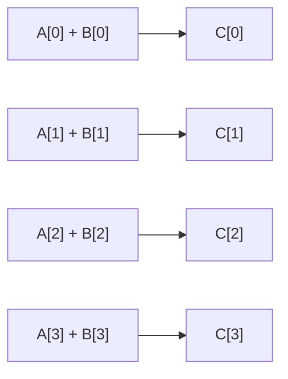

There are no arrows between the four calculations because one result is not
needed to compute another. This is **data parallelism**: the same operation is
applied independently to many data elements.

Transformer inference contains much larger versions of this pattern. Matrix
multiplication computes many output elements whose arithmetic can be performed
in parallel.

> **Analogy — a worksheet:** A program is a worksheet of instructions, data is
> the set of numbers written on it, and processors are people doing the work.
> One very capable person may finish a complicated, branching worksheet
> quickly. Thousands of people become useful when the worksheet can be divided
> into thousands of similar, independent calculations. This analogy explains
> parallelism, but processors do not literally read worksheets or behave like
> people.

---

## 2. Heterogeneous computing: host and device

A system with an NVIDIA GPU has at least two different processors:

- The **host** is normally the CPU and its main memory (system RAM).
- The **device** is the GPU and its device memory (VRAM).

They are designed for different kinds of work. The CPU runs the operating
system and the main Python process, makes decisions, handles files and network
requests, and asks the GPU to perform parallel operations. The GPU executes
large amounts of parallel numerical work.

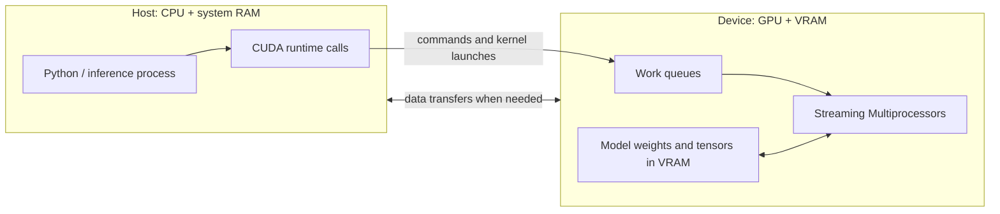

The host and device do not normally execute the same instruction stream. The
host program submits work to the device. This is why CUDA programming is called
**heterogeneous computing**: different types of processors cooperate.

### A simplified inference operation

When Python evaluates a PyTorch operation on a CUDA tensor, a simplified flow
is:

```text
Python model code
    ↓
PyTorch chooses an implementation
    ↓
CUDA library/runtime submits GPU work
    ↓
GPU executes one or more kernels
    ↓
Result remains in VRAM unless it must be copied elsewhere
```

The CPU does not personally calculate every tensor element. It orchestrates
the work.

### Submission is often asynchronous

Many GPU operations are **asynchronous** from the CPU's perspective. The CPU
submits a command and may continue executing host code before the GPU finishes
it.

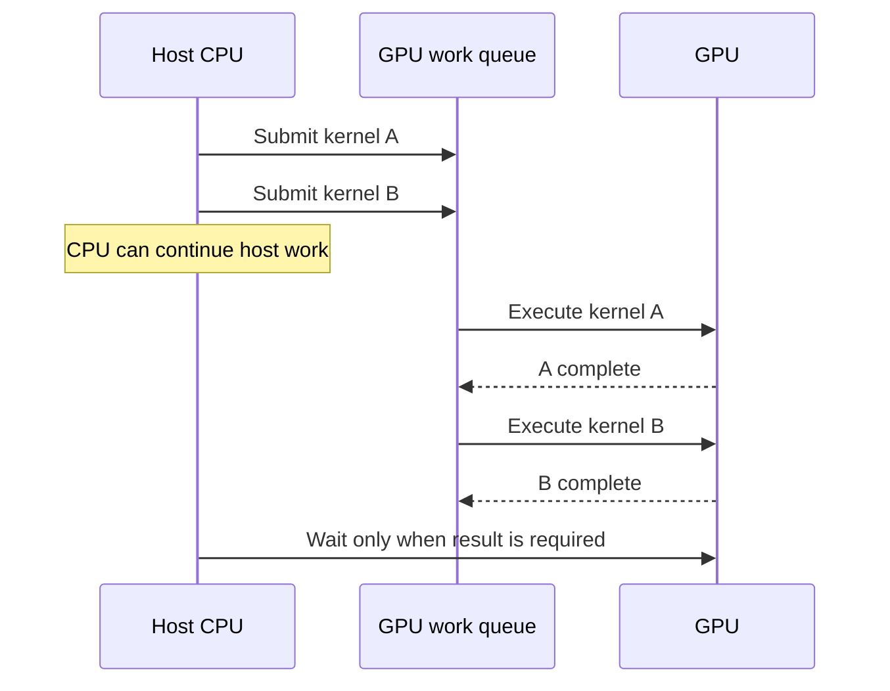

This has an important measurement consequence: timing only the host call may
measure how long submission took, not how long GPU execution took. Later labs
will use explicit synchronization or CUDA events when accurate GPU timing is
required.

### Data movement is real work

The CPU and a discrete GPU usually have physically separate memory. Copying a
tensor from system RAM to VRAM takes time and consumes interconnect bandwidth.
Efficient applications try to keep frequently used weights and intermediate
data on the GPU rather than repeatedly moving them.

```text
System RAM ───── host-to-device copy ────▶ VRAM
System RAM ◀─── device-to-host copy ───── VRAM
```

The exact memory architecture differs for integrated and unified-memory
systems, but the logical host/device distinction remains useful.

---

## 3. What is a kernel?

A **kernel** is a function intended to execute on the GPU across many GPU
threads. A **kernel launch** is the host's request to run that function with a
specified amount and shape of parallel work.

This use of *kernel* is unrelated to the operating-system kernel.

Imagine a function that adds two vectors. Conceptually, each GPU thread can be
assigned one output position:

```text
Thread 0 computes C[0] = A[0] + B[0]
Thread 1 computes C[1] = A[1] + B[1]
Thread 2 computes C[2] = A[2] + B[2]
...
Thread N computes C[N] = A[N] + B[N]
```

The kernel contains the rule—“add the two input elements for my position”—and
the launch creates enough logical threads to cover the data.

### Logical threads are not physical cores

A CUDA **thread** is a logical execution instance. Launching one million
threads does **not** require one million physical execution units. The GPU
schedules the logical threads in groups over time on the hardware it has.

This distinction is fundamental:

```text
Software describes: potentially millions of logical threads
Hardware provides:   a finite number of SMs and execution pipelines
Scheduler performs:  mapping and time-sharing
```

> **Analogy — jobs and workers:** A print shop can receive 10,000 print jobs
> without owning 10,000 printers. Its scheduler feeds queued jobs to the
> printers as they become available. Likewise, a GPU launch can describe far
> more threads than the GPU can execute at one instant. This analogy does not
> capture warp execution, which is introduced below.

### One framework operation may launch several kernels

Do not assume one line of Python equals one kernel. A framework operation can
launch multiple kernels, and optimized systems may **fuse** several logical
operations into one kernel to reduce launch and memory overhead.

```text
One Python operation  ──▶ one kernel, several kernels, or no new kernel
Several operations    ──▶ possibly one fused kernel
```

Profilers reveal the actual relationship.

---

## 4. The CUDA execution hierarchy

CUDA organizes logical work into three main levels:

```text
Grid
└── Thread block
    └── Thread
```

- A **thread** is one logical execution instance of the kernel.
- A **thread block** is a group of threads that can cooperate closely.
- A **grid** is the collection of all blocks created by one kernel launch.

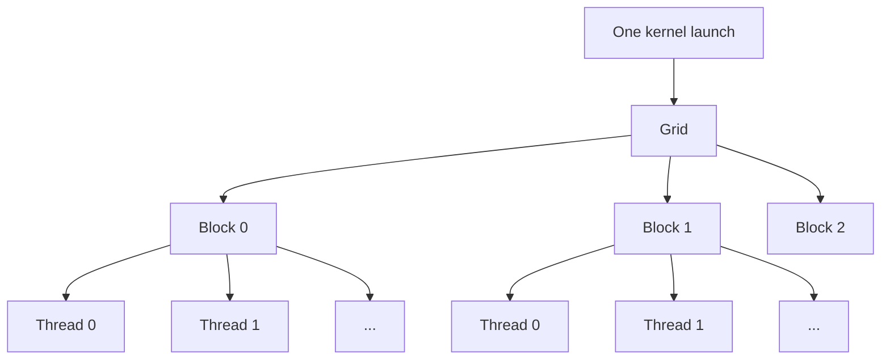

Threads and blocks can be arranged in one, two, or three dimensions. The
dimensions make it convenient to map work to data shapes.

```text
1D: vector elements       thread index x
2D: image or matrix       thread indices (x, y)
3D: volume                thread indices (x, y, z)
```

The dimensions are an indexing convenience. They do not imply that the GPU is
physically arranged in the same shape.

### Worked example: adding 1,000 values

Suppose a launch uses blocks of 256 threads.

```text
Needed threads:             1,000
Threads per block:            256
Blocks needed: ceil(1000 / 256) = 4
Logical threads launched:    1,024
```

The final 24 threads have no valid element. The kernel guards against going out
of bounds:

```text
global_index = block_index × threads_per_block + thread_index_in_block

if global_index < 1000:
    C[global_index] = A[global_index] + B[global_index]
```

Selected indices are:

| Block | Local thread | Global index | Action |
| ---: | ---: | ---: | --- |
| 0 | 0 | 0 | Compute `C[0]` |
| 0 | 255 | 255 | Compute `C[255]` |
| 1 | 0 | 256 | Compute `C[256]` |
| 3 | 231 | 999 | Compute `C[999]` |
| 3 | 232 | 1000 | Skip: outside data |

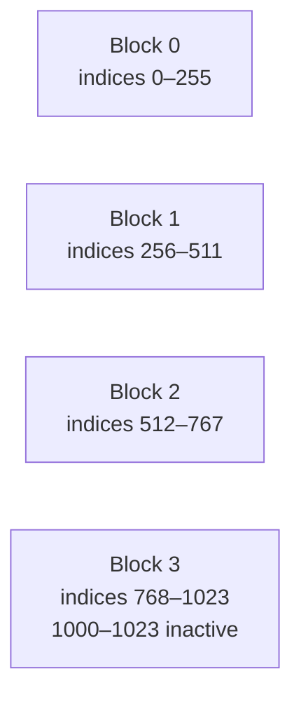

### Why blocks exist

Blocks serve two important purposes:

1. **Scheduling:** blocks are independent units that the GPU can assign to
   available SMs in any order.
2. **Cooperation:** threads in the same block can communicate through shared
   memory and use block-level synchronization.

Ordinary blocks must be able to run independently because CUDA does not
generally promise that all blocks in a grid are resident at the same time.

---

## 5. Streaming Multiprocessors and block scheduling

An NVIDIA GPU contains multiple **Streaming Multiprocessors**, abbreviated
**SMs**. An SM is a major hardware execution unit. It contains schedulers,
register storage, shared memory, and several types of execution pipelines.

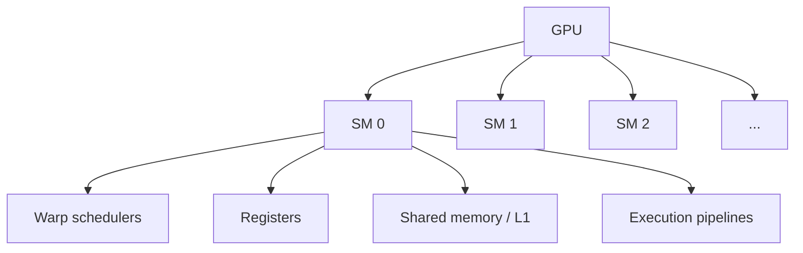

When a kernel launches, a hardware scheduler assigns its blocks to SMs that
have sufficient available resources.

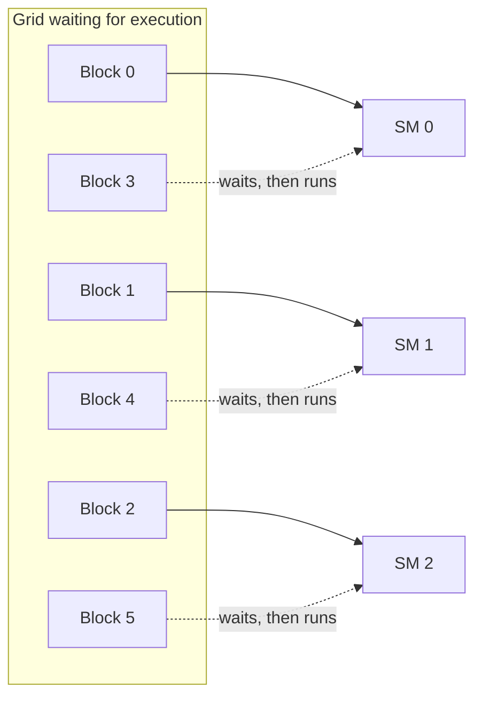

Important scheduling properties:

- A block is assigned to one SM for its lifetime; it does not migrate between
  SMs halfway through execution.
- An SM can often hold multiple blocks at once.
- Blocks can run in any order.
- More blocks than can fit concurrently wait until resources become available.
- When an SM finishes a block, another waiting block can be assigned.

### What determines how much fits on an SM?

Every resident block consumes finite SM resources, including:

- threads/warps slots;
- registers used by its threads; and
- shared memory requested by the block.

If each block uses many registers or a large amount of shared memory, fewer
blocks may be resident simultaneously. The fraction of the SM's possible
active warps that are actually resident is related to **occupancy**.

High occupancy can help hide latency, but maximum occupancy is not itself the
ultimate goal. A kernel can perform well at less than maximum occupancy, and
reducing useful register use merely to increase occupancy can make it slower.

---

## 6. Warps: the unit the scheduler works with

Threads in a block are partitioned into groups of 32 called **warps** on
current NVIDIA GPUs.

For a block of 256 threads:

```text
Warp 0: threads   0–31
Warp 1: threads  32–63
Warp 2: threads  64–95
...
Warp 7: threads 224–255
```

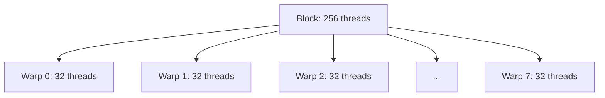

The warp scheduler selects a **ready warp** and issues an instruction for it.
The threads in that warp execute the instruction on their own data. This model
is called **Single Instruction, Multiple Threads**, or **SIMT**.

```text
Shared instruction: ADD

Thread lane:       0       1       2       ...      31
Input A:           3       9       1                7
Input B:           4       2       8                5
Result:            7      11       9               12
```

Each position within a warp is often called a **lane**. The threads share an
instruction path when possible, but each maintains its own logical state,
including its own registers and thread index.

### SIMT is not “one thread copied 32 times”

The 32 threads can operate on different data and can follow different control
paths. However, the hardware executes them most efficiently when they perform
the same instruction together.

Modern NVIDIA architectures support independent thread scheduling in ways that
make the underlying behavior more flexible than the simplest lockstep model.
For a beginner performance model, it remains correct and useful to reason that
threads within a warp should follow the same path whenever possible.

### Partial warps

If a block size is not a multiple of 32, its last warp has inactive lanes. For
example, a 40-thread block requires two warps:

```text
Warp 0: 32 active lanes
Warp 1:  8 active lanes + 24 unused lanes
```

The second warp still occupies a warp slot, so regularly using awkward block
sizes may waste potential execution capacity. This is one reason block sizes
are commonly multiples of 32, although kernel-specific constraints determine
the best choice.

---

## 7. Branch divergence

A **branch** is a decision in code, such as an `if` statement. **Warp
divergence** occurs when threads in the same warp choose different paths.

Suppose the kernel contains:

```text
if value >= 0:
    output = expensive_positive_calculation(value)
else:
    output = expensive_negative_calculation(value)
```

If every thread in a warp has a nonnegative value, all threads follow the first
path together. If some values are positive and others negative, the warp must
execute the needed paths while disabling lanes that do not belong to each
path.

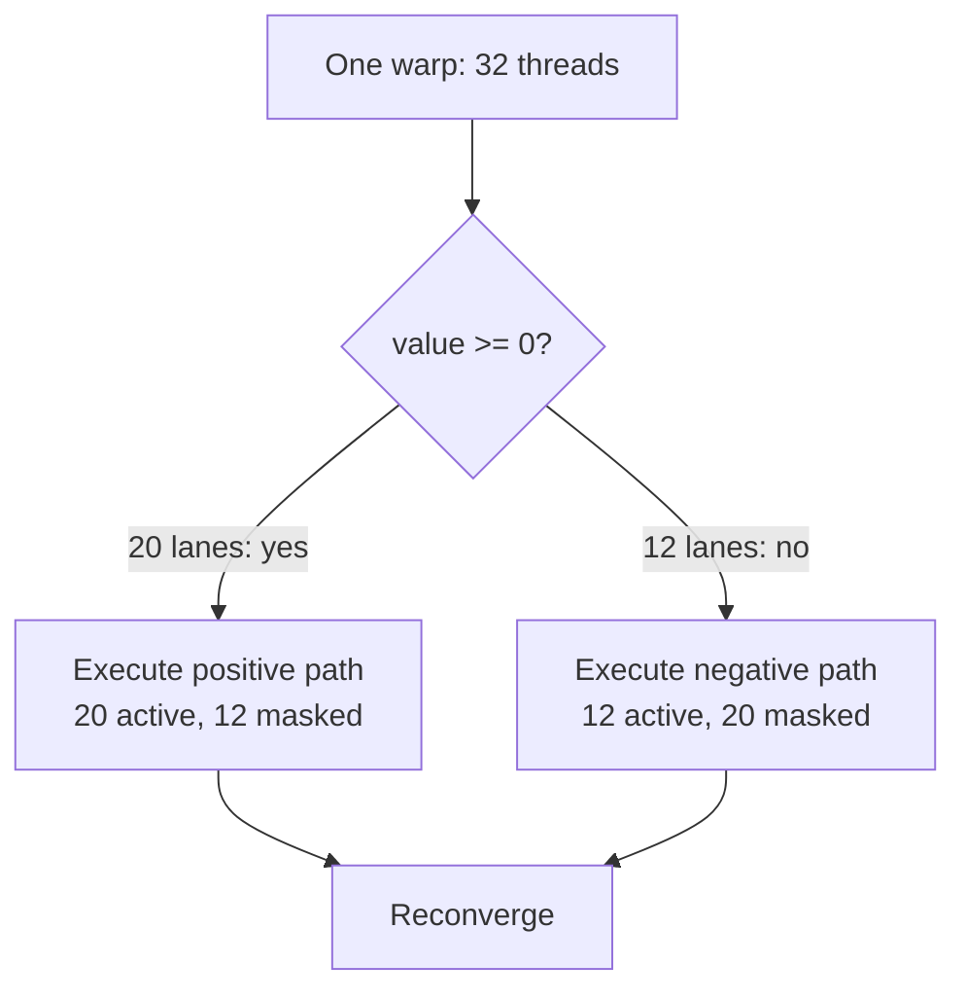

A simplified timeline looks like this:

```text
Time ─────────────────────────────────────────────────────────▶

Positive path: [20 lanes useful | 12 lanes inactive]
Negative path:                         [12 useful | 20 inactive]
After branch:                                                   [32 useful]
```

The two paths are effectively serialized for that warp, lowering the fraction
of lanes doing useful work.

### Divergence is a warp-local property

Different warps taking different paths is normally not called warp divergence.
Warp 0 can execute one branch while Warp 1 executes another. The efficiency
problem arises when lanes **within the same warp** disagree.

### Not every branch is disastrous

- A short, infrequent branch may have little impact.
- If all lanes make the same decision, the branch is uniform and does not
  diverge.
- Compilers may turn simple branches into predicated instructions.
- Some algorithms inherently require irregular control flow.

The correct question is not “does the code contain an `if`?” It is “do threads
within warps take different, expensive paths often enough to matter?”

### Worked example: the boundary check

In the 1,000-element example, only the last warp contains out-of-range threads.
Eight lanes compute indices 992–999 and 24 lanes skip indices 1000–1023. This
causes inefficiency in one warp, but the many fully active earlier warps still
do useful work. A small amount of boundary divergence is normal.

---

## 8. Latency and latency hiding

**Latency** is the delay between starting an operation and having its result
available. Reading data from distant memory can take many GPU clock cycles. A
warp that needs missing data cannot execute its next dependent instruction
immediately.

A CPU often uses large caches, sophisticated prediction, and out-of-order
execution to reduce the delay experienced by a small number of instruction
streams. A GPU relies heavily on having many warps available. When one warp is
waiting, the SM can issue work from another ready warp.

```mermaid
sequenceDiagram
    participant W0 as Warp 0
    participant S as Warp scheduler
    participant W1 as Warp 1
    participant W2 as Warp 2
    W0->>S: Memory request; must wait
    S->>W1: Issue ready arithmetic instruction
    S->>W2: Issue ready arithmetic instruction
    Note over W0: Data arrives
    S->>W0: Resume ready instruction
```

This is **latency hiding**. The memory access did not become faster; other work
filled some of the otherwise idle time.

```text
Without enough ready warps:
Warp 0: [request] [---------- waiting ----------] [compute]
SM:     [ work  ] [----------- idle -----------] [ work  ]

With other ready warps:
Warp 0: [request] [---------- waiting ----------] [compute]
Warp 1:           [compute][request] ...
Warp 2:                    [compute][compute] ...
SM:     [-------- useful instructions continue -----------]
```

### Resident, ready, and stalled are different

- A **resident warp** has its state allocated on the SM.
- A **ready warp** has an instruction whose inputs are available and can be
  scheduled.
- A **stalled warp** cannot currently issue its next instruction, perhaps
  because it is waiting for memory or a prior calculation.

Many resident warps help only if some are ready when others stall.

### Sources of insufficient latency hiding

An SM may run out of ready work when:

- the launch contains too few blocks or threads;
- blocks use so many registers/shared memory that few warps can reside;
- many warps wait on the same long-latency dependency;
- frequent synchronization forces warps to wait; or
- control-flow and instruction dependencies limit available work.

This connects software shape to performance. A very small operation may leave
most SMs unused; a larger operation or batch can expose enough parallel work to
keep the machine busy.

### Throughput versus latency

Do not confuse hiding latency with eliminating it.

- **Latency** asks how long one operation or request takes.
- **Throughput** asks how much work completes per unit time.

By interleaving many warps, a GPU can achieve high overall throughput even
though an individual memory request still has substantial latency.

> **Analogy — cooking:** A cook starts rice, then chops vegetables while the
> rice cooks, rather than staring at the pot. The rice takes the same time, but
> the cook completes more total work during that interval. Unlike a cook, an SM
> tracks many machine-level warps and switches among ready ones with extremely
> low scheduling overhead.

---

## 9. Synchronization boundaries

Parallel workers sometimes depend on one another. **Synchronization** creates a
point at which specified work must be complete before dependent work proceeds.
It preserves correctness, but waiting can reduce parallel efficiency.

There is no single “synchronize the entire GPU” rule for every situation. The
scope matters.

### Within a warp

Threads in a warp often execute instructions together, but modern independent
thread scheduling means software should not assume implicit coordination for
every warp-level communication pattern. CUDA provides explicit warp-level
primitives when threads exchange values or must converge. You do not need their
syntax yet.

### Within a block

Threads in the same block can cooperate through shared memory. A block-level
barrier can require all participating threads to reach a point before any
continue beyond it.

```mermaid
sequenceDiagram
    participant T0 as Thread 0
    participant T1 as Thread 1
    participant T2 as Thread 2
    T0->>T0: Write shared data
    T1->>T1: Write shared data
    T2->>T2: Write shared data
    T0->>T0: Reach barrier; wait
    T2->>T2: Reach barrier; wait
    T1->>T1: Reach barrier last
    Note over T0,T2: All participating threads arrived
    T0->>T0: Read complete shared data
    T1->>T1: Read complete shared data
    T2->>T2: Read complete shared data
```

If only some threads reach a required block barrier while others take a branch
that skips it, the program may hang or behave incorrectly. This is one reason
synchronization must be designed carefully.

### Between ordinary blocks

Ordinary blocks in a grid generally cannot use a simple in-kernel barrier to
wait for every other block. The GPU may not have resources to make every block
resident simultaneously. If resident blocks waited for blocks that had not yet
been scheduled, execution could deadlock.

The common global boundary is the end of a kernel:

```text
Kernel A: many independent blocks
              ↓ all of A completes before dependent B begins
Kernel B: consumes A's results
```

CUDA has advanced cooperative mechanisms, but they are outside this lesson.

### Between host and device

Because kernel launches are often asynchronous, the host may need to wait when
it requires a completed GPU result. Examples include:

- copying a result back to the CPU;
- printing a CUDA tensor's value from host code;
- measuring elapsed GPU execution accurately; or
- handling a decision on the CPU that depends on the result.

An unnecessary host-device synchronization can prevent useful overlap and
create visible idle gaps in a profiler timeline.

### Streams and ordering at a high level

A CUDA **stream** is an ordered sequence of submitted GPU operations.
Operations in one stream execute in issue order. Independent operations in
different streams may overlap when dependencies and hardware resources allow.

```mermaid
gantt
    title Simplified overlap with two streams
    dateFormat X
    axisFormat %L
    section Stream 1
    Kernel A :a, 0, 4
    Kernel B :b, 4, 3
    section Stream 2
    Data transfer :c, 1, 3
    Kernel C :d, 4, 2
```

Overlap is not guaranteed merely because multiple streams exist. The
operations must be independent, and the GPU must have suitable resources.

### A synchronization checklist

Whenever you see a wait, ask:

1. **Who is waiting?** A lane, warp, block, stream, host thread, or device?
2. **What must finish?** A memory operation, another thread's work, a kernel,
   or an entire stream?
3. **Is the wait required for correctness?**
4. **Could independent work overlap with the wait?**

---

## 10. End-to-end worked example

Suppose PyTorch needs to apply an elementwise activation to 1,000,000 tensor
values already in VRAM.

### Step 1: the host submits work

Python calls a PyTorch operation. PyTorch selects a CUDA implementation and
launches a kernel. Assume, purely for illustration, that the kernel uses 256
threads per block.

```text
Blocks = ceil(1,000,000 / 256) = 3,907 blocks
Logical threads = 3,907 × 256 = 1,000,192 threads
Warps per block = 256 / 32 = 8 warps
Total logical warps = 3,907 × 8 = 31,256 warps
```

The extra 192 logical threads perform a boundary check and skip invalid
indices.

### Step 2: blocks reach the GPU

The grid's 3,907 blocks enter the device's scheduling system. The GPU has far
fewer SMs than blocks, so only a subset becomes resident initially.

```text
Grid queue: [B0][B1][B2] ... [B3906]
                    │
                    ▼
GPU SMs:    [SM0][SM1][SM2] ... [SMn]
```

Each SM may hold multiple blocks, subject to thread, register, and shared-memory
limits.

### Step 3: SMs schedule warps

Each 256-thread block becomes eight warps. Warp schedulers select ready warps
and issue instructions. Every active lane calculates its global index, loads
its input, performs the activation arithmetic, and stores the result.

### Step 4: waiting is hidden when possible

When Warp 0 waits for values from VRAM, the scheduler can issue instructions
from Warp 1, Warp 2, or another resident warp. Enough ready warps keep execution
pipelines occupied.

### Step 5: blocks retire and replacements arrive

When a block finishes, its resources are released. A waiting block can then
become resident. This continues until all 3,907 blocks complete.

### Step 6: the result remains on the device

The output tensor can feed the next GPU operation without returning to system
RAM. If the next operation depends on it in the same stream, stream ordering
preserves the dependency. The CPU only needs an explicit wait when host code
requires completion.

This example connects all levels:

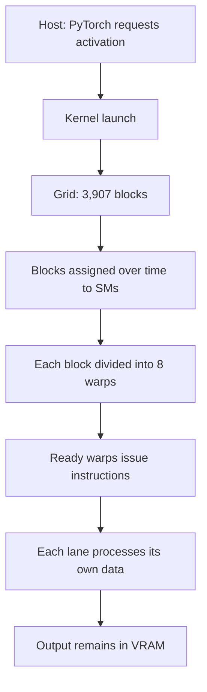

---

## 11. Connection to LLM inference

An inference engineer usually does not manually assign one CUDA thread to each
model value. PyTorch, cuBLAS, attention libraries, and inference engines select
and launch optimized kernels. You still need the execution model to interpret
their behavior.

### Large matrix operations

Linear layers and attention contain matrix operations with large amounts of
parallel work. Their kernels create grids of blocks, schedule many warps, and
may use specialized Tensor Core instructions. Large shapes can occupy many SMs
effectively.

### Small decode operations

During autoregressive decode, the model produces one new token per sequence per
step. At a small batch size, some operations expose less parallel work than
large prompt processing. The GPU may have fewer ready blocks/warps, and reading
weights or KV-cache data can dominate.

### Kernel launch overhead and fusion

A transformer step involves many logical operations. Launching numerous tiny
kernels creates host/runtime overhead and gaps between kernels. Inference
engines use techniques such as operator fusion and CUDA graphs to reduce some
of this overhead. These techniques make more sense once you understand that the
host submits discrete units of device work.

### What you will see in profilers

- **PyTorch Profiler** connects framework operations to CPU and GPU activity.
- **Nsight Systems** shows host API calls, kernel launches, streams, kernels,
  memory transfers, and idle gaps on a timeline.
- **Nsight Compute** explains detailed behavior within a selected kernel,
  including warp stalls and resource use.

---

## 12. Common misconceptions

### “One CUDA thread equals one CUDA core.”

False. A thread is logical work. Execution pipelines are physical hardware.
Many more threads are launched than can execute at once, and the hardware
schedules them over time.

### “A block is a physical part of the GPU.”

False. A block is a software grouping of threads. It is assigned to one SM
during execution.

### “An SM is just one core.”

False. An SM is a substantial hardware unit containing schedulers, registers,
shared memory, and multiple execution pipelines.

### “All threads in a grid execute simultaneously.”

False. Only the subset that fits on the SMs can be resident. Other blocks wait.

### “Warps are declared directly by the programmer.”

Usually false. The programmer chooses block dimensions; hardware partitions
each block's threads into warps of 32.

### “Threads in a warp always do different work.”

Misleading. They have distinct data and state, but SIMT is most efficient when
they execute the same instruction path together.

### “Any `if` statement makes GPU code slow.”

False. Divergence matters when lanes in the same warp take different paths and
the paths cost enough to affect performance.

### “High occupancy guarantees high performance.”

False. Occupancy can provide enough resident warps to hide latency, but memory
traffic, instruction mix, dependencies, and other bottlenecks still determine
performance.

### “Asynchronous means operations can run in any order.”

False. It means the submitting host thread may continue without waiting.
Ordering rules, streams, and data dependencies still apply.

### “Synchronization is always bad.”

False. Synchronization is essential when correctness requires completed data.
Unnecessary or overly broad synchronization is the performance problem.

---

## 13. Vocabulary

| Term | Beginner definition |
| --- | --- |
| Program | An organized sequence of instructions that operates on data. |
| Instruction | A small operation a processor can execute. |
| Parallelism | Multiple pieces of work being executable at the same time. |
| Host | The CPU side of a heterogeneous application. |
| Device | The GPU side of a heterogeneous application. |
| Kernel | A GPU function executed across many logical threads. |
| Kernel launch | A request to execute a kernel with a particular grid and block shape. |
| Thread | One logical instance of a kernel. |
| Thread block | A group of threads that executes on one SM and can cooperate locally. |
| Grid | All blocks belonging to one kernel launch. |
| Streaming Multiprocessor (SM) | A major GPU hardware unit that schedules warps and contains execution resources. |
| Warp | A scheduling/execution group of 32 CUDA threads on NVIDIA GPUs. |
| Lane | One thread position within a warp. |
| SIMT | Single Instruction, Multiple Threads: threads apply a common instruction to their individual state/data. |
| Branch divergence | Lanes in one warp taking different control-flow paths. |
| Resident warp | A warp whose execution state is currently allocated on an SM. |
| Ready warp | A resident warp able to issue its next instruction. |
| Stalled warp | A warp temporarily unable to issue its next instruction. |
| Latency hiding | Executing ready warps while other warps wait. |
| Occupancy | Resident warps relative to the hardware's supported maximum. |
| Synchronization | Coordination that ensures specified work completes before dependent work proceeds. |
| Stream | An ordered sequence of submitted GPU operations. |
| Asynchronous launch | Submission that lets the host continue before device execution finishes. |

---

## 14. Knowledge check

Answer without looking back. Then review the relevant section for any answer
you cannot explain in your own words.

### Recall

1. What is the difference between a program, an instruction, and data?
2. What do **host** and **device** mean in a typical CUDA system?
3. What is a GPU kernel? How is a kernel launch different from a kernel?
4. Put these in order from largest logical grouping to smallest: block, grid,
   thread.
5. Why can a program launch one million threads on a GPU that has far fewer
   physical execution units?
6. What is an SM?
7. Can one ordinary thread block migrate between SMs while it executes?
8. What is a warp, and how many threads does it contain on NVIDIA GPUs?
9. What does SIMT mean?
10. What is the difference between a resident warp and a ready warp?

### Explain

11. Why do thread blocks generally need to be independent of one another?
12. A block has 100 threads. How many warps does it require, and how many lanes
    in the final warp are unused? Show your reasoning.
13. Explain branch divergence using an example of your own.
14. Why is it usually fine for two different warps to choose different
    branches, while threads inside one warp choosing different branches may be
    inefficient?
15. Does latency hiding reduce the actual latency of a VRAM access? What does
    it improve instead?
16. Why might launching too little work leave a GPU underutilized?
17. Why does high occupancy not guarantee a fast kernel?
18. Why can timing an asynchronous PyTorch CUDA call with only a CPU clock give
    a misleading result?
19. Why can threads within a block synchronize more directly than arbitrary
    blocks in a grid?
20. Give one example of necessary synchronization and one example of a
    potentially unnecessary synchronization.

### Apply

21. You need one thread per element for 10,000 elements and choose 256 threads
    per block. How many blocks and logical threads are launched? How many
    threads skip the calculation?
22. A profiler shows short kernels separated by CPU-side gaps. Which part of
    the host/device model helps explain the gaps, and what category of
    optimization might an inference engine use?
23. Most warps are resident but stalled on memory, and only a few are ready.
    Explain why the word “resident” alone does not prove that the SM can stay
    busy.
24. During single-request LLM decoding, an operation creates too few blocks to
    occupy all SMs. Name two ways a production inference system might expose
    more parallel work without changing the GPU hardware.

### Drawing exercise

From memory, draw both diagrams below on paper or in your learning journal:

1. Host → kernel launch → grid → blocks → warps → threads.
2. A grid with more blocks than can fit simultaneously, being scheduled in
   waves across several SMs.

Your drawing does not need to be artistic. It must show the difference between
logical work and physical hardware.

---

## 15. Completion standard

You are ready for the next lesson when you can:

- accurately draw the execution hierarchy;
- explain why a logical thread is not a physical core;
- calculate blocks and warps for a simple one-dimensional example;
- explain divergence and latency hiding without using the analogies above;
- describe at least three synchronization scopes; and
- connect small decode workloads to insufficient parallel work at a high
  level.

If those statements are not yet comfortable, reread Sections 4–9 and redo
questions 12, 13, 15, 18, and 21 before moving on.
