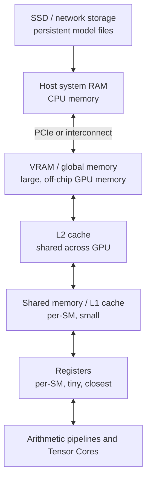
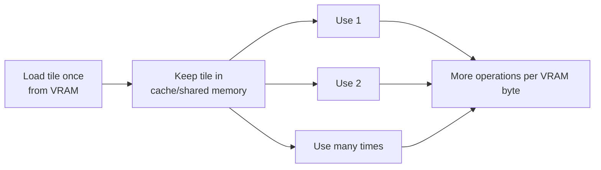
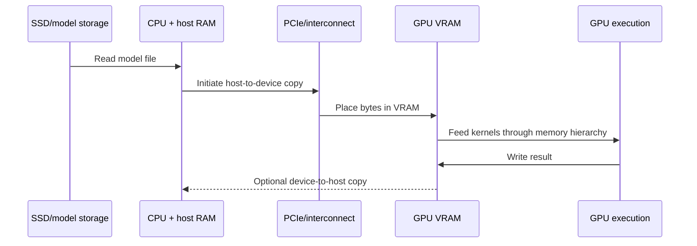

# Lesson 04 — GPU Memory Hierarchy

## Why this lesson matters

A GPU cannot calculate with data merely because the data *exists*. The bytes
must reach the execution units that need them. Modern GPUs can perform an
enormous number of arithmetic operations per second, so moving data is often
the limiting factor. This is especially important in LLM inference: model
weights, activations, and the KV cache all have to live somewhere and move
through the machine.

By the end of this lesson, you should be able to:

- explain bits, bytes, tensor shapes, and data types;
- distinguish memory **capacity**, **bandwidth**, and **latency**;
- describe the roles of registers, shared memory/L1, L2, and VRAM;
- explain why caches, locality, and grouped memory access help performance;
- distinguish host RAM from GPU VRAM;
- estimate the storage required by weights, activations, and a KV cache; and
- explain why reported GPU memory may exceed the live tensors in a program.

> **Scope note:** This lesson presents a useful conceptual model, not a circuit
> diagram. Cache organization, sizes, whether L1 and shared memory share
> physical resources, access rules, and exact behavior vary by NVIDIA GPU
> architecture and generation. Always consult the guide for the target GPU
> before relying on a hardware-specific detail.

---

## 1. From bits to tensors

### Bits and bytes

A **bit** is one binary digit: `0` or `1`. Eight bits form one **byte**.

```text
1 bit  = one 0 or 1
1 byte = 8 bits

Decimal units often used by hardware vendors:
1 KB = 1,000 bytes
1 MB = 1,000,000 bytes
1 GB = 1,000,000,000 bytes

Binary units:
1 KiB = 1,024 bytes
1 MiB = 1,024 KiB
1 GiB = 1,024 MiB
```

The labels GB and GiB are sometimes used loosely in tools and conversation.
When an estimate must be exact, state which convention you used.

### A value needs an encoding

Memory stores bits, not abstract numbers. A **data type** (or `dtype`) defines
how those bits represent a value.

| Common dtype | Bits per value | Bytes per value | Typical role |
| --- | ---: | ---: | --- |
| `float32` / FP32 | 32 | 4 | High-precision floating-point work |
| `float16` / FP16 | 16 | 2 | Lower-memory neural-network compute |
| `bfloat16` / BF16 | 16 | 2 | Lower-memory compute with a wide numeric range |
| `int8` | 8 | 1 | Quantized weights or activations |
| 4-bit value | 4 | 0.5 nominally | Quantized weights, packed into bytes/words |

“Four-bit values use half a byte” is useful arithmetic, but physical storage
usually packs multiple values into larger storage units. Quantized formats also
need metadata such as scales and sometimes zero points. Consequently, a 4-bit
model often occupies somewhat more than exactly 0.5 byte per parameter.

### Tensors occupy memory

A **tensor** is a multidimensional collection of values with a shape and a
dtype. In a dense tensor, its raw payload is approximately:

```text
number of elements = product of all shape dimensions
payload bytes      = number of elements × bytes per element
```

**Worked example — matrix storage**

A weight matrix has shape `[4096, 4096]` and dtype FP16:

```text
elements = 4096 × 4096
         = 16,777,216

bytes    = 16,777,216 × 2
         = 33,554,432 bytes
         = 32 MiB
```

Changing only the dtype to FP32 doubles the payload to 64 MiB. The number of
matrix entries did not change; the representation of each entry did.

Real allocations may be larger because of alignment, allocator bookkeeping,
padding, temporary format conversions, or quantization metadata.

---

## 2. Three properties that must not be confused

### Capacity: how much fits?

**Capacity** is the amount of data a storage level can hold. A 24 GB GPU cannot
simultaneously hold 30 GB of required live data in its VRAM without some data
being moved elsewhere, recomputed, compressed, or the workload being changed.

Capacity is comparable to the size of a reservoir.

### Bandwidth: how much can move per second?

**Bandwidth** is the rate at which data can be transferred, commonly measured
in GB/s. If an operation must read 20 GB and the relevant *achieved* bandwidth
is 500 GB/s, then the read alone has an ideal lower bound of:

```text
20 GB ÷ 500 GB/s = 0.04 s = 40 ms
```

This is an optimistic bound. Contention, access patterns, other transfers, and
hardware inefficiencies can make the real time longer. Peak specification
bandwidth is not a promise that every workload achieves it.

Bandwidth is comparable to how much water a pipe can deliver per second.

### Latency: how long one access takes to begin returning data

**Latency** is the delay between requesting data and receiving it. A memory
system can have high bandwidth yet substantial latency: many requests in flight
can collectively move lots of data, even though any one request takes time.

Latency is comparable to the travel time through the pipe.

> **Analogy — warehouse logistics (imperfect but useful):** Capacity is the
> warehouse floor area, bandwidth is the number of boxes its loading docks can
> process each second, and latency is the time between requesting one box and
> receiving it. The analogy breaks down because GPU memory transactions and
> caches do not behave exactly like people moving boxes.

The key distinction is:

```text
Capacity asks:  Can the workload fit?
Bandwidth asks: Can bytes arrive quickly enough in aggregate?
Latency asks:   How long does an individual access make execution wait?
```

---

## 3. The hierarchy: small and close to large and distant

No single memory technology is simultaneously enormous, extremely fast, and
cheap. GPUs therefore use a hierarchy.



As data moves toward execution units, storage generally becomes smaller and
faster. Software and hardware attempt to keep frequently needed data close.

### Registers

Registers are the fastest storage directly available to executing GPU threads.
They hold values such as loop counters, addresses, and intermediate arithmetic
results. Registers are located on an SM and are extremely limited.

Each active thread needs some registers. If a kernel requires many registers
per thread, fewer warps may fit concurrently on an SM. If register demand is
too high, some values can be **spilled** into much slower memory. Thus “using
more registers” is not unconditionally good or bad; it is a resource tradeoff.

### Shared memory and L1 cache

**Shared memory** is fast, programmer-managed storage associated with an SM.
Threads in a thread block can cooperate through it. A kernel might load a tile
of a matrix from VRAM once, reuse it many times in shared memory, and thereby
avoid repeated long-distance reads.

**L1 cache** is hardware-managed and retains recently accessed data near an SM.
On many NVIDIA architectures, L1 and shared memory use a unified or closely
related on-chip resource whose capacity can be partitioned, but the exact
design varies. Conceptually, remember the management distinction:

- cache placement is primarily handled by hardware;
- shared-memory placement is explicitly requested by the kernel.

Shared memory is visible to cooperating threads in the same block, not a
general communication mechanism for every thread on the GPU.

### L2 cache

L2 is a larger cache shared by the GPU's SMs. It can satisfy some accesses
without returning all the way to VRAM and can help when different SMs access
the same regions. It is slower and farther away than per-SM storage but faster
than repeatedly fetching data from VRAM.

### VRAM, global memory, and framebuffer memory

**VRAM** is the GPU's large off-chip memory. CUDA commonly calls the addressable
device-memory space **global memory**. Monitoring tools may report
**framebuffer (FB) memory**. In an introductory inference discussion these
often refer to the same capacity of interest, although the terms describe
different perspectives and should not be treated as universal synonyms in
every hardware context.

VRAM stores long-lived and large objects that cannot fit in on-chip storage:
model weights, activations, KV caches, inputs, outputs, and workspaces. VRAM is
fast compared with ordinary storage and often host transfers, but far slower
than registers or on-chip caches from an execution unit's perspective.

| Level | Typical scope | Managed primarily by | Relative capacity | Relative proximity/speed |
| --- | --- | --- | ---: | ---: |
| Registers | Thread, physically allocated per SM | Compiler/hardware | Tiny | Closest/fastest |
| Shared memory | Thread block on one SM | Kernel programmer/library | Small | Very close |
| L1 cache | SM | Hardware | Small | Very close |
| L2 cache | Whole GPU | Hardware | Medium | Intermediate |
| VRAM/global memory | Whole GPU | Application/runtime + hardware | Large | Farther/slower |

This table is qualitative. Exact sizes and latency figures depend on the GPU
and even on access patterns.

---

## 4. Locality, reuse, and caches

A cache is useful because programs often exhibit **locality**:

- **Temporal locality:** data used recently is likely to be used again soon.
- **Spatial locality:** nearby addresses are likely to be used near each other
  in time.

Imagine multiplying matrices in tiles. A tile loaded from VRAM can participate
in many multiply-accumulate operations before being replaced. This increases
**data reuse**: more arithmetic is performed per byte fetched from distant
memory.



A cache hit avoids a farther access. A cache miss must be served by another
level. But caches are limited; large working sets, unfavorable access patterns,
or competing data can evict useful entries.

### Coalescing, conceptually

Threads in a warp issue memory operations together. If neighboring threads
access neighboring, suitably aligned addresses, the hardware can often combine
their requests into a small number of efficient memory transactions. This is
called **coalescing**.

```text
More regular access:
thread:   0    1    2    3    4    5
address: [A0] [A1] [A2] [A3] [A4] [A5]
          └──── contiguous region ────┘

Scattered access:
thread:   0    1    2    3    4    5
address: [A0] [Z9] [C2] [Q7] [B4] [X1]
          potentially more transactions
```

Do not reduce this to “contiguous is always fast.” Alignment, element size,
cache behavior, architecture, and exact instruction patterns matter. The
beginner-level principle is that coordinated, regular access usually uses
memory bandwidth more efficiently than scattered access.

---

## 5. Host RAM and GPU VRAM are different memory domains

In a conventional discrete-GPU system, the CPU has **host RAM** and the GPU has
**device VRAM**. A tensor in host RAM is not automatically ready for a GPU
kernel. It must be made accessible to the GPU, commonly by copying it across
PCI Express (PCIe).



PCIe bandwidth is normally far lower than internal VRAM bandwidth, and each
transfer has overhead. Repeatedly moving weights between host and device can
therefore erase much of the GPU's compute advantage. Inference systems usually
keep weights resident in VRAM when capacity allows and transfer only necessary
inputs and outputs.

Transfers can sometimes overlap with computation through asynchronous copies
and CUDA streams. **Pinned host memory** can enable more efficient asynchronous
transfers, but it is a limited host resource and does not eliminate the PCIe
bottleneck.

Integrated and unified-memory systems differ. For example, CPU and GPU may
share physical memory, or CUDA managed memory may migrate pages automatically.
Shared addressing does not imply zero data-movement cost or uniform access
speed. Always reason about the actual platform.

---

## 6. What consumes VRAM during inference?

### Model weights

Weights are the learned parameters of the model. A first approximation is:

```text
weight bytes ≈ parameter count × bytes per parameter
```

**Worked example — seven billion parameters**

```text
FP32: 7,000,000,000 × 4 bytes ≈ 28 GB
FP16: 7,000,000,000 × 2 bytes ≈ 14 GB
INT8: 7,000,000,000 × 1 byte  ≈  7 GB
4-bit: 7,000,000,000 × 0.5    ≈  3.5 GB + metadata/overhead
```

These are payload estimates, not guarantees of observed process memory.

### Activations

**Activations** are intermediate tensors produced as inputs pass through model
layers. During inference, they include layer inputs/outputs and intermediate
results needed by subsequent operations. Their sizes depend on batch size,
sequence length, hidden dimensions, dtype, execution strategy, and whether
buffers are reused. Training retains many more activations for backpropagation;
inference generally does not.

For a simple activation shaped `[batch, sequence, hidden]`:

```text
bytes = batch × sequence × hidden × bytes per element
```

Example: `[4, 2048, 4096]` in FP16:

```text
4 × 2048 × 4096 × 2 = 67,108,864 bytes = 64 MiB
```

This computes one tensor, not total activation memory across the entire model.

### KV cache

During autoregressive decoding, attention needs keys and values from previous
tokens. Recomputing them for the entire prefix at every step would be wasteful,
so inference engines store them in the **key-value (KV) cache**.

A useful approximation for standard multi-head attention is:

```text
KV bytes ≈
  2                       # key and value
  × number of layers
  × batch size
  × cached sequence length
  × number of KV heads
  × head dimension
  × bytes per element
```

**Worked example**

Assume 32 layers, batch 1, 4,096 cached tokens, 32 KV heads, head dimension 128,
and FP16:

```text
2 × 32 × 1 × 4096 × 32 × 128 × 2
= 2,147,483,648 bytes
= 2 GiB
```

With batch 4, the same approximation becomes 8 GiB. Longer contexts and more
concurrent requests can make KV cache capacity a primary serving constraint.

Architectures with multi-query or grouped-query attention use fewer KV heads
than query heads, reducing this cache. Engines may also page, quantize, or
otherwise manage KV storage, so inspect the actual model and runtime.

### Temporary workspaces and other allocations

Libraries may allocate temporary buffers for matrix multiplication, attention,
sorting, sampling, communication, or graph execution. Other consumers include:

- input IDs, masks, logits, and output tensors;
- loaded CUDA libraries and runtime contexts;
- allocator metadata and alignment;
- duplicated or converted weights during loading;
- CUDA graph capture pools; and
- communication buffers in multi-GPU execution.

Therefore:

```text
required VRAM is not merely parameter count × bytes per parameter
```

---

## 7. Allocated, reserved, and visible memory

Repeatedly asking the driver for GPU memory can be expensive. Frameworks such
as PyTorch use a **caching allocator**. When a tensor is deleted, its block may
be retained by the framework for quick reuse rather than immediately returned
to the GPU driver.

Conceptually:

```text
GPU memory visible to driver / nvidia-smi
┌─────────────────────────────────────────────┐
│ Framework-reserved pool                     │
│ ┌─────────────────────┐ ┌─────────────────┐ │
│ │ Currently allocated │ │ Cached/free     │ │
│ │ to live tensors     │ │ inside pool     │ │
│ └─────────────────────┘ └─────────────────┘ │
├─────────────────────────────────────────────┤
│ CUDA context, libraries, other allocations  │
└─────────────────────────────────────────────┘
```

- **Allocated memory** commonly means memory currently occupied by live tensor
  allocations known to the framework.
- **Reserved memory** commonly means memory the framework's allocator obtained
  and manages, including allocated blocks and cached blocks available for reuse.
- A driver-level tool such as `nvidia-smi` sees memory from a broader system
  perspective and may report more than the framework's live tensor total.

Definitions differ among frameworks and APIs, so name the metric and tool when
reporting a number. Fragmentation can also leave enough total free bytes but no
suitable contiguous block for a request. Clearing an allocator cache can return
unused cached blocks to the system, but it does not free live tensors and is not
a substitute for fixing a workload that genuinely exceeds capacity.

---

## 8. Why this hierarchy affects LLM inference

During each decoder step, the GPU must read model weights and relevant KV-cache
data. At a small batch size, there may be too little reuse to keep all arithmetic
units busy. The step can become **memory-bandwidth-bound**: performance improves
more by reducing or reusing transferred bytes than by adding theoretical
arithmetic throughput.

Prefill processes many prompt tokens together. Its matrix operations can reuse
weights across many token positions, creating more arithmetic per byte fetched.
It can therefore use compute resources more effectively than single-token,
single-request decode, although the precise bottleneck varies by model, batch,
sequence length, kernels, dtype, and hardware.

```text
Small-batch decode (simplified):
read weights + read growing KV cache → relatively little work for one new token

Prefill (simplified):
read weights → reuse them across many prompt-token calculations
```

Quantization can reduce weight bytes and sometimes KV or activation bytes. That
can improve capacity and bandwidth pressure—but only if the runtime has
efficient kernels for the format and conversion/metadata costs do not dominate.
Quantization is therefore relevant to server inference as well as on-device
inference.

---

## 9. Common misconceptions

**“If the model fits in VRAM, it will be fast.”**

Fitting answers a capacity question only. Bandwidth, compute, scheduling, kernel
quality, batching, and transfer overhead still determine speed.

**“VRAM is slow.”**

VRAM has very high aggregate bandwidth compared with ordinary host memory, but
it is relatively distant and high-latency compared with on-chip GPU storage.
“Fast” and “slow” require a comparison and workload context.

**“More cache guarantees better performance.”**

A cache helps only when accesses have exploitable locality and the useful
working set behaves well within it.

**“Shared memory and L1 are the same thing.”**

They may share hardware resources on some architectures, but shared memory is
explicitly controlled by the kernel while L1 caching is hardware-managed.

**“CUDA automatically moves everything optimally.”**

Frameworks and CUDA automate much work, but placement, transfer timing, tensor
layout, kernels, and runtime choices still matter.

**“`nvidia-smi` memory equals my tensors.”**

It can include reserved allocator pools, contexts, libraries, workspaces, and
other allocations.

**“Half-precision always halves total process memory.”**

It approximately halves the payload of tensors converted from FP32, but not
every allocation changes dtype, and fixed/runtime overhead remains.

---

## 10. Vocabulary

| Term | Meaning |
| --- | --- |
| Bit | A binary digit, `0` or `1` |
| Byte | Eight bits |
| Tensor | A multidimensional collection of values with a shape and dtype |
| Capacity | Amount of data a storage system can hold |
| Bandwidth | Amount of data transferable per unit time |
| Latency | Delay for an individual operation or access |
| Register | Very small, fast storage used by executing threads on an SM |
| Shared memory | Programmer-managed on-chip storage shared within a block |
| Cache | Hardware-managed storage retaining data likely to be reused |
| VRAM/global memory | Large device memory accessible by GPU kernels |
| Locality | Tendency to reuse recent data or access nearby data |
| Coalescing | Combining coordinated warp memory accesses into efficient transactions |
| Host RAM | Main memory associated with the CPU |
| PCIe | Common interconnect between a host and a discrete GPU |
| Activation | Intermediate tensor produced by a model operation |
| KV cache | Stored attention keys and values for previous tokens |
| Allocated memory | Memory currently assigned to live allocations under a stated API |
| Reserved memory | Memory held by an allocator for current or future allocations |
| Workspace | Temporary storage used by an operation or library |

---

## 11. Knowledge check

Answer without looking back. Then revisit any section you cannot explain in
your own words.

1. How many bytes are in one FP32 value? One BF16 value? One INT8 value?
2. Estimate the payload size in MiB of a `[2048, 4096]` FP16 tensor.
3. Explain capacity, bandwidth, and latency using both technical language and
   your own analogy.
4. Put registers, shared memory/L1, L2, and VRAM in order from closest to the
   execution units to farthest.
5. Who primarily manages a cache, and who explicitly manages shared memory?
6. What are temporal and spatial locality?
7. Why can regular neighboring accesses by warp threads use bandwidth more
   efficiently than scattered accesses?
8. Why is repeatedly transferring model weights over PCIe undesirable?
9. Name at least five consumers of VRAM during LLM inference.
10. Why does KV-cache memory grow with sequence length and batch size?
11. Estimate FP16 weight payload for a three-billion-parameter model in decimal
    GB. Why might the observed memory be higher?
12. Why can `nvidia-smi` show more memory than the framework reports as allocated
    to live tensors?
13. Why can a model fit in memory and still be memory-bandwidth-bound?
14. Explain why prefill can reuse weights more effectively than single-request
    decode.
15. What details in this lesson might change across GPU architectures?

### Calculation answers

Check these only after doing the arithmetic yourself.

1. FP32 is 4 bytes, BF16 is 2 bytes, and INT8 is 1 byte.
2. `2048 × 4096 × 2 = 16,777,216 bytes = 16 MiB`.
11. `3,000,000,000 × 2 = 6,000,000,000 bytes`, or about 6 GB decimal.
    Runtime state, allocator behavior, workspaces, activations, KV cache,
    alignment, and possible loading conversions can increase observed usage.

## Completion criterion

You are ready to continue when you can draw the memory hierarchy from memory,
calculate tensor and approximate KV-cache sizes, distinguish capacity from
bandwidth and latency, and explain why weights resident in VRAM may still be a
performance bottleneck.
