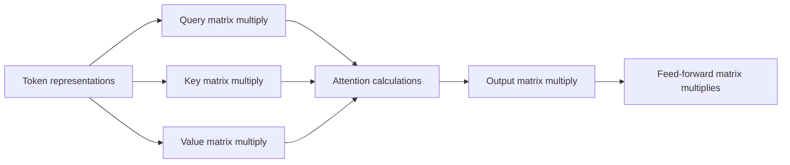
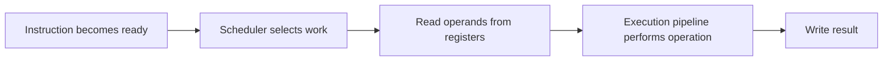
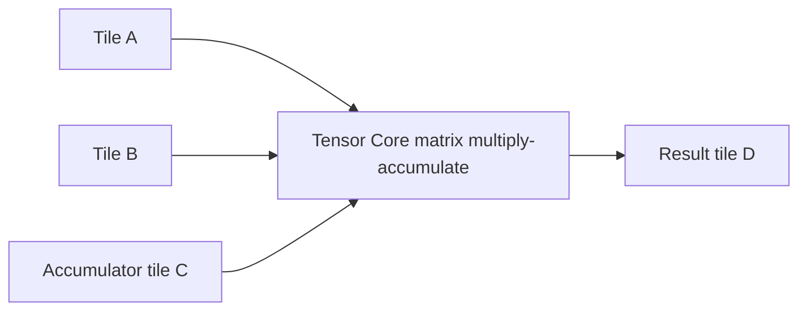
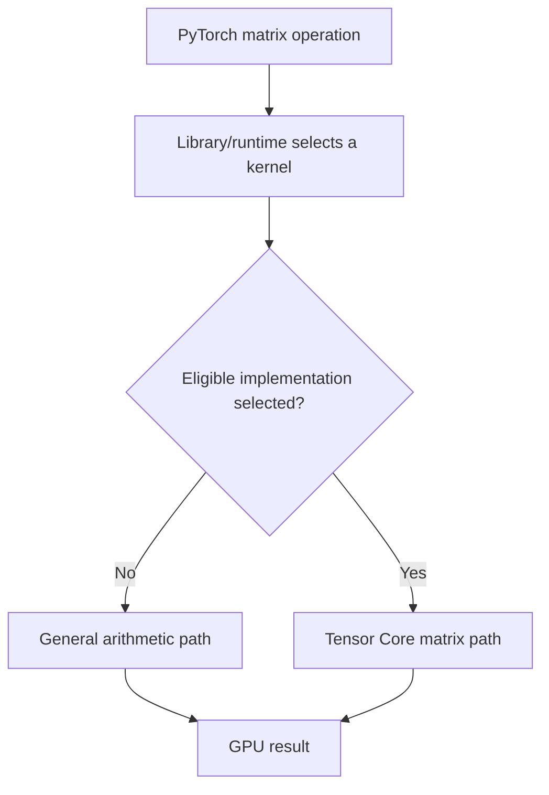
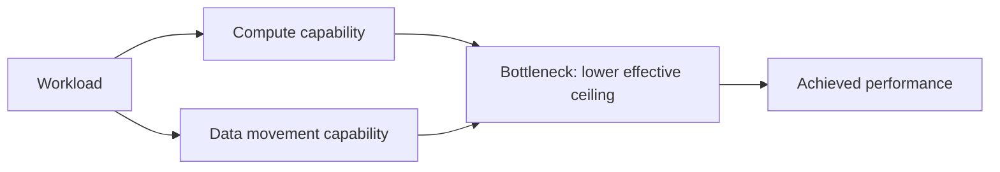

# Lesson 05 — Compute Units and Tensor Cores

## What you will learn

By the end of this lesson, you should be able to explain:

- what arithmetic work a GPU actually performs;
- the difference between scalars, vectors, and matrices;
- why multiply-accumulate operations appear throughout neural networks;
- what NVIDIA commonly calls a CUDA core;
- what a Tensor Core is—and what it is not;
- why running CUDA code does not guarantee Tensor Core use;
- how data type, matrix shape, alignment, and software kernels affect hardware selection;
- the difference between latency, throughput, theoretical FLOPS, and achieved FLOPS.

No linear-algebra background is assumed. Basic multiplication and addition are enough.

---

## 1. Start with arithmetic

A processor transforms numbers by executing instructions. Some instructions add two numbers, some multiply, some compare, and some move data. For example:

```text
input values:  3 and 4
instruction:   multiply
result:        12
```

This is one arithmetic operation in the everyday sense. Performance literature often counts a multiplication and an addition separately. Therefore, the expression

```text
(3 × 4) + 5 = 17
```

contains two floating-point operations: one multiply and one add.

### Scalar, vector, and matrix

A **scalar** is one number:

```text
7
```

A **vector** is an ordered one-dimensional list of numbers:

```text
[2, 4, 6]
```

A **matrix** is a rectangular grid of numbers:

```text
┌      ┐
│ 1  2 │
│ 3  4 │
└      ┘
```

The words describe the organization of the data, not necessarily distinct physical objects in hardware. Ultimately, the numbers are stored as bits in memory.

### Elementwise work versus matrix multiplication

An elementwise addition combines corresponding positions:

```text
[1, 2, 3] + [10, 20, 30] = [11, 22, 33]
```

Each result is independent, so the three additions can potentially happen in parallel.

Matrix multiplication is different. Every output entry is built from a row of the first matrix and a column of the second. Consider two 2 × 2 matrices:

```text
A = ┌     ┐      B = ┌     ┐
    │ 1 2 │          │ 5 6 │
    │ 3 4 │          │ 7 8 │
    └     ┘          └     ┘
```

Their product is:

```text
C[0,0] = (1 × 5) + (2 × 7) = 19
C[0,1] = (1 × 6) + (2 × 8) = 22
C[1,0] = (3 × 5) + (4 × 7) = 43
C[1,1] = (3 × 6) + (4 × 8) = 50

C = ┌       ┐
    │ 19 22 │
    │ 43 50 │
    └       ┘
```

Each output entry requires repeated multiplication followed by addition. Large neural networks perform this pattern at enormous scale.

### Multiply-accumulate

A **multiply-accumulate** operation multiplies two inputs and adds the product into a running total:

```text
accumulator = accumulator + (a × b)
```

For `C[0,0]` above, the running calculation can be pictured as:

```text
accumulator starts at 0
0  + (1 × 5) = 5
5  + (2 × 7) = 19
```

Hardware and programming documentation may use **FMA** (fused multiply-add) or **MAC** (multiply-accumulate). These terms are related, but not interchangeable in every context. A fused floating-point instruction computes a multiplication and addition with a single final rounding step. For performance counting, it is conventionally counted as two floating-point operations.

### Why transformers need this

Transformer weights are mostly large matrices. Activations—the numerical representation of the current input—are multiplied by those weights in operations such as:

- the query, key, and value projections in attention;
- the attention output projection;
- the feed-forward network's linear layers;
- the final projection from hidden states to token scores.



This repeated matrix arithmetic is why specialized matrix hardware matters to inference.

---

## 2. From an instruction to a result

An arithmetic unit does not work in isolation. Data and instructions move through an **execution pipeline**. A simplified view is:



Real GPUs have many pipeline types, multiple schedulers, dependencies, queues, and mechanisms for hiding delay. The diagram is a mental model, not a literal blueprint for every NVIDIA architecture.

An operation cannot execute merely because an arithmetic unit exists. It also needs:

1. an instruction that the unit supports;
2. input data available at the right time;
3. space to hold the result;
4. independent work that the scheduler can issue.

If an instruction is waiting for data from memory, its arithmetic unit may have nothing useful to do. GPUs keep many groups of threads available so they can often issue work from another group while one waits. This is one reason utilization depends on the whole system, not only the advertised number of arithmetic units.

### Pipelines are specialized

A modern NVIDIA Streaming Multiprocessor (SM) contains several kinds of execution resources. Depending on architecture, these can include pipelines for floating-point arithmetic, integer arithmetic, load/store operations, special mathematical functions, and matrix operations. Exact arrangements and capabilities vary by GPU generation and model.

```text
Streaming Multiprocessor (conceptual—not to scale)
┌──────────────────────────────────────────────────┐
│ Warp schedulers and instruction dispatch         │
│                                                  │
│ General arithmetic pipelines   Matrix pipelines │
│ (FP / integer operations)      (Tensor Cores)   │
│                                                  │
│ Load/store and special-function pipelines        │
│ Registers, shared memory, caches                  │
└──────────────────────────────────────────────────┘
```

The scheduler issues eligible instructions to compatible pipelines. It does not convert every ordinary multiply into a Tensor Core matrix operation automatically.

---

## 3. What is a “CUDA core”?

**CUDA** is NVIDIA's parallel-computing platform and programming model. A CUDA program launches GPU functions called **kernels**, which are executed by many GPU threads.

In product descriptions, **CUDA core** is the name commonly used for a general-purpose arithmetic execution lane in an NVIDIA GPU. It is useful as a broad architectural and marketing count, but it should not be treated as if it were equivalent to a CPU core.

A CPU core is a comparatively independent and complex processor capable of sophisticated instruction scheduling and control. A so-called CUDA core is a much narrower execution resource inside an SM. A GPU thread is also not permanently assigned to one physical CUDA core.

```text
Incorrect mental model:
one CUDA thread ───────────> one permanent CUDA core

Better mental model:
many thread instructions
        ↓ scheduled in groups over time
SM execution pipelines and arithmetic lanes
```

Ordinary floating-point and integer instructions may execute through general arithmetic pipelines. Which exact lane handles an instruction, and what can issue concurrently, depends on the GPU architecture. Consequently:

- do not compare “CUDA core count” directly with CPU core count;
- do not infer real application speed from CUDA core count alone;
- do not assume every listed lane can perform every data type at the same rate;
- do not assume two GPU generations deliver equal work per listed core per clock.

CUDA cores are important, but performance also depends on Tensor Cores, clock rates, memory bandwidth, cache, instruction mix, occupancy, software kernels, and workload shape.

---

## 4. What is a Tensor Core?

A **Tensor Core** is a specialized execution unit designed to accelerate small matrix multiply-accumulate operations. Software combines many such hardware operations to compute larger matrix products.

A useful abstract description is:

```text
D = A × B + C
```

Here `A`, `B`, `C`, and `D` represent matrix tiles—small rectangular pieces of larger matrices.



This does **not** mean one Tensor Core accepts an arbitrary million-by-million matrix in one step. Libraries and kernels divide large problems into tiles, distribute them across thread blocks and SMs, and repeatedly apply supported operations.

### Why specialized hardware can be faster

A general arithmetic pipeline can execute individual arithmetic instructions. Tensor Core pipelines perform a structured collection of multiply-accumulate work at high throughput when the operation has an eligible form. The specialization trades flexibility for speed and efficiency.

Imagine a restaurant:

- a general cook can prepare many individual dishes;
- a specialized machine can stamp out a tray of identical dumplings rapidly;
- the machine is excellent only when the requested work fits its input and process.

Tensor Cores are not “better CUDA cores.” They are different execution resources for suitable matrix operations.

### Formats and precision

A numeric **format** specifies how bits encode a value. Using fewer bits usually reduces storage and data movement, and compatible hardware may process more values per unit time. But reduced precision can also change numerical results.

Depending on GPU generation and operation, Tensor Cores may support formats including some of the following:

- FP16 (16-bit floating point);
- BF16 (16-bit floating point with a different range/precision tradeoff);
- TF32 (a Tensor Core input mode used for certain FP32 operations);
- FP8 variants;
- integer formats such as INT8 and, on some hardware paths, lower-bit forms;
- FP64 on certain data-center architectures.

This is deliberately not a universal support table. **Format support, accumulation behavior, throughput, sparsity features, and programming interfaces vary by architecture.** Check the programming guide and specifications for the exact GPU being used.

Often multiplication inputs use a lower-precision format while accumulation uses a wider format. For example, an operation may multiply FP16 inputs and accumulate into FP32. Wider accumulation helps preserve useful numerical accuracy, but the exact mode is a software and hardware choice.

### Precision is not only a speed switch

Changing from FP32 to FP16, BF16, INT8, or INT4 can affect:

- memory occupied by weights and activations;
- bytes moved through memory;
- which kernels and execution units are available;
- numerical range and rounding error;
- model output quality;
- conversion or calibration requirements.

Therefore, “lower bits equals faster” is not a reliable rule. A conversion-heavy or unsupported path may bring little benefit. Always measure the actual model, runtime, and hardware.

---

## 5. Why CUDA execution does not imply Tensor Core use

These statements mean different things:

```text
The operation ran on an NVIDIA GPU using CUDA.
The operation used Tensor Core instructions.
```

The first says the GPU ran a CUDA kernel. That kernel may use general arithmetic pipelines, Tensor Cores, load/store pipelines, or a mixture. Tensor Core use requires a suitable operation and a kernel implementation that emits eligible matrix instructions.



### Conditions that influence eligibility

#### 1. Data format

The inputs and requested computation must use a mode supported by the hardware and kernel. An unsupported format cannot use that Tensor Core path.

#### 2. Matrix dimensions and shape

Matrix kernels divide inputs into tiles. Dimensions that fit the implementation's tiling rules tend to be easier to process efficiently. Awkward or very small shapes may leave tile capacity unused, require remainder handling, or lead the library to select another kernel.

Exact preferred multiples are not universal: they depend on data format, instruction shape, library version, layout, and GPU architecture. Avoid memorizing “all dimensions must be divisible by eight” as a timeless rule.

#### 3. Alignment and layout

**Alignment** describes whether data begins at memory addresses and strides suitable for efficient vectorized access. **Layout** describes how matrix elements are arranged in memory, such as which dimension is contiguous. A mathematically valid matrix can still be stored in a way that requires copying, transposition, narrower loads, or a different kernel.

#### 4. Kernel availability and selection

PyTorch generally calls libraries or generated kernels rather than directly assigning work to hardware units. The software stack chooses among implementations based on shape, type, layout, hardware, configuration, and heuristics. A Tensor Core-capable GPU cannot help if the selected kernel does not issue compatible instructions.

#### 5. Operation size

For small work, setup and kernel-launch overhead may dominate. A specialized high-throughput path does not guarantee lower end-to-end latency for every tiny operation.

### How do you know Tensor Cores were used?

Do not rely solely on the model's data type or the fact that CUDA is available. Evidence can include:

- kernel names and library documentation;
- Nsight Compute instruction or pipeline metrics appropriate to that GPU;
- framework profiler evidence combined with knowledge of the selected kernel;
- controlled comparisons, treated cautiously rather than as proof by themselves.

Later labs will use profiling tools. At this stage, remember: **capability is not evidence of utilization**.

---

## 6. Connecting the hardware to transformer shapes

Suppose a token is represented by four numbers:

```text
token activation = [1, 2, 3, 4]
```

A learned projection can transform it using a 4 × 3 weight matrix:

```text
                 output features
                 1  2  3
weights = input  ┌        ┐
feature 1        │ 1  0  2│
feature 2        │ 0  1  1│
feature 3        │ 1  1  0│
feature 4        │ 2  0  1│
                 └        ┘
```

The first output is:

```text
(1 × 1) + (2 × 0) + (3 × 1) + (4 × 2) = 12
```

All three outputs can be computed as a matrix multiplication. Real transformer hidden dimensions are much larger, and prompts or batches supply additional rows of activations.

```text
Activation matrix                 Weight matrix
[tokens or batch, hidden size]  × [hidden size, output size]
                                =
Output matrix
[tokens or batch, output size]
```

During **prefill**, many prompt tokens can contribute rows, often producing substantial matrix operations. During single-request **decode**, the model usually processes one new token at a time, which can make some operations effectively narrow matrix-vector-like cases. The weights still have to be read, but there may be less parallel arithmetic per request. Batching several requests can make dimensions larger and improve utilization, though it can also alter latency and scheduling behavior.

Tensor Core capability is therefore only part of the story. Shape, batch size, prompt phase, memory traffic, and kernel implementation influence whether the hardware reaches high utilization.

---

## 7. Throughput and latency are different

**Latency** is the elapsed time to complete one unit of work. Examples include milliseconds for one matrix multiplication or time to generate one token.

**Throughput** is work completed per unit time. Examples include tokens per second, requests per second, or floating-point operations per second.

```text
Latency question:    “How long did this request take?”
Throughput question: “How many requests did the system finish per second?”
```

A system may improve throughput by batching work, while an individual request waits longer to join or complete the batch.

Example:

```text
System A: 1 request finishes in 10 ms
          throughput ≈ 100 requests/s if processed one after another

System B: a batch of 8 finishes in 40 ms
          batch latency = 40 ms
          throughput = 8 / 0.040 = 200 requests/s
```

System B has higher throughput but greater latency for a request within that simplified example. Neither is universally “better”; the service objective decides which matters.

Tensor Cores are designed for high matrix-compute throughput. Their peak capability does not mean every individual operation completes with proportionally lower end-to-end latency.

---

## 8. FLOPS: theoretical versus achieved

**FLOP** means floating-point operation. **FLOPS** means floating-point operations per second. Despite the final `S`, FLOPS is a rate; FLOP is an amount of work.

Recall that one fused multiply-add is conventionally counted as two FLOPs:

```text
a × b + c  →  one multiply + one add  →  2 FLOPs
```

### Theoretical peak

Theoretical peak FLOPS estimates the maximum arithmetic rate under specific assumptions, such as:

- a particular data format and instruction type;
- suitable operations issued continuously;
- relevant execution units active;
- a stated or assumed clock frequency;
- no starvation from dependencies or memory.

Vendors may advertise different peaks for FP32, FP16 Tensor Core, sparse modes, and other formats. These numbers describe different operating conditions and must not be compared without reading the labels.

### Achieved performance

Achieved FLOPS is the useful arithmetic rate observed for a particular workload:

```text
achieved FLOPS = counted floating-point work / elapsed seconds
```

If a calculation performs 2 billion FLOPs in 0.01 seconds:

```text
2,000,000,000 / 0.01 = 200,000,000,000 FLOPS = 200 GFLOPS
```

Achieved performance is normally below theoretical peak because of factors such as:

- time moving data through memory;
- dependencies between instructions;
- shapes that underfill hardware tiles;
- insufficient parallel work;
- kernel-launch and synchronization overhead;
- non-arithmetic instructions;
- contention with other work;
- clock and power behavior;
- time spent in portions of the application that the peak figure does not cover.

### Utilization needs a denominator

People sometimes compute:

```text
compute efficiency = achieved FLOPS / relevant theoretical peak FLOPS
```

The word **relevant** matters. Dividing an FP32 measurement by an FP16 sparse Tensor Core peak would produce a misleading percentage. Operation counting can also be difficult for fused, sparse, or irregular kernels. Profilers' hardware metrics are often more useful than a hand-calculated number, but those metrics must also be interpreted for the specific architecture.

### A roofline intuition

Arithmetic units cannot remain busy if data arrives too slowly. A simplified performance ceiling is the lower of:

```text
compute ceiling
memory-bandwidth ceiling for this operation's data reuse
```



This is why a GPU with enormous advertised Tensor Core FLOPS may still generate tokens slowly at a small batch size: inference may be constrained by weight and KV-cache movement rather than matrix arithmetic capacity.

---

## 9. Common misconceptions

### “A CUDA core is a tiny CPU core.”

No. The term refers to a much narrower execution resource inside an SM. GPU scheduling and execution differ fundamentally from assigning an independent program to each CPU core.

### “CUDA is another name for Tensor Cores.”

No. CUDA is a platform and programming model. A CUDA kernel can use many types of GPU resources and may never issue a Tensor Core instruction.

### “If I use FP16, Tensor Cores are guaranteed.”

No. FP16 may make a Tensor Core path possible, but operation type, shapes, layouts, hardware support, library configuration, and kernel selection still matter.

### “Tensor Cores calculate whole model matrices in one operation.”

No. They operate on supported matrix fragments or tiles. Software coordinates many operations to produce a large result.

### “More Tensor Cores always means lower request latency.”

No. End-to-end latency can be dominated by memory traffic, launch overhead, CPU work, communication, or sequential decode dependencies.

### “Peak FLOPS tells me how fast an LLM will run.”

No. Peak FLOPS is a specialized ceiling. Model architecture, precision, batch size, memory bandwidth, KV cache, kernels, and serving software all affect observed performance.

### “Lower precision always improves speed.”

No. Speedup requires an efficient supported path, and conversions or other bottlenecks may erase the benefit. Lower precision can also affect model quality.

---

## 10. Vocabulary

| Term | Meaning |
|---|---|
| Scalar | One numerical value. |
| Vector | An ordered one-dimensional collection of values. |
| Matrix | A rectangular two-dimensional collection of values. |
| Elementwise operation | An operation applied independently to corresponding elements. |
| Matrix multiplication | An operation that forms outputs from row-by-column multiply-accumulates. |
| MAC | Multiply a pair of values and add the product to an accumulator. |
| FMA | A fused floating-point multiply-add with one final rounding step. |
| Execution pipeline | Hardware stages and resources through which an instruction is processed. |
| CUDA kernel | A GPU function launched for execution by many threads. |
| CUDA core | NVIDIA's common term for a general arithmetic execution lane; not equivalent to a CPU core. |
| Tensor Core | Specialized hardware for supported matrix multiply-accumulate operations. |
| Tile | A small rectangular portion of a larger matrix processed as a unit by a kernel. |
| Precision/format | The bit-level representation and numerical properties of a value. |
| Alignment | Placement and spacing of data in memory relative to hardware access requirements. |
| Latency | Time required to complete a unit of work. |
| Throughput | Amount of work completed per unit time. |
| FLOP | One floating-point operation under a stated counting convention. |
| FLOPS | Floating-point operations per second. |
| Theoretical peak | A hardware arithmetic ceiling under specified ideal conditions. |
| Achieved FLOPS | Arithmetic rate observed for a real workload. |

---

## 11. Knowledge check

Answer these in your own words without looking back. Correct reasoning matters more than memorized terminology.

1. What is the difference between a scalar, vector, and matrix?
2. Calculate the dot product `[2, 3] · [4, 5]`. Show the multiply-accumulate steps.
3. Why is an FMA conventionally counted as two FLOPs?
4. Name three transformer operations that involve matrix multiplication.
5. Why is a CUDA core not comparable one-for-one with a CPU core?
6. Describe a Tensor Core without saying merely that it “makes AI faster.”
7. What does `D = A × B + C` communicate about a Tensor Core-style operation?
8. Why must a large matrix multiplication be divided into tiles?
9. List four conditions that can affect whether a Tensor Core kernel is used.
10. A PyTorch operation ran on CUDA. What can you conclude about Tensor Core utilization?
11. Why can an awkward matrix shape reduce efficiency even when the calculation is valid?
12. Explain the difference between lower-precision multiplication and accumulation precision.
13. Give an example in which throughput improves while latency becomes worse.
14. What assumptions are hidden inside a theoretical peak FLOPS number?
15. Why would comparing achieved FP32 FLOPS with an advertised sparse FP16 peak be misleading?
16. How can memory bandwidth prevent arithmetic units from reaching peak throughput?
17. Why may prefill expose more matrix parallelism than single-request decode?
18. What profiler evidence would you seek before claiming that a workload used Tensor Cores?

### Worked exercise

Multiply these matrices by hand:

```text
A = ┌     ┐     B = ┌      ┐
    │ 1 2 │         │ 2  1 │
    │ 0 3 │         │ 4 -1 │
    └     ┘         └      ┘
```

Then answer:

1. How many scalar multiplications did you perform?
2. How many additions did you perform if each output starts with its first product rather than zero?
3. Which output entries could be computed independently?
4. What extra challenges would appear if each dimension were thousands rather than two?

<details>
<summary>Check your matrix result only after attempting it</summary>

```text
A × B = ┌       ┐
        │ 10 -1 │
        │ 12 -3 │
        └       ┘
```

There are eight scalar multiplications and four additions under the stated counting method. All four output entries can be computed independently once their inputs are available. Large dimensions require tiling, data movement, scheduling, and repeated accumulation.

</details>

---

## 12. Completion standard

You are ready to continue when you can explain, without notes:

1. how matrix multiplication is built from multiply-accumulate work;
2. how general arithmetic pipelines differ from Tensor Core matrix pipelines;
3. why CUDA execution alone is not proof of Tensor Core execution;
4. why format, shape, layout, and kernel selection matter;
5. why peak Tensor Core FLOPS is not an LLM performance prediction;
6. why throughput and latency can move in different directions.

Do not memorize a particular GPU's core counts or tile-size rules yet. The durable skill is reasoning from the operation, software kernel, hardware generation, and measured evidence.

### Concise answers

1. **Matrix multiplication:** Each output cell is a row-column dot product: multiply corresponding values and accumulate their products. Many output cells are independent.
2. **General pipelines versus Tensor Cores:** General arithmetic pipelines execute scalar or vector instructions. Tensor Cores perform supported matrix multiply-accumulate operations on small tiles.
3. **CUDA is not proof of Tensor Core use:** A CUDA kernel may run on general arithmetic pipelines. Tensor Core use depends on the instructions and kernel actually selected.
4. **Format, shape, layout, and kernel:** Tensor Core paths require supported data types and efficient dimensions, alignment, memory layout, and implementation. Poor conditions may select another kernel or waste hardware.
5. **Peak FLOPS is not an LLM prediction:** Peak FLOPS assumes ideal arithmetic utilization. Real inference also includes memory movement, attention, synchronization, launch overhead, sampling, and sequential decode dependencies.
6. **Throughput versus latency:** Larger batches can complete more total work per second while making an individual request wait longer in a queue or batch.
