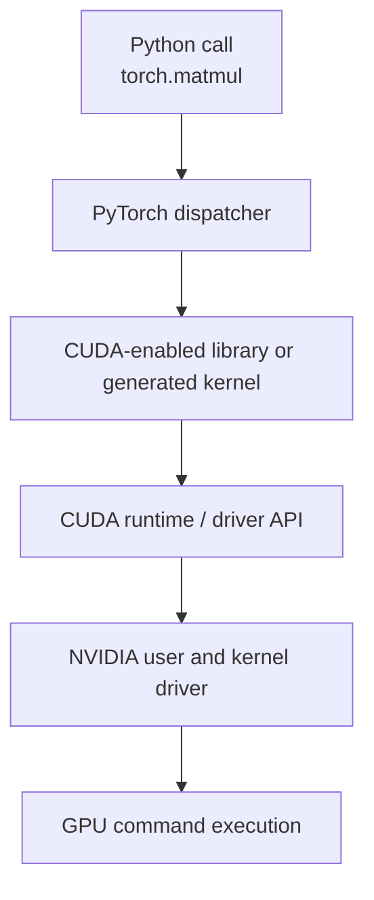
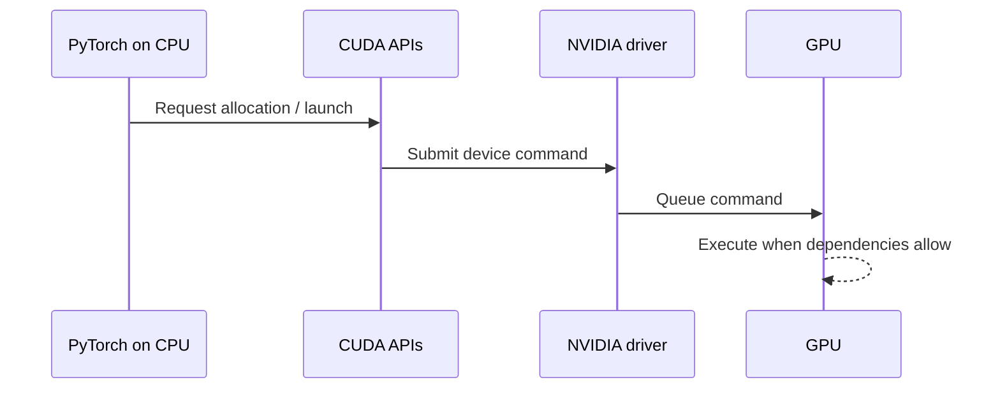
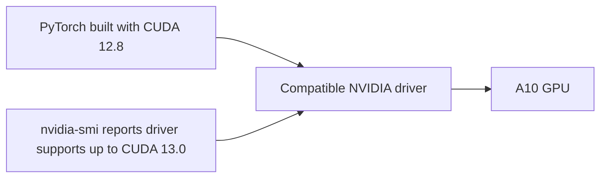
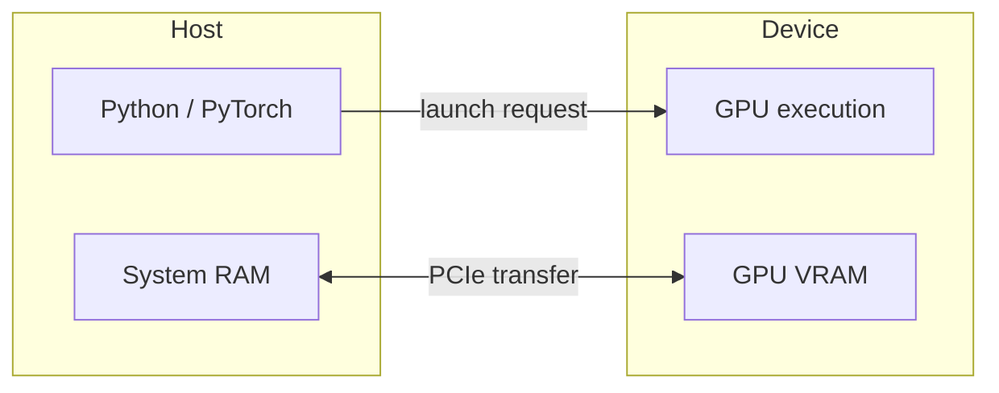
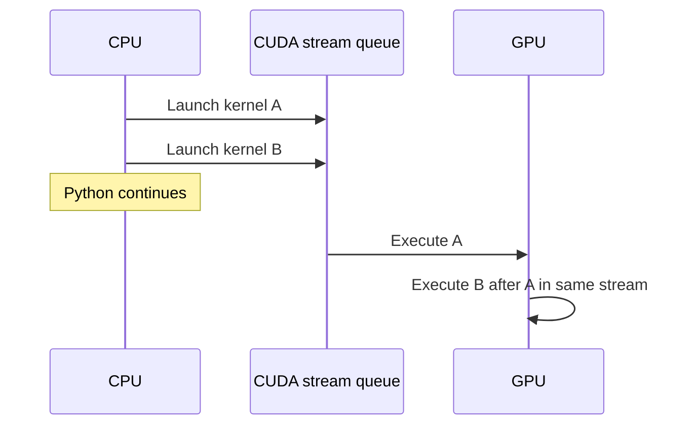
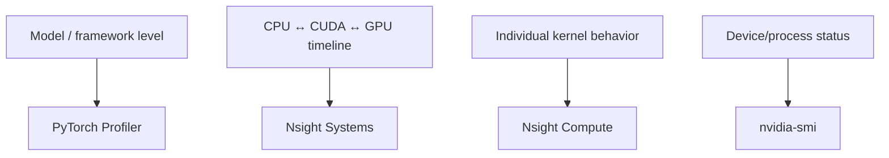
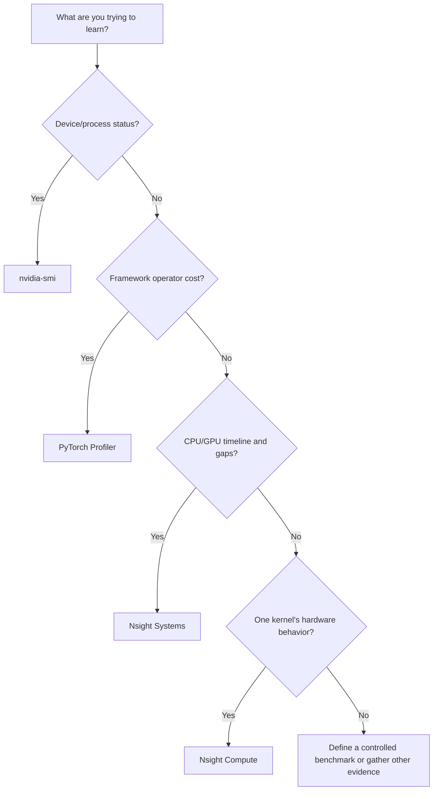

# Lesson 06 — CUDA Software Stack and GPU Observability

## Purpose

An inference request crosses several software and hardware layers. When a model
is slow or fails, “the GPU” is rarely a sufficient explanation. This lesson
separates Python, PyTorch, CUDA libraries and runtime, the NVIDIA driver, GPU
hardware, and the tools used to observe them.

## 1. Hardware Does Not Understand Python

When Python evaluates:

```python
c = torch.matmul(a, b)
```

the GPU does not read that source line. Python and PyTorch run on the host CPU.
PyTorch determines tensor devices, shapes, and types, chooses an implementation,
and eventually causes GPU work to be submitted through CUDA interfaces.



Different operations may take different paths. A matrix multiplication may use
cuBLAS, while an elementwise operation may use a kernel supplied or generated
by PyTorch. The exact route varies, but the layers remain conceptually useful.

## 2. Framework: PyTorch

PyTorch provides high-level concepts such as:

- Tensors, shapes, and dtypes
- CPU and CUDA device placement
- Neural-network layers
- Model parameter management
- Operation dispatch
- Memory allocation interfaces
- Automatic differentiation, although inference usually disables gradient
  tracking
- Profiling labels connected to framework operations

PyTorch decides what operation is requested. It does not itself replace the
driver or GPU.

```text
User intent:     multiply these model states by these weights
PyTorch view:    tensor operation with shape, dtype, layout, device
CUDA view:       memory addresses, streams, library calls, kernel launches
GPU view:        commands, instructions, data movement, execution
```

## 3. CUDA as a Platform

**CUDA** is NVIDIA's platform and programming model for general-purpose GPU
computing. People sometimes use “CUDA” loosely, which causes confusion.

Relevant pieces include:

- A programming model for kernels, threads, blocks, and memory
- The CUDA runtime API
- The lower-level CUDA driver API
- Compilers and developer tools in the CUDA Toolkit
- Optimized libraries such as cuBLAS for linear algebra
- Debugging and profiling tools

CUDA is neither the physical GPU nor a single application.

## 4. CUDA Runtime and Driver API

Applications use APIs to request GPU services such as:

- Find devices
- Create or use a context
- Allocate device memory
- Copy data
- Create streams and events
- Launch kernels
- Synchronize work

The CUDA **runtime API** provides convenient implicit management. The lower-level
**driver API** exposes more explicit control. PyTorch and its dependencies may
use these interfaces so application authors usually do not call them directly.



## 5. NVIDIA Driver

The driver is the privileged software layer that enables the operating system
and applications to control NVIDIA hardware. It handles capabilities such as:

- Device discovery and initialization
- Memory mappings and contexts
- Command submission
- Hardware scheduling and isolation
- Error reporting
- Interfaces used by monitoring tools

Without a compatible NVIDIA driver, CUDA-enabled PyTorch cannot use the GPU even
if PyTorch packages are installed.

The driver has user-space components and an operating-system kernel component.
You do not need their internal details yet; understand that the driver is a
separate installed system dependency.

## 6. CUDA Toolkit, Runtime Version, and Driver Capability

Several version numbers can coexist:

```text
nvidia-smi “CUDA Version”        maximum CUDA level supported by driver
torch.version.cuda               CUDA version used to build this PyTorch
nvcc --version                   installed CUDA compiler/toolkit version
NVIDIA driver version            installed driver release
```

Our accepted Lambda environment demonstrated this:

```text
Driver-reported CUDA capability: 13.0
PyTorch compiled CUDA:            12.8
```

This is not automatically a mismatch. NVIDIA drivers are designed with defined
compatibility behavior, and a sufficiently new driver can run applications
built with supported older CUDA versions.



Do not interpret the `nvidia-smi` CUDA field as proof that every CUDA 13 toolkit
component is installed.

## 7. Host, Device, and Transfers

In CUDA terminology:

- **Host** usually means CPU-side execution and system memory.
- **Device** usually means the GPU and device memory.



Calling `.to("cuda")` generally requests device storage and a transfer when
needed. A model and its input tensors must be on compatible devices for an
operation. Transfers cost time and should not be hidden accidentally inside a
measurement.

## 8. Asynchronous GPU Execution

GPU operations are usually **asynchronous** from the CPU's perspective. The CPU
submits work and can continue before the GPU finishes.



This enables overlap and efficient command submission, but creates a timing
trap:

```python
start = time.perf_counter()
y = torch.matmul(a, b)  # may only enqueue work
elapsed = time.perf_counter() - start
```

The timer may measure submission rather than completion. Accurate timing uses
CUDA events or an explicit synchronization at the correct boundary.

```python
torch.cuda.synchronize()
start = time.perf_counter()
y = torch.matmul(a, b)
torch.cuda.synchronize()
elapsed = time.perf_counter() - start
```

Synchronization changes execution behavior if overused. Use it to define a
measurement boundary, not after every ordinary operation.

## 9. CUDA Streams

A **stream** is an ordered sequence of GPU operations. Operations submitted to
the same stream execute in issue order. Operations in different streams may
overlap when dependencies and resources allow.

```text
Time ───────────────────────────────────────────────▶

Stream 0: [kernel A][kernel B][kernel C]
Stream 1:       [copy X────][kernel D]
```

The diagram shows potential overlap, not a guarantee. Dependencies, resource
contention, and implicit synchronization can prevent it.

PyTorch uses a default stream unless code or libraries select others. Phase 1
does not require manual stream programming, but streams appear in profiler
timelines and explain why submission order and execution overlap matter.

## 10. Observation Is Layered

An **observer** exposes some facts and hides others. No tool gives a complete
explanation.



### `nvidia-smi`

Useful for:

- GPU identity
- Driver version
- Driver-supported CUDA level
- Total, used, and free framebuffer memory
- Active processes and their memory
- Sampled GPU and memory activity
- Temperature, power, and clocks where available

Not sufficient for:

- Naming PyTorch operations
- Showing kernel-by-kernel timing
- Proving Tensor Core utilization
- Explaining stalls
- Measuring exact request latency

Important nuance: the reported **GPU utilization** is the percentage of the
sample period during which one or more kernels executed. **Memory utilization**
is sampled time during which device memory was read or written. Neither is the
same as percentage of theoretical peak capability achieved.

### PyTorch Profiler

Useful for connecting execution to framework concepts:

- PyTorch operator names
- CPU and CUDA time attributed to operators
- Tensor shapes
- Tensor memory activity
- User-defined ranges
- Stack information, with overhead
- Exportable timelines

Question it answers:

> Which operations visible to PyTorch consumed the measured time or memory?

It does not automatically explain low-level kernel stalls or entire system
behavior outside the framework.

### Nsight Systems

Nsight Systems is a system-wide timeline profiler. It can show:

- CPU threads and call stacks
- CUDA runtime and driver calls
- Kernel launches and execution
- Memory transfers
- CUDA streams
- NVTX ranges
- Scheduling and GPU metrics when supported and permitted
- Idle gaps and overlap

```text
Timeline ─────────────────────────────────────────▶
CPU thread: [Python][cudaLaunch][Python gap][cudaLaunch]
GPU stream:          [kernel A]          [kernel B]
NVTX range: [──────────── decode token 7 ───────────]
```

Question it answers:

> How do host activity, CUDA submission, transfers, and GPU work relate over
> time?

It generally has less deep detail about why one particular kernel uses hardware
inefficiently.

### Nsight Compute

Nsight Compute profiles individual CUDA kernels using detailed metrics. It can
help investigate:

- Memory throughput
- Arithmetic-pipeline activity
- Occupancy and warp behavior
- Instruction and stall categories
- Tensor-related pipeline use where supported

Question it answers:

> Why does this selected kernel behave as it does on this GPU?

It may replay kernels, add substantial overhead, and generate many metrics.
Therefore it is a diagnostic instrument, not a normal end-to-end benchmark.

## 11. A Tool-Selection Decision Tree



Often the sequence is broad to narrow:

1. Observe unexpected request behavior.
2. Check device/process state.
3. Identify expensive framework operations.
4. Inspect timeline gaps and transfers.
5. Select a kernel for deep analysis only if necessary.

## 12. Worked Diagnostic Scenario

Symptom: generation is slower than expected.

### Step 1: Establish a controlled measurement

Record model, dtype, prompt/output tokens, batch, warmup, and timing boundary.

### Step 2: Check device status

`nvidia-smi` confirms the intended GPU and process, but sampled utilization is
intermittent.

### Step 3: Framework view

PyTorch Profiler shows many small operations and some CPU-heavy preparation.

### Step 4: Timeline view

Nsight Systems shows gaps between short GPU kernels. CPU activity occupies the
gaps.

### Step 5: Form a cautious conclusion

Evidence suggests launch frequency or host-side work may underfill the GPU. It
does not yet prove that GPU memory bandwidth is insufficient. Nsight Compute is
not the first tool because the broad timeline already shows idle gaps between
kernels.

## 13. Profiling Changes the Workload

Measurement adds overhead:

- Recording shapes retains or inspects metadata
- Stack capture costs CPU time
- Tracing emits records
- Hardware-counter collection may replay kernels
- Very detailed collection creates large reports

Best practice:

```text
Correctness run → representative benchmark → targeted profile → re-benchmark
```

Do not report profiler-instrumented latency as ordinary production latency
unless that is the explicit measurement goal.

## 14. Common Misconceptions

### “CUDA version” is one universal installed number.

Driver capability, toolkit/compiler version, runtime libraries, and PyTorch's
build CUDA version are related but distinct.

### `nvidia-smi` proves Tensor Cores are working.

It does not identify instruction or pipeline use at that depth.

### A PyTorch operator maps to exactly one GPU kernel.

One operator may launch multiple kernels, and optimized execution may fuse
multiple conceptual operations.

### Profilers are passive and free.

All profiling introduces some overhead; deeper collection can change execution
substantially.

### A timeline correlation proves causation.

It shows temporal relationships. A causal conclusion requires controlled
comparison and supporting evidence.

## Vocabulary

- **Framework:** high-level software for expressing and executing model work
- **CUDA:** NVIDIA's GPU computing platform and programming model
- **Runtime API:** convenient interface for device operations and launches
- **Driver:** system software controlling and exposing the GPU
- **Kernel:** a function scheduled for parallel execution on the GPU
- **Stream:** an ordered queue of GPU operations
- **Asynchronous:** submission can return before execution completes
- **Synchronization:** waiting or enforcing an ordering boundary
- **Trace:** time-ordered record of observed activity
- **Metric:** a measured numerical property
- **Instrumentation overhead:** behavior added by measurement itself

## Knowledge Check

1. Why does the GPU not directly execute the Python statement
   `torch.matmul(a, b)`?
2. What responsibilities belong to PyTorch?
3. What does the CUDA runtime help an application request?
4. Why is the NVIDIA driver required separately from PyTorch?
5. Distinguish the CUDA field in `nvidia-smi`, `torch.version.cuda`, and
   `nvcc --version`.
6. Why can PyTorch built with CUDA 12.8 run under a driver reporting CUDA 13.0?
7. What does asynchronous execution do to naive Python timing?
8. What ordering guarantee exists within one CUDA stream?
9. What does `nvidia-smi` GPU utilization actually summarize?
10. Choose the first tool for finding an expensive PyTorch operator.
11. Choose the first tool for finding CPU gaps between kernel launches.
12. Choose the first tool for investigating one kernel's memory throughput.
13. Why can profiler numbers differ from ordinary benchmark numbers?
14. Why might one PyTorch operator correspond to several kernels?
15. Design a broad-to-narrow investigation for a slow model request.

## Ready to Continue When

You can draw the complete software stack from Python to GPU, explain the three
different CUDA-related version numbers, and choose an observation tool based on
a specific question rather than habit.
