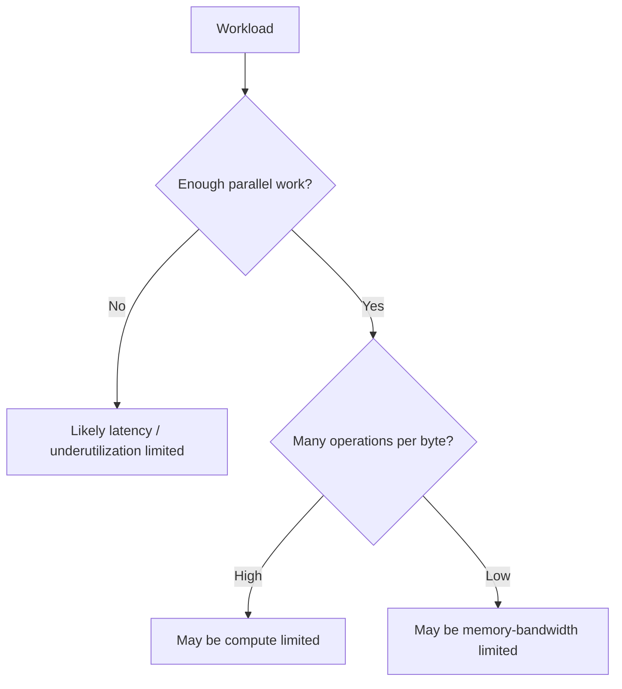
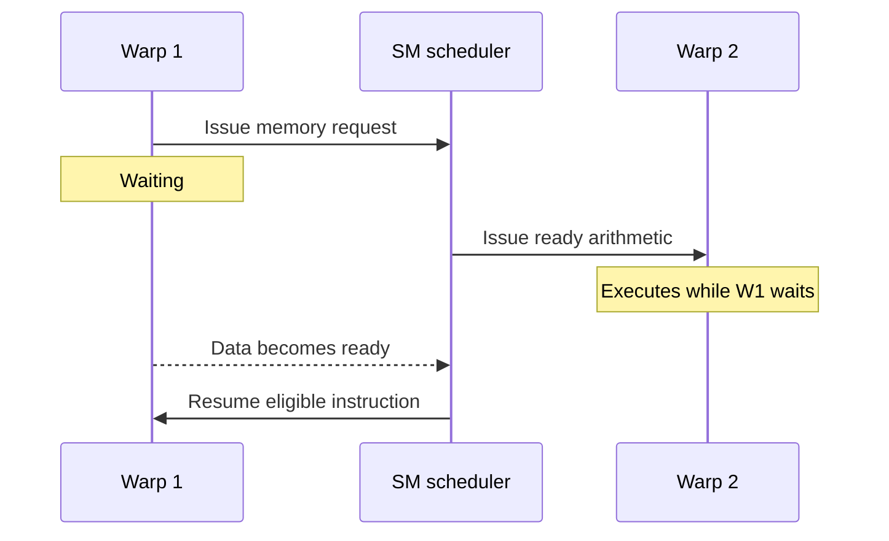
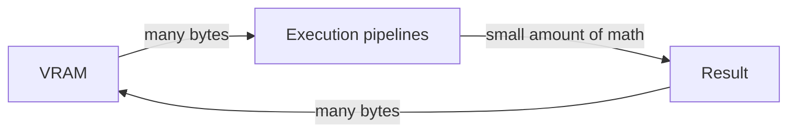
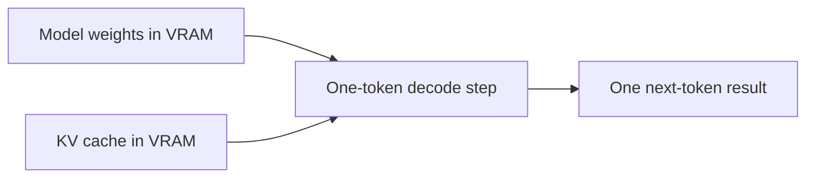
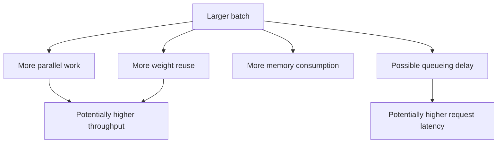

# Lesson 07 — Why GPU Workloads Become Slow

## Purpose

Knowing GPU components is not enough. Performance engineering asks which
resource prevents a workload from finishing sooner. This lesson develops a
first-order model for latency, compute throughput, memory bandwidth, arithmetic
intensity, parallelism, and batching.

This is a reasoning model, not a substitute for measurement.

## 1. Performance Needs a Boundary

“How fast is it?” is incomplete. Fast at what?

Possible boundaries include:

- One GPU kernel
- One model forward pass
- Prompt prefill
- One decode token
- A complete generation request
- Many requests completed per second


Optimizing the kernel boundary may not improve the request boundary if another
stage dominates. Always name the measured boundary and unit.

## 2. Three First-Order Limiters

NVIDIA's introductory performance model groups many GPU limitations into:

1. **Latency limitation** — not enough independent work exists to keep the
   machine occupied, or serialized delays dominate.
2. **Compute limitation** — arithmetic pipelines are the scarce resource.
3. **Memory-bandwidth limitation** — moving bytes is the scarce resource.



The words “likely” and “may” matter. Real systems can have mixed limits and
change bottlenecks between phases.

## 3. Latency-Limited and Underutilized Work

Suppose a GPU can operate on thousands of threads, but a program launches only
enough work for a tiny portion of the machine.

```text
Available SM capacity:  [SM][SM][SM][SM][SM][SM][SM][SM]
Tiny launch uses:       [##][  ][  ][  ][  ][  ][  ][  ]
```

Even if each thread performs substantial arithmetic, the GPU's aggregate
resources remain mostly idle. Common contributors include:

- Small tensor shapes
- Batch size one with limited sequence parallelism
- Many tiny kernels
- CPU gaps between launches
- Synchronization after every operation
- Sequential dependencies between decode iterations

### Kernel launch overhead

GPU work must be described and submitted. The fixed cost of a launch can be
small, but it matters when useful work is even smaller.

```text
Large kernel:   [launch][================ useful work ================]
Tiny kernel:    [launch][work]
```

For the tiny kernel, overhead is a larger fraction of elapsed time.

### Latency hiding

GPUs tolerate some waiting by keeping multiple warps ready. When one warp waits
for data, an SM may issue work from another ready warp.



This does not reduce the first warp's memory latency. It hides some of that
latency behind useful work from other warps. If too few warps are ready, there
is nothing to switch to.

## 4. Compute-Limited Work

A workload is compute-limited when arithmetic demand takes longer than required
data movement, assuming enough parallel work exists.

Imagine:

```text
Time required by arithmetic at available compute rate:  8 ms
Time required by memory at available bandwidth:         3 ms
Approximate lower bound: max(8 ms, 3 ms) = 8 ms
```

If arithmetic and memory activity overlap well, the slower requirement sets the
first-order limit. Faster VRAM alone would not remove an 8 ms arithmetic cost.

Potential evidence of compute limitation includes high utilization of the
relevant arithmetic pipelines and a kernel whose performance approaches the
hardware's achievable compute rate. Confirming this requires profiler metrics,
not intuition alone.

Large matrix multiplications with enough rows, columns, reduction work, and
batching can become compute-limited, particularly when they reuse loaded data
many times.

## 5. Memory-Bandwidth-Limited Work

A workload is memory-bandwidth-limited when transferring required bytes takes
longer than the arithmetic performed on those bytes.

```text
Time required by arithmetic:  2 ms
Time required by memory:      7 ms
Approximate lower bound: max(2 ms, 7 ms) = 7 ms
```

Example: add 1 to every value in a large array.

For each element, the program roughly:

1. Reads the old value.
2. Performs one addition.
3. Writes the new value.

There is little arithmetic per byte moved. Faster arithmetic units cannot help
much if they are already waiting for data.



## 6. Arithmetic Intensity

**Arithmetic intensity** is a simplified ratio:

```text
arithmetic intensity = useful arithmetic operations / bytes moved
```

Units may be written as operations per byte or FLOPs per byte.

### Low-intensity example

For a simplified FP16 elementwise addition `C = A + B`:

- Read `A`: 2 bytes
- Read `B`: 2 bytes
- Write `C`: 2 bytes
- Perform approximately 1 addition

```text
intensity ≈ 1 operation / 6 bytes ≈ 0.17 operations per byte
```

This ignores caches and implementation details, but it shows the basic shape:
many bytes for little arithmetic.

### Higher-intensity matrix example

In matrix multiplication, an input value can contribute to many output values.
If the implementation reuses data from fast memory rather than rereading it
from VRAM, many multiply-add operations can be performed per byte fetched.

```text
Load a tile of A and B once
          │
          ▼
Reuse those values across many multiply-adds
          │
          ▼
Write completed output tile
```

This reuse raises effective arithmetic intensity.

### The hardware balance point

A GPU has both a peak arithmetic rate and a peak memory-bandwidth rate. Their
ratio gives a rough hardware operations-per-byte balance point.

```text
hardware balance ≈ peak operations per second / bytes per second
```

If a workload requires fewer operations per byte than the hardware balance,
memory bandwidth is likely to become the limit. If it requires more, compute
may become the limit—provided there is enough parallelism.

You do not need to calculate a roofline in Phase 1. Understand the comparison.

## 7. Why the Model Is Only Approximate

Arithmetic-intensity reasoning can be wrong or incomplete because:

- Cache hits reduce VRAM traffic
- Data may be read more times than the algorithm suggests
- Kernels perform addressing and control instructions not counted as model math
- Tensor shapes may not map efficiently to hardware
- Synchronization and launch overhead may dominate
- Frequencies and power limits vary
- Multiple resources can be stressed
- Peak specification numbers are rarely fully attainable by every workload

Use the model to form a hypothesis. Use profiler evidence to test it.

## 8. Transformer Prefill

During prefill, many prompt-token representations move through transformer
layers. Linear operations can treat token positions and batches as larger
matrix dimensions.

```text
             Larger token dimension
Prompt states ┌────────────────────────────┐
              │ token 1 representation     │
              │ token 2 representation     │
              │ ...                        │
              │ token N representation     │
              └────────────────────────────┘
                             × model weights
```

Larger matrix dimensions generally expose more parallelism and more opportunity
to reuse weight tiles. Prefill can therefore use compute resources more
effectively than a batch-one decode step. Attention cost also grows with prompt
length, and the exact bottleneck depends on model, implementation, shape, and
hardware.

“Prefill is compute-bound” is not a universal law. It is a hypothesis that is
often reasonable for sufficiently large operations and must be measured.

## 9. Transformer Decode

During one batch-one decode iteration, the model produces one next-token state.
It still needs access to the model's layer weights and an expanding KV cache.



The weight matrices contain many values, but with only one new token there is
less reuse across a token dimension. Repeatedly moving weights can dominate the
amount of arithmetic performed for that token. Decode at small batch size is
therefore often memory-bandwidth-sensitive.

Again, this is not universal. Larger batches, specialized kernels, cache layout,
quantization, and model architecture can move the bottleneck.

## 10. Batching Changes the Shape

Batching processes multiple requests or sequences together.

```text
Batch 1:  [request A]
Batch 4:  [request A][request B][request C][request D]
```

The model weights can serve calculations for multiple requests after being
loaded into the memory hierarchy. This can increase reuse and arithmetic work
per byte, raising throughput and GPU utilization.

But batching introduces tradeoffs:

- A request may wait for a batch to form
- A larger batch consumes more activation and KV-cache memory
- One batch takes longer than one batch-one step
- Total requests or tokens per second may improve
- Individual request latency may worsen



## 11. Precision and Quantization Connection

Representing each weight with fewer bytes can reduce memory traffic.

For one billion weights, ignoring metadata and overhead:

```text
FP32: 1,000,000,000 × 4 bytes ≈ 4 GB
FP16: 1,000,000,000 × 2 bytes ≈ 2 GB
INT8: 1,000,000,000 × 1 byte  ≈ 1 GB
INT4: 1,000,000,000 × 0.5 byte ≈ 0.5 GB
```

This can improve a memory-bound workload, but only if the runtime and hardware
execute the selected format efficiently. Quantization can also add scaling,
conversion, metadata, and quality tradeoffs. Smaller storage alone does not
guarantee lower latency.

## 12. How Tools Test the Hypothesis

| Question | Useful first evidence |
| --- | --- |
| Is the GPU active at all? | `nvidia-smi` sampled utilization/processes |
| Is Python leaving large gaps between operations? | Nsight Systems timeline |
| Which PyTorch operations dominate? | PyTorch Profiler |
| Is one kernel limited by memory or compute behavior? | Nsight Compute |
| Does longer prompt increase prefill time? | Controlled benchmark + profiler |
| Does batching improve total throughput? | Controlled benchmark |

No single tool proves the whole explanation.

## 13. Common Misconceptions

### “100% GPU utilization means the GPU is optimally used.”

`nvidia-smi` GPU utilization indicates that at least one kernel was executing
during sampled periods. It does not say which pipelines were busy or whether
the kernels were efficient.

### “Memory-bound means the model does not fit in memory.”

Fit is capacity. Memory-bound performance is about movement rate. A model can
fit comfortably and still wait on bandwidth.

### “Compute-bound is good and memory-bound is bad.”

They describe limiting resources, not software quality. Good optimization means
meeting the desired outcome within constraints.

### “A profiler label is a causal explanation.”

A measurement is evidence. Explaining cause requires connecting multiple
measurements to a controlled experiment.

## Vocabulary

- **Bottleneck:** the limiting resource or stage for a defined boundary
- **Underutilization:** available hardware resources lack useful ready work
- **Latency hiding:** executing other ready work while one operation waits
- **Compute-bound:** primarily limited by arithmetic throughput
- **Memory-bound:** primarily limited by data-movement throughput
- **Arithmetic intensity:** arithmetic operations performed per byte moved
- **Batch:** multiple examples or requests processed together
- **Warmup:** unmeasured work used to reach representative steady behavior
- **Hypothesis:** a testable proposed explanation

## Knowledge Check

1. Why must a performance claim name its measurement boundary?
2. What makes a tiny kernel potentially latency-limited?
3. Does latency hiding reduce the latency of a memory access itself? Explain.
4. In the simplified max model, what happens when memory time is 9 ms and
   compute time is 3 ms?
5. Explain arithmetic intensity without using the word “intensity.”
6. Why can matrix multiplication reuse data more effectively than elementwise
   addition?
7. Why is arithmetic intensity insufficient to prove a bottleneck?
8. Why is prefill often able to use more GPU compute than batch-one decode?
9. How can batching improve throughput while worsening request latency?
10. Why might FP16 weights improve decode performance relative to FP32?
11. Why does smaller numerical precision not guarantee a speedup?
12. What combination of experiment and tools would you use to test whether
    decode is memory-bandwidth-limited?

## Ready to Continue When

You can look at a workload and propose latency, compute, and memory hypotheses
without presenting any hypothesis as proven before measurement.
