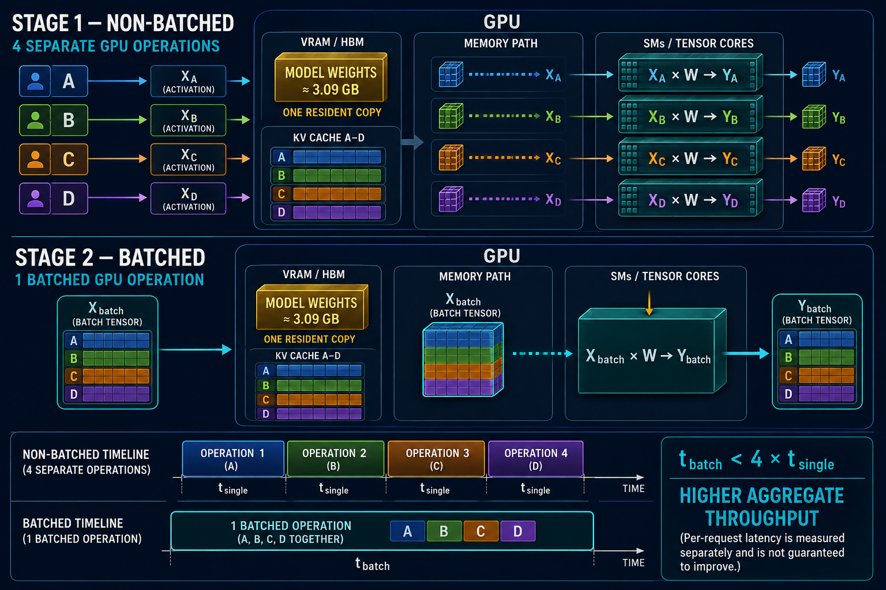
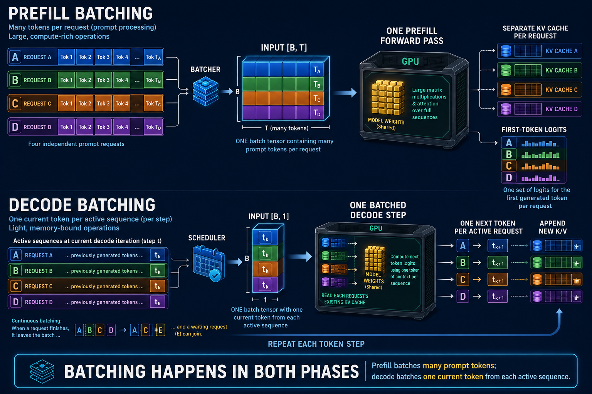

# Experiment 2: Batch-size scaling

This experiment measures how serving multiple requests together changes GPU
throughput, per-request latency, and memory use. It follows the [Week 1 direct
PyTorch baseline](../01-pytorch-baseline/README.md) and uses the same Qwen2.5-1.5B FP16 model on an
NVIDIA A10.

## Batching background

### What batching is

**Batching** means grouping multiple independent inference requests into one
model invocation. The **batch size**, written `B`, is the number of requests in
that invocation. `B=1` means one request is processed; `B=4` means four requests
are represented as four items along the leading tensor dimension and processed
by the same sequence of model operations.

A batcher performs four conceptual steps:

1. Several requests wait or become ready for the same kind of model work.
2. The batcher stacks their tensors along a new leading `B` dimension.
3. The GPU executes larger operations over the combined tensor using the same
   model weights.
4. The resulting batch tensor is separated back into request-specific outputs.

For equal 512-token prompts:

```text
A [1, 512] ┐
B [1, 512] ├─ stack on the B axis ─> input_ids [4, 512]
C [1, 512] ┤                         └─ one model invocation
D [1, 512] ┘
```

Batching does **not** concatenate these into one 2,048-token conversation.
Request A cannot attend to B, C, or D. Each request retains its own attention
mask, activations, outputs, and KV-cache history; `B` is a container dimension
for independent examples.

### What problem batching solves

GPUs are designed to execute a great deal of parallel arithmetic. A small
inference operation—especially a `B=1` decode step that contributes only one
new token—may not expose enough work to occupy all SMs and Tensor Cores. The GPU
still pays kernel-launch and scheduling costs, and it must access the model
weights, yet part of its compute capacity can remain idle.

Running four requests as four separate calls repeats that small-workload pattern
four times. The result is low aggregate throughput: fewer total tokens are
completed per second than the GPU could process with a better-shaped workload.

### How batching solves it

Batching turns several small operations into a larger tensor operation. For a
linear layer, the conceptual change is:

```text
unbatched: X_A × W, then X_B × W, then X_C × W, then X_D × W
batched:   X_batch × W, where X_batch contains A, B, C, and D
```

This helps because the larger operation exposes more parallel work, amortizes
launch overhead, and allows weight tiles fetched from VRAM to be reused across
more input rows during the operation. There is still only one resident model-
weight allocation; weights are not copied once per request. Physical HBM reads
remain kernel- and cache-dependent, so “read once” should be understood as
shared reuse within the batched operation rather than literally one hardware
transaction for every weight byte.



Batching improves **aggregate throughput** when one batched pass completes the
group in less time than the equivalent separate passes:

```text
t_batch < B × t_single
aggregate throughput = completed tokens / elapsed time
```

It does not guarantee lower latency for an individual request. A request may
wait while a batch forms, and a larger operation may take longer than one
`B=1` operation. Batching exchanges some latency and memory capacity for better
total GPU utilization.

## Does batching occur during prefill or decode?

**Both.** Prefill and decode can each be batched, but the tensor shapes, work,
and scheduling behavior differ.

| Phase | What each request contributes | Batched input | Main work | Result |
|---|---|---|---|---|
| Prefill | Many prompt tokens | `[B, T]` token IDs | Large projections, MLPs, and attention across each prompt | Separate KV cache and first-token logits per request |
| Decode | One current token per active sequence per step | `[B, 1]` token IDs | One-token projections plus reads from each sequence's existing KV cache | One next token and appended K/V per active request |



### Prefill batching

During prefill, the model processes the prompt tokens that arrived with each
request. With four equal 512-token prompts, the input is `[4, 512]`, and hidden
states are `[4, 512, hidden_size]`. The GPU performs one batched prefill forward
pass, but attention remains isolated within each request. The pass creates a
separate K/V history and a next-token prediction for each request.

Prefill already contains many tokens and often forms large, compute-rich matrix
operations at `B=1`. It can therefore reach good GPU utilization at a smaller
batch size than decode. Batching may still increase throughput, but it also
raises activation memory and can delay time to first token while requests wait
for the prefill batch.

### Decode batching

During cached decode, each active sequence contributes approximately one
current token at each iteration. Four active sequences therefore form token IDs
with shape `[4, 1]`. The model executes one batched decode step, reads each
sequence's own KV cache, produces four next-token results, and appends new K/V
for each sequence. The process repeats for the following token step.

Decode batching is particularly important because a single `B=1` decode step
is small and frequently limited by moving weights and KV data rather than by
available arithmetic. A larger active batch provides more work per weight
access and per kernel launch.

Production engines commonly use **continuous batching** during decode. When one
sequence finishes, it can leave the active batch and a waiting request can join
at a later iteration. The batch membership changes over time even though each
individual GPU step still sees a concrete active batch size.

### Can prefill and decode work coexist?

Yes. A simple static PyTorch experiment can batch a fixed group through prefill
and keep the same group together during decode. Serving engines use more
flexible scheduling: they may batch prefills together, batch decode tokens
together, split long prefills into chunks, or schedule some prefill work near
ongoing decode work. This experiment begins with a fixed equal-length batch so
the effect of `B` can be measured without mixing in scheduler policy.

## What changes when B increases

The notation below is `[batch, tokens, features]` for ordinary model
activations and `[batch, heads, tokens, head_dimension]` for attention tensors.
For a 512-token prompt, one request has these representative shapes:

```text
input_ids       [1, 512]
hidden states   [1, 512, 1536]
K per layer     [1, 2, 512, 128]
V per layer     [1, 2, 512, 128]
```

Here is what each shape means:

- `input_ids [1, 512]`: one request (`B=1`) represented by 512 integer token
  IDs. A token ID is an index, not a 1,536-dimensional vector yet.
- `hidden states [1, 512, 1536]`: 512 token positions, where each position is
  represented by a 1,536-value learned vector. These vectors are the model's
  working representation of the prompt. The embedding layer creates the first
  version, and every transformer layer updates it using context from the
  sequence. Hidden states are activations, not model weights, and are generally
  temporary.
- `K per layer [1, 2, 512, 128]`: at one transformer layer, each of the 512
  positions has a 128-value key vector in each of 2 KV heads. The leading `1`
  identifies the request.
- `V per layer [1, 2, 512, 128]`: the matching value vectors. K and V have the
  same shape but contain different projections and serve different roles in
  attention.

With four equal-length requests, the leading batch dimension changes to 4:

```text
input_ids       [4, 512]
hidden states   [4, 512, 1536]
K per layer     [4, 2, 512, 128]
V per layer     [4, 2, 512, 128]
```

The same dimensions now mean:

- `input_ids [4, 512]`: four independent requests, each with 512 token IDs;
- `hidden states [4, 512, 1536]`: four separate sequences of 512 vectors;
- `K/V [4, 2, 512, 128]`: four separate K/V caches at that layer. The `4` does
  not mean one request has four heads; it means there are four request-specific
  copies of the two-head cache.

Batching adds the leading `B` dimension. It does not concatenate the requests
into one 2,048-token sequence, and it does not let request A attend to request
B. Attention masks and the batch layout keep those computations independent.

The model weights are not duplicated. The same weights process every batch
item, while the request-dependent tensors gain four times as many rows. Each
batch item still has its own attention computation and its own K/V history.

## Memory and latency tradeoffs

Every request adds input/activation storage and a separate K/V history. Larger
batches increase peak memory and can cause queueing: an arriving request may
wait for an existing batch to finish. The goal is not the largest possible `B`,
but the largest useful `B` that meets a latency and memory target.

The KV-cache equation makes the scaling explicit:

```text
KV bytes = 2 × B × L × H_kv × T × D × bytes_per_element
```

At `T=512`, the Week 1 cache was 14 MiB for `B=1`. Holding every other factor
constant gives approximately:

```text
B=1 → 14 MiB
B=2 → 28 MiB
B=4 → 56 MiB
B=8 → 112 MiB
```

This is only KV storage. Weights, activations, logits, CUDA workspaces, and
allocator reserve also consume memory.

## Equal and unequal sequence lengths

The first sweep uses equal-length prompts so the effect of `B` is isolated. Real
traffic has different prompt and generation lengths. Padding handles unequal
lengths by adding placeholder tokens (wasted work); packing and variable-length
kernels reduce that waste; continuous batching admits new sequences as others
finish. These are follow-up experiments, not confounding variables for this
one.

## Experiment objective

Predict and then find the batch-size operating point that maximizes aggregate
token throughput without exceeding a latency or memory limit. Use prompt
lengths 512 and 2,048, and sweep `B=1, 2, 4, 8, ...` until the A10 approaches
its memory limit. The key result is the **throughput knee**: the batch size
after which adding more requests produces little additional aggregate
throughput.

### Experimental guardrails

The phrase **latency target** in this experiment means a relative guardrail
against the `B=1` result for the same prompt length and output-token count. A
batch size passes the guardrail when both of these are true:

```text
median prefill service time(B) ≤ 1.25 × median prefill service time(B=1)
median TPOT(B)                 ≤ 1.25 × median TPOT(B=1)
```

In other words, the experiment permits at most a 25% increase in prefill
service time and time per output token in exchange for higher aggregate
throughput. This 25% value is a deliberately chosen study criterion, not a
customer or production SLO. The direct PyTorch experiment also excludes request
queueing and network time, so its prefill timing is not a complete production
TTFT measurement.

The memory guardrail is:

```text
peak reserved CUDA memory ≤ 90% of usable GPU VRAM
```

Finally, define the measured throughput knee as the first tested batch size for
which doubling `B` produces less than a 5% increase in aggregate output-token
throughput. Report the best batch that satisfies all three conditions: latency,
memory, and useful throughput gain.

Record for every case:

- aggregate tokens/second;
- per-request tokens/second;
- prefill, decode, and end-to-end latency;
- peak allocated and reserved CUDA memory;
- measured KV-cache bytes;
- GPU utilization sampled during the measured interval; and
- the first batch size that violates either explicit latency guardrail.

Use these definitions:

```text
aggregate throughput = total generated tokens / elapsed seconds
per-request throughput = aggregate throughput / B
TPOT = decode-only seconds / decode-generated tokens
KV bytes = 2 × B × L × H_kv × T × D × bytes_per_element
```

The deliverable is a table or plot showing where aggregate throughput improves,
where it flattens, and where memory or latency becomes the limiting constraint.
Annotate the predicted throughput knee and the measured knee separately.

## Before running: predict memory and performance

The experiment should make a prediction before collecting measurements. A
prediction does not need to be exact to be useful: it should identify the
dominant terms, estimate a safe batch-size range, and predict whether throughput
will still improve or has begun to saturate.

### Memory prediction

For a prefill call, use this practical peak-memory model:

```text
peak_bytes ≈ weight_bytes
           + KV_cache_bytes
           + prefill_logits_bytes
           + temporary_activation_and_workspace_bytes
```

The first three terms are directly calculable:

```text
weight_bytes       ≈ 1.54B parameters × 2 bytes       ≈ 3.09 GB
KV_cache_bytes     = 2 × B × L × H_kv × T × D × 2
prefill_logits     = B × T × vocabulary_size × 2
```

Here `T` is the number of prompt positions processed during prefill, and the
factor `2` is the two bytes used by FP16 logits. The corresponding tensor shape
is:

```text
logits = [B, T, vocabulary_size]
```

This estimate applies to the direct Transformers call used in the baseline,
which commonly materializes logits for every prompt position. A serving engine
can select only the final position before retaining or transferring logits:

```text
last-token logits = [B, 1, vocabulary_size]
                  = B × 1 × vocabulary_size × 2 bytes
```

That optimized form is roughly `T` times smaller than the full prefill-logits
tensor. During cached decode, the model normally produces one new-position
logit per step, so use `T=1` for this term even though the KV cache still spans
the entire sequence history.

For Qwen2.5-1.5B, `L=28`, `H_kv=2`, `D=128`, and the vocabulary is about
151,936 tokens. At `T=512`, the KV cache is 14 MiB per batch item and the
prefill logits are about 0.156 GB per batch item. At `T=2,048`, those values are
56 MiB and about 0.622 GB per batch item. The temporary term is measured rather
than known in advance because it depends on the attention kernel, framework,
CUDA workspaces, and allocator behavior.

A first estimate of the largest safe batch is therefore:

```text
B_max ≈ floor(
    (VRAM_budget - weight_bytes - fixed_overhead)
    / (KV_bytes_per_request + logits_bytes_per_request)
)
```

Use a safety budget such as 85–90% of usable VRAM rather than the advertised
capacity. The estimate should be treated as a screening tool: the actual run
must still verify both PyTorch allocated and reserved memory and stop before an
out-of-memory failure.

### Latency and throughput prediction

Exact latency cannot be derived from tensor shapes alone. It depends on GPU
clock state, kernel selection, launch overhead, memory bandwidth, attention
implementation, and contention between requests. We can nevertheless predict
the useful shape of the result:

```text
prefill attention work ∝ B × T²
prefill projection/MLP ∝ B × T
decode work/step       ∝ B       (one new token per active request)
KV read traffic        ∝ B × current_sequence_length
aggregate work         ≈ B × single-request work
```

At small `B`, aggregate throughput often rises because the GPU is under-filled
and fixed launch costs are amortized. At larger `B`, throughput flattens when
the GPU reaches its compute or memory-bandwidth limit. Per-request latency and
queueing delay generally continue to rise.

For a more quantitative prediction, use a small pilot (`B=1, 2, 4`) to fit a
saturating throughput curve. A useful starting model is:

```text
throughput(B) = R_max × B / (B + B₀)
```

`R_max` is the fitted high-batch asymptote and `B₀` controls how quickly the
curve bends. At small `B`, the curve is approximately linear; at large `B`, it
flattens. Define the practical knee as the first batch size whose measured
increment is below a chosen threshold, such as a 5% throughput gain. Fit on the
pilot points, predict the remaining batch sizes, and evaluate the prediction on
held-out measurements. This is better suited to end-to-end inference than a
pure hardware ceiling because it captures launch overhead and contention.

For the latency side, start with a simple service-time model and add a
queueing term only if the experiment introduces arrivals over time:

```text
batch_service_time(B) ≈ L_fixed + L_work × B^p
```

Use `p≈1` as the initial hypothesis, then fit `p` from the pilot. Per-request
latency is the batch service time; user-visible latency can be higher when a
request waits in a queue. Keeping service time and queueing delay separate
prevents a batch-size effect from being confused with a scheduler effect.

### Roofline as a secondary diagnostic

Use roofline analysis to explain *why* the fitted curve bends, rather than as the
sole predictor of the exact knee. It checks whether important kernels are
limited by compute or memory bandwidth:

```text
arithmetic_intensity = FLOPs / bytes_moved
achievable_performance ≤ min(peak_compute,
                             memory_bandwidth × arithmetic_intensity)
```

As `B` increases, decode GEMMs usually gain arithmetic intensity because the
same weight matrices are reused across more request items. Throughput should
rise while the GPU is under-filled, then flatten when the dominant kernels
approach either the compute ceiling or the bandwidth ceiling. A rough crossover
batch is where:

```text
arithmetic_intensity(B) ≈ peak_compute / memory_bandwidth
```

This gives a useful regime prediction, not an exact end-to-end batch size.
Prefill commonly reaches high utilization at smaller `B` because each request
contributes many prompt tokens. Decode often needs a larger `B`, but its KV reads grow with
`B × current_sequence_length`. Kernel fusion, launch overhead, clock state, and
attention implementation can move the measured knee away from the simple
roofline estimate.

For each sweep point, compare the saturation-curve prediction with measured
aggregate tokens/second, latency, peak memory, and GPU utilization. Then use the
roofline result to interpret the knee. A strong conclusion is phrased as a
range—for example, “the fitted curve predicts diminishing returns between
`B=4` and `B=8`, while roofline data suggests bandwidth pressure”—not as a
claim that either model determines an exact batch size without a run.

The comparison deliverable should place predicted and actual memory beside each
other, and plot predicted versus actual aggregate throughput and latency for
each batch size. A good prediction need not match every millisecond; it should
correctly identify the memory-limited region, the throughput knee, and the
latency tradeoff.
