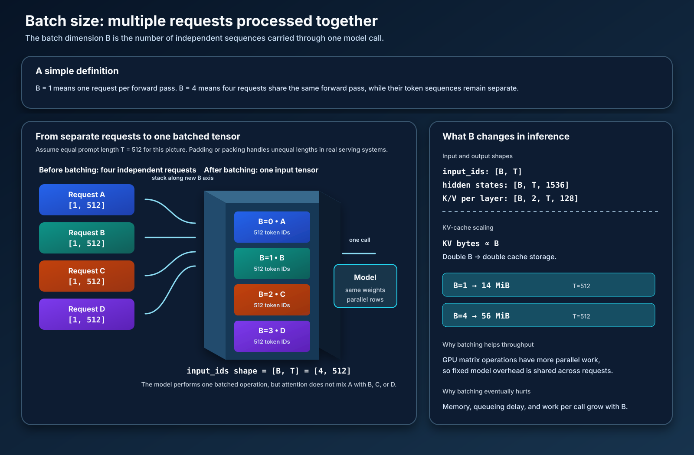

# Experiment 2: Batch-size scaling

This experiment measures how serving multiple requests together changes GPU
throughput, per-request latency, and memory use. It follows the [Week 1 direct
PyTorch baseline](../01-pytorch-baseline/README.md) and uses the same Qwen2.5-1.5B FP16 model on an
NVIDIA A10.

## What is batch size?

The **batch size**, written as `B`, is the number of independent sequences
included in one model call. With `B=1`, the model receives one request. With
`B=4`, it receives four independent requests (four batch items) at the same
time and performs the same layers and matrix operations for those requests in
parallel. Each request may itself contain hundreds of token rows; the batch
dimension is separate from those token/matrix rows. The requests do not
share words, attention scores, or KV entries; batching only gives the GPU more
independent work to process together.



## What changes when B increases

The notation below is `[batch, tokens, features]` for ordinary model
activations and `[batch, heads, tokens, head_dimension]` for attention tensors.
For a 512-token prompt, one request has these representative shapes:

```text
input_ids       [1, 512]
hidden states   [1, 512, 1536]
K per layer     [1, 2, 512, 128]
V per layer     [1, 2, 512, 128]
```

Here is what each shape means:

- `input_ids [1, 512]`: one request (`B=1`) represented by 512 integer token
  IDs. A token ID is an index, not a 1,536-dimensional vector yet.
- `hidden states [1, 512, 1536]`: 512 token positions, where each position is
  represented by a 1,536-value learned vector. These vectors are the model's
  working representation of the prompt. The embedding layer creates the first
  version, and every transformer layer updates it using context from the
  sequence. Hidden states are activations, not model weights, and are generally
  temporary.
- `K per layer [1, 2, 512, 128]`: at one transformer layer, each of the 512
  positions has a 128-value key vector in each of 2 KV heads. The leading `1`
  identifies the request.
- `V per layer [1, 2, 512, 128]`: the matching value vectors. K and V have the
  same shape but contain different projections and serve different roles in
  attention.

Yes, hidden states were discussed in the previous experiment. In the [Week 1
walkthrough](../01-pytorch-baseline/pytorch-code-walkthrough.md), they were
called `X` and shown as the input to the Q/K/V projections. This section repeats
that shape because batching changes its first dimension. The attention
projection relationship is:

```text
X              [B, T, 1536]
Q = reshape(XWq) [B, 12, T, 128]
K = reshape(XWk) [B,  2, T, 128]
V = reshape(XWv) [B,  2, T, 128]
```

Qwen uses grouped-query attention: 12 query heads share 2 K/V heads. That is
why K and V have `2` in their head dimension while the hidden state retains the
full `1536 = 12 × 128` features.

With four equal-length requests, the leading batch dimension changes to 4:

```text
input_ids       [4, 512]
hidden states   [4, 512, 1536]
K per layer     [4, 2, 512, 128]
V per layer     [4, 2, 512, 128]
```

The same dimensions now mean:

- `input_ids [4, 512]`: four independent requests, each with 512 token IDs;
- `hidden states [4, 512, 1536]`: four separate sequences of 512 vectors;
- `K/V [4, 2, 512, 128]`: four separate K/V caches at that layer. The `4` does
  not mean one request has four heads; it means there are four request-specific
  copies of the two-head cache.

Batching adds the leading `B` dimension. It does not concatenate the requests
into one 2,048-token sequence, and it does not let request A attend to request
B. Attention masks and the batch layout keep those computations independent.

The model weights are not duplicated. The same weights process every batch
item, while the request-dependent tensors gain four times as many rows. Each
batch item still has its own attention computation and its own K/V history.

## Why batching improves throughput

A GPU is most efficient when it has enough independent matrix work to keep its
many streaming multiprocessors busy. A single short decode step can leave much
of the GPU idle. Processing four requests together makes matrix multiplications
larger, so fixed launch and scheduling costs are shared across requests. This
can increase **aggregate throughput** (tokens/second across all requests), even
though each individual request may take longer.

## Why batching costs memory and can hurt latency

Every request adds input/activation storage and a separate K/V history. Larger
batches increase peak memory and can cause queueing: an arriving request may
wait for an existing batch to finish. The goal is not the largest possible `B`,
but the largest useful `B` that meets a latency and memory target.

The KV-cache equation makes the scaling explicit:

```text
KV bytes = 2 × B × L × H_kv × T × D × bytes_per_element
```

At `T=512`, the Week 1 cache was 14 MiB for `B=1`. Holding every other factor
constant gives approximately:

```text
B=1 → 14 MiB
B=2 → 28 MiB
B=4 → 56 MiB
B=8 → 112 MiB
```

This is only KV storage. Weights, activations, logits, CUDA workspaces, and
allocator reserve also consume memory.

## Equal and unequal sequence lengths

The first sweep uses equal-length prompts so the effect of `B` is isolated. Real
traffic has different prompt and generation lengths. Padding handles unequal
lengths by adding placeholder tokens (wasted work); packing and variable-length
kernels reduce that waste; continuous batching admits new sequences as others
finish. These are follow-up experiments, not confounding variables for this
one.

## Prefill versus decode batching

- **Prefill:** each request contributes hundreds or thousands of prompt tokens.
  Increasing `B` increases the large matrix operations and the KV cache created
  for each prompt.
- **Decode:** each active request contributes approximately one new token per
  step. Batching active sequences turns many small one-token operations into a
  larger GPU workload, which is often the most important throughput benefit.

## Experiment objective

Find the batch-size operating point that maximizes aggregate token throughput
without exceeding a latency or memory limit. Use prompt lengths 512 and 2,048,
and sweep `B=1, 2, 4, 8, ...` until the A10 approaches its memory limit.

Record for every case:

- aggregate tokens/second;
- per-request tokens/second;
- prefill, decode, and end-to-end latency;
- peak allocated and reserved CUDA memory;
- measured KV-cache bytes; and
- the first batch size that fails or violates the chosen latency target.

Use these definitions:

```text
aggregate throughput = total generated tokens / elapsed seconds
per-request throughput = aggregate throughput / B
KV bytes = 2 × B × L × H_kv × T × D × bytes_per_element
```

The deliverable is a table or plot showing where aggregate throughput improves,
where it flattens, and where memory or latency becomes the limiting constraint.
