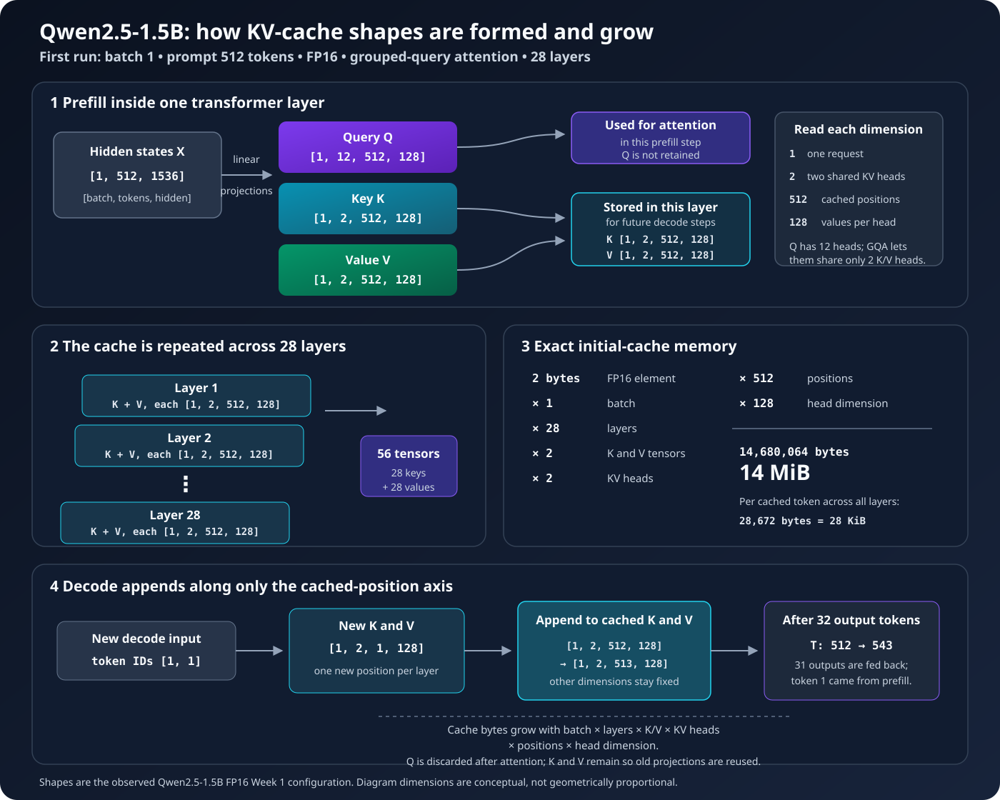
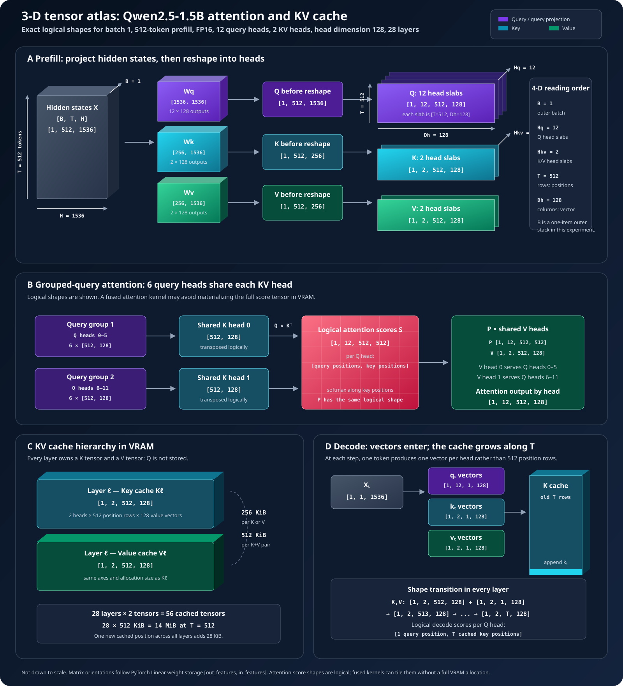

# Week 1 PyTorch Code Walkthrough

This note explains what the Week 1 baseline does, which software component owns
each step, and when data moves onto the GPU. The executable source is
[`week1_pytorch_baseline.py`](week1_pytorch_baseline.py).

## The Stack Used in Week 1

```text
Hugging Face Hub
    stores and downloads configuration, tokenizer, and weight files
                         ↓
Hugging Face Transformers
    constructs the Qwen PyTorch model and implements its forward pass
                         ↓
PyTorch
    owns tensors, moves them to CUDA, and dispatches model operations
                         ↓
CUDA libraries and kernels
    execute the operations on the NVIDIA A10
```

**vLLM is not used in Week 1.** We deliberately use a visible Transformers and
PyTorch loop so that model loading, prefill, decode, and KV-cache behavior can
be inspected directly. vLLM becomes the serving engine in Week 3.

## 1. Download and Construct the Model

The script uses these two Transformers classes:

```python
tokenizer = AutoTokenizer.from_pretrained(args.model, revision=args.revision)

model = AutoModelForCausalLM.from_pretrained(
    args.model,
    revision=args.revision,
    torch_dtype=dtype,
).to("cuda").eval()
```

For the discovery run:

```text
model:    Qwen/Qwen2.5-1.5B-Instruct
revision: 989aa7980e4cf806f80c7fef2b1adb7bc71aa306
dtype:    float16
device:   NVIDIA A10
```

`from_pretrained` performs two conceptually separate jobs:

1. Hugging Face downloads the model configuration, tokenizer files, and
   `safetensors` weight files into the instance's local cache if they are not
   already present.
2. Transformers reads the Qwen configuration, constructs the corresponding
   PyTorch modules, and fills their parameter tensors from the downloaded
   weights.

The downloaded files are not yet the live GPU model. They are persistent files
on the instance's local disk. On an instance without an attached filesystem,
they disappear when the instance is terminated.

## 2. Move the Weights to GPU Memory

This part moves the model:

```python
.to("cuda")
```

PyTorch allocates parameter tensors in A10 VRAM and copies the model parameters
to them. Since the selected dtype is FP16, each parameter element uses two
bytes. A 1.5-billion-parameter model therefore needs roughly 3 GB for weights,
plus additional memory for temporary tensors, inputs, outputs, and the KV cache.

This part changes model behavior for inference:

```python
.eval()
```

`eval()` tells modules such as dropout to use evaluation behavior. It does not
move the model, disable gradient tracking, or perform inference by itself.

## 3. Tokenize and Move the Inputs

The tokenizer converts text into integer token IDs on the CPU. The Week 1 script
repeats a stable synthetic agent-context paragraph and truncates it to exactly
the requested token count.

For the first run, the CPU tensors have these shapes:

```text
input_ids:      [1, 512]
attention_mask: [1, 512]
```

The dimensions mean `[batch, sequence]`: one request containing 512 prompt
tokens. The input tensors then move to VRAM:

```python
inputs = {
    name: tensor.to("cuda")
    for name, tensor in cpu_inputs.items()
}
```

Both the model parameters and input tensors must be on compatible devices before
the forward pass can execute.

## 4. Run Prefill

The first model call processes all prompt tokens together:

```python
outputs = model(
    input_ids=input_ids,
    attention_mask=attention_mask,
    use_cache=True,
)
```

This is **prefill**. Transformers executes the Qwen forward method, whose layers
call PyTorch operations for:

- token embeddings;
- Q, K, and V linear projections;
- attention score and weighted-value calculations;
- attention output projections;
- normalization;
- gated MLP projections; and
- the final vocabulary projection.

Because the model and inputs are CUDA tensors, PyTorch dispatches CUDA work for
these operations. PyTorch may call optimized NVIDIA libraries or framework
kernels; Python does not individually implement the matrix multiplications.

The important outputs are:

```text
logits:         [batch, prompt tokens, vocabulary size]
past_key_values: keys and values retained for every transformer layer
```

The script selects the first generated token from the final prompt position:

```python
next_token = outputs.logits[:, -1, :].argmax(dim=-1, keepdim=True)
```

This uses deterministic greedy decoding rather than sampling.

## 5. Understand the KV-Cache Shape



The visualization follows one tensor through four levels: the projections in a
single layer, the repetition across all 28 layers, the resulting memory
calculation, and the one-position-at-a-time growth during decode.

### Detailed 3-D tensor atlas



Read each 3-D block as a visual encoding of tensor axes, not as a physically
scaled object. A stack of slabs represents the head axis of a four-dimensional
tensor. Within each slab, rows represent token positions and columns represent
the 128-value head vector. The one-element batch axis wraps the entire stack.

The atlas also includes the projection-weight matrices. PyTorch stores a
`Linear` weight as `[out_features, in_features]`, which is why `Wq` is
`[1536, 1536]`, while `Wk` and `Wv` are `[256, 1536]`. The latter output only
`2 × 128 = 256` values per position because grouped-query attention uses two KV
heads.

The first run observed key and value tensors shaped:

```text
[1, 2, 512, 128]
```

Their dimensions are:

```text
[batch, KV heads, cached token positions, head dimension]
```

Qwen2.5-1.5B uses grouped-query attention: it has more query heads than KV
heads, so the cache contains two KV heads rather than one key and value for
every query head.

There is one key tensor and one value tensor for each of 28 transformer layers,
giving 56 cache tensors. The initial cache size is therefore:

```text
2 bytes per FP16 value
× 1 batch
× 28 layers
× 2 tensors (K and V)
× 2 KV heads
× 512 positions
× 128 values per head
= 14,680,064 bytes (14 MiB)
```

The cache grows linearly with batch size and cached sequence length. It prevents
the model from recalculating earlier keys and values during every decode step.

### Shape changes from prefill to decode

| Phase | Q shape | New K/V shape | Stored K/V shape | What changes? |
|---|---|---|---|---|
| Prefill | `[1, 12, 512, 128]` | `[1, 2, 512, 128]` | `[1, 2, 512, 128]` | All 512 prompt positions are created together. |
| First feedback step | `[1, 12, 1, 128]` | `[1, 2, 1, 128]` | `[1, 2, 513, 128]` | One position is appended to K and V. |
| Later decode step | `[1, 12, 1, 128]` | `[1, 2, 1, 128]` | `[1, 2, T, 128]` | Only `T`, the cached-position dimension, grows. |

The query tensor has 12 heads because every query head can ask a different
question of the context. K and V have only two heads because grouped-query
attention lets groups of query heads share the same keys and values. Q is used
for the current attention calculation and discarded. K and V represent the
reusable history, so they are retained.

## 6. Run KV-Cached Decode

After prefill, each decode call receives only the newest token plus the cache:

```python
step = model(
    input_ids=next_token,
    attention_mask=attention_mask,
    past_key_values=cache,
    use_cache=True,
)
```

The input shape is now approximately `[1, 1]`, not `[1, 512]`. The model still
uses the cached keys and values from all previous positions when computing
attention for the new token. Each call produces one next token and extends the
cache by one position.

This loop is autoregressive: token 2 cannot be computed until token 1 is known.
That dependency is one reason decode has a different performance profile from
the highly parallel prefill phase.

## 7. Compare with No Cache

The no-cache experiment deliberately passes the entire growing sequence on
every step:

```python
outputs = model(
    input_ids=sequence,
    attention_mask=mask,
    use_cache=False,
)
```

Its input lengths look like:

```text
512, 513, 514, 515, ...
```

This repeatedly recomputes work for old tokens. In the first run, cached
generation produced about 54.2 output tokens/s, while full recomputation
produced about 24.7 output tokens/s. The comparison demonstrates what the KV
cache avoids; disabling it is not the intended production configuration.

## 8. Time CUDA Correctly

CUDA launches are asynchronous with respect to the CPU. Ordinary wall-clock
timing can stop before queued GPU work has completed. The script uses CUDA
events and synchronizes the ending event:

```python
start = torch.cuda.Event(enable_timing=True)
end = torch.cuda.Event(enable_timing=True)

start.record()
result = operation()
end.record()
end.synchronize()
elapsed_ms = start.elapsed_time(end)
```

The first measured run reported median times of approximately:

```text
prefill:             30.2 ms
cached decode:      560.0 ms for the remaining 31 decode steps
cached total:       590.3 ms for 32 output tokens
no-cache total:   1,295.6 ms for 32 output tokens
```

These are single-request baseline measurements, not serving P99 results. Later
weeks add concurrent load, streaming TTFT, and percentile distributions.

## 9. Disable Gradient Bookkeeping

Both generation functions use:

```python
@torch.inference_mode()
```

This tells PyTorch not to construct the autograd graph used for training. It
reduces unnecessary inference memory and overhead. It is separate from
`model.eval()`; a normal inference path generally uses both.

## Component Ownership Summary

| Action | Component responsible |
|---|---|
| Store and deliver model files | Hugging Face Hub |
| Interpret Qwen configuration and define its model class | Transformers |
| Tokenize text | Transformers tokenizer |
| Represent weights and inputs as tensors | PyTorch |
| Copy tensors to A10 VRAM | PyTorch CUDA backend |
| Express model layers and operations | Transformers using PyTorch modules |
| Dispatch GPU operations | PyTorch CUDA backend |
| Execute kernels | CUDA libraries/kernels on the NVIDIA A10 |
| Schedule concurrent serving requests | Not present in Week 1; vLLM in Week 3 |

## What Happens When the Script Ends?

When the Python process exits, its CUDA context and GPU tensors are destroyed,
so the model no longer occupies VRAM. The downloaded model files remain in the
local Hugging Face cache and make subsequent loading faster. They are loaded
back into VRAM the next time the script starts.
